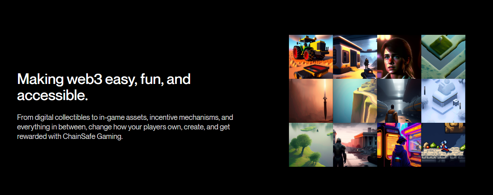

# Introducing ChainSafe Gaming

[ChainSafe Gaming](https://gaming.chainsafe.io/?utm_source=github&utm_medium=documentation&utm_campaign=chainsafe_gaming_docs) is a complete toolkit of web3 gaming products and services for studios, developers, and players that includes our web3.unity SDK, an NFT minter, marketplaces and lootboxes.

The ChainSafe Gaming docs is your portal to learn more about our products and services.



# Web3.unity, An SDK To Bring Games To The Blockchain

Your journey in blockchain-enabled gaming begins with our SDK. We recommend you follow the package manager installation in the [getting started](https://docs.gaming.chainsafe.io/current/getting-started) section. If you'd like to see the source code repository you can do so [here](https://github.com/ChainSafe/web3.unity/releases).

Web3.unity is a modular open-source gaming SDK written in C# and developed by [ChainSafe Gaming](https://gaming.chainsafe.io/?utm_source=github&utm_medium=documentation&utm_campaign=chainsafe_gaming_docs). It connects games built in the Unity game engine to the blockchain. The library currently supports games built for web browsers (WebGL), iOS/Android mobile, and desktop. Web3.unity is compatible with most EVM-based chains such as Ethereum, Polygon, Avalanche, Base, Skale, Cronos, Godwoken, and Binance Smart Chain, letting developers easily choose and switch between them to create the best in-game experience.

## Features of Web3.unity

Out-of-the-box, Web3.unity comes with Unity sample scripts, scenes, prefabs & tooling that will make building web3 games easier. These features include:

* In-game and [no-code](https://dashboard.gaming.chainsafe.io/nfts) NFT minting
* Voucher-based NFT minting implementation
* In-game and web [marketplaces](https://gaming.chainsafe.io/marketplace) for NFTS
* Web3 wallet builds for desktop, mobile (iOS or Android), and browser games (WebGL)
* Social logins
* Sign & verify digital signatures
* Multiple ERC-20, ERC-721, ERC-1155 token interactions
* Custom smart contract interactions
* ... many more!

## Ready To Get Started?

#### Current SDK Builds (v3.x)

In the latest 3.0 we've significantly reduced the effort for developers to interact with the blockchain. Once you have the core package installed you can just drag and drop the Web3Unity prefab to the scene:

```csharp
public class ExampleClass : MonoBehaviour
{
    public async void Start()
    {
        await Web3Unity.Instance.Initialize(false);
        await Web3Unity.Web3.Erc20.BalanceOf("0xd25b827D92b0fd656A1c829933e9b0b836d5C3e2");
    }
}
```

[Click here](https://docs.gaming.chainsafe.io/current/getting-started) to open documentation for the latest version of web3.unity.

## Supported Chains&#x20;

Web3.Unity should work with any EVM based network on the blockchain. Below you'll find a list of tested and approved networks, however you can find a wider range of supported networks on [Chainlist](https://chainlist.org/): 

| Network Name   | Type of Chain |  Chain ID   |
| ------------   | ------------- | ----------- |
| ETH Mainnet    | Mainnet       | 1           |
| Sepolia        | Testnet       | 11155111    |
| Polygon        | Mainnet       | 137         |
| Amoy           | Testnet       | 80002       |
| B3             | Testnet       | 8333        |
| B3 Sepolia     | Testnet       | 1993        |
| BSC            | Mainnet       | 56          |
| BSC            | Testnet       | 97          |
| Avalanche      | Mainnet       | 43114       |
| Fuji Avalanche | Testnet       | 43113       |
| Base           | Mainnet       | 8453        |
| Base Sepolia   | Testnet       | 8453        |
| SKALE Nebula   | Mainnet       | 1482601649  |
| SKALE Nebula   | Testnet       | 503129905   |
| SKALE Chaos    | Testnet       | 1351057110  |

## Additional Resources

If you are new to web3.unity and blockchain-enabled gaming, we recommend that you read over these docs carefully. If you are new to building with the Unity game engine, the [Unity3D manual](https://docs.unity3d.com/Manual/index.html) is a great place to start as well as [learn Unity](https://learn.unity.com/).

* Our [Discord](https://discord.gg/zxHUgGGTGk) is an active community of game devs sharing tips and tricks with each other
  * Hop into our [office hours](https://discord.gg/GTK89A72?event=1242583988623769611) every Wednesday at 9 am EST to get help with your code, brainstorm ideas, or provide feedback to the team.
* Our [Twitter](https://twitter.com/chainsafegaming) periodically provides news and updates, and shares our community's work
* Our [YouTube](https://youtube.com/chainsafe-systems) provides a set of video tutorials and how-to guides on using web3.unity:
  * [Installing web3.unity](https://www.youtube.com/playlist?list=PLPn3rQCo3XrMkgAqFRtih9xGIKciD0b0N)
  * [Web3.unity Documentation Videos](https://www.youtube.com/playlist?list=PLPn3rQCo3XrP6kFaurgMfMQBsyppYBhqW)

## Contribute

All contributions are welcomed! The web3.unity docs is intended to be a living document and requires the contributions of many to be maintained.

Please use GitHub Issues to propose any large changes and to facilitate discussion and questions regarding content and structure.

It is recommended you review the [Docusaurus docs](https://docusaurus.io/docs) to ensure you utilize its features correctly.

After making a PR, you can validate your proposed changes by clicking on the `View deployment` link in the `Checks` section.
