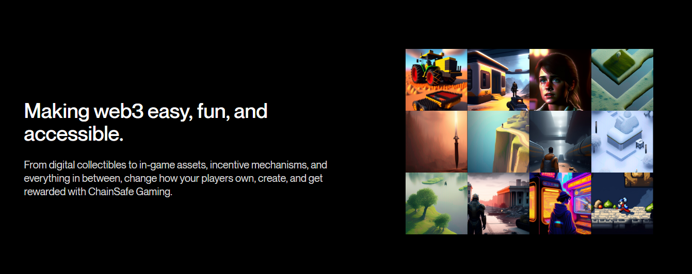

# Introducing ChainSafe Gaming

[ChainSafe Gaming](https://gaming.chainsafe.io/?utm_source=github&utm_medium=documentation&utm_campaign=chainsafe_gaming_docs) is a complete toolkit of web3 gaming products and services for studios, developers, and players that includes our web3.unity SDK, an NFT minter, and marketplace.

The ChainSafe Gaming docs is your portal to learn more about our products and services.

## Bridging Unity Games to the Blockchain and Creating In-Game NFTs

Your journey in blockchain-enabled gaming begins with the [latest release](https://github.com/ChainSafe/web3.unity/releases) of web3.unity.

web3.unity is an open-source gaming SDK written in C# and developed by [ChainSafe Gaming](gaming.chainsafe.io). It connects games built in the Unity game engine to the blockchain. The library currently supports games built for web browsers (WebGL), iOS/Android mobile, and desktop. web3.unity is compatible with most EVM-based chains such as Ethereum, Polygon, Moonbeam, Cronos, Nervos, and Binance Smart Chain, letting developers easily choose and switch between them to create the best in-game experience.

## Current SDK Builds

[Click here](https://docs.gaming.chainsafe.io/current/getting-started) to open documentation for the latest version of web3.unity.

## Legacy Builds 1.6

[Click here](https://docs.gaming.chainsafe.io/legacy/getting-started) to open legacy documentation for web3.unity.