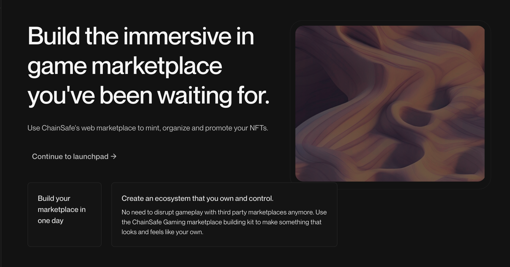

# Introduction

## Launchpad, A Tool To Bridge NFT Assets To Your Game

NFT Launchpad is an offering by chainsafe gaming to help game developers to mint NFTs and create collections of those NFTs and link them to their games.
The users of the game can then buy, sell and trade these NFTs inside of the game itself giving them smooth and seamless experience. 
Game Developers can create, manage and visualize NFTs through the dashboard without any knowledge of Solidity contracts.

### Ready To Get Started?

Head over to the [NFT Launchpad Dashboard](https://dashboard.gaming.chainsafe.io/nfts/entry) to manage your collections and mint NFTs for your projects.

Follow the guide to know more about how to interact with the NFT Launchpad and mint NFTs for your projects.