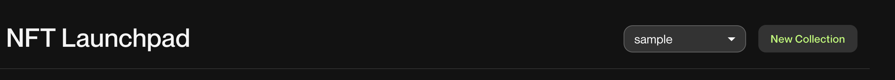
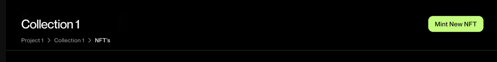

---
#spell-check-ignore-start
slug: /launchpad/tutorial
sidebar_position: 2
sidebar_label: Tutorial
#spell-check-ignore-end
---

# NFT Launchpad Tutorial

This tutorial will guide you through the process of creating a collection, minting NFTs, and launching your NFT project using the ChainSafe NFT Launchpad.

## Prerequisites

Before you begin, ensure you have the following:

- A project created for your game. If you don't have one, you can create one [here](https://dashboard.gaming.chainsafe.io/dashboard).
- Connect your wallet to the ChainSafe Gaming Dashboard. You can connect your wallet by clicking on the `Connect Wallet` button on the top right corner of the dashboard.

## Step 1: Create a Collection

- Head over to `NFT Launchpad` tab in the [ChainSafe Gaming Dashboard](https://dashboard.gaming.chainsafe.io/nfts/entry).

- select the project you want to create a collection for.

- Click on the `New Collection` button on top right

- Fill in the details for your collection and click on `Create Collection` button.

### Collection Details

- **Name**: The name of your collection.
- **Description**: A brief description of your collection.
- **Network**: The chain for which you want to create the collection.
- **Collection Type**: The type of collection you want to create. You can choose from `ERC721`, `ERC1155`
- **Logo Image**: The logo for your collection. This is an optional field.
- **Banner Image**: The banner for your collection. This is an optional field.

## Step 2: Mint NFTs

Once you have created a collection, you can mint NFTs for that collection.

- Click on the collection you want to mint NFTs for.

- Click on the `Mint New NFT` button on top right in the collection you want to mint NFTs for.

- Fill in the details for your NFT and click on `Mint NFT` button.

### Mint NFT Details

- **Name**: The name of your NFT.
- **Description**: A brief description of your NFT.
- **Token Type**: The type of token you want to mint. You can choose from `ERC721`, `ERC1155`
- **Supply**: The number of NFTs you want to mint.
- **Additional Media**: You can add additional media for your NFT. This is an optional field.
- **Upload Files**: You can upload files for your NFT. This is an optional field.

## Step 3: Launch Your NFT Project

- Once you have minted NFTs for your collection, you can access your collection and NFTs directly into your game using the
    `GraphQL` API for that project.
- You can also list your NFTs in your game and let users buy, sell and trade your NFTs.