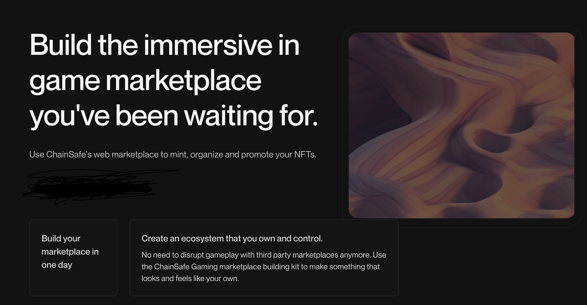

# Introduction

## Marketplace, One Stop Shop For All Your NFT Needs

ChainSafe Marketplace is an offering by ChainSafe Gaming to help game developers build their own in-game NFT marketplace and list their NFTs for sale. 
Gamers can then buy, sell, and trade these NFTs in-game, providing a smooth and seamless experience. 
Game Developers can create, manage, and visualize NFTs through the dashboard without any knowledge of Solidity contracts.

Our marketplace offering is on chain, meaning the marketplaces you created in game are based on smart contracts deployed on a blockchain.
The marketplace smart contract is responsible for managing the NFTs that are listed for sale. It also handles the buying and selling of the NFTs.

You can create multiple marketplaces within a single project but can only list a given NFT
in one marketplace at a time. Our marketplace tool kit supports Ethereum, Polygon, Avalanche and Binance Smart Chain. Support for any other EVM compatible blockchain can be added upon request. 

### Ready To Get Started?

Head over to the [NFT Marketplace Dashboard](https://dashboard.gaming.chainsafe.io/marketplaces/entry?utm_source=docs&utm_medium=documentation&utm_campaign=chainsafe_gaming_docs) to manage your marketplace and list NFTs for your projects.
