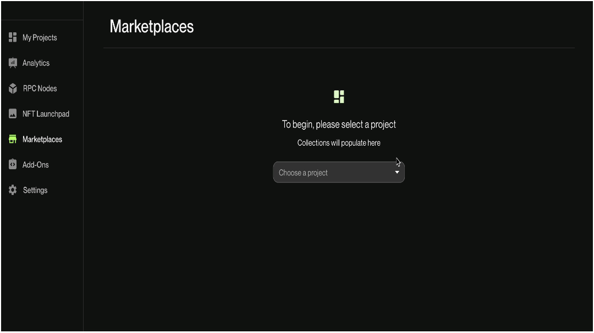
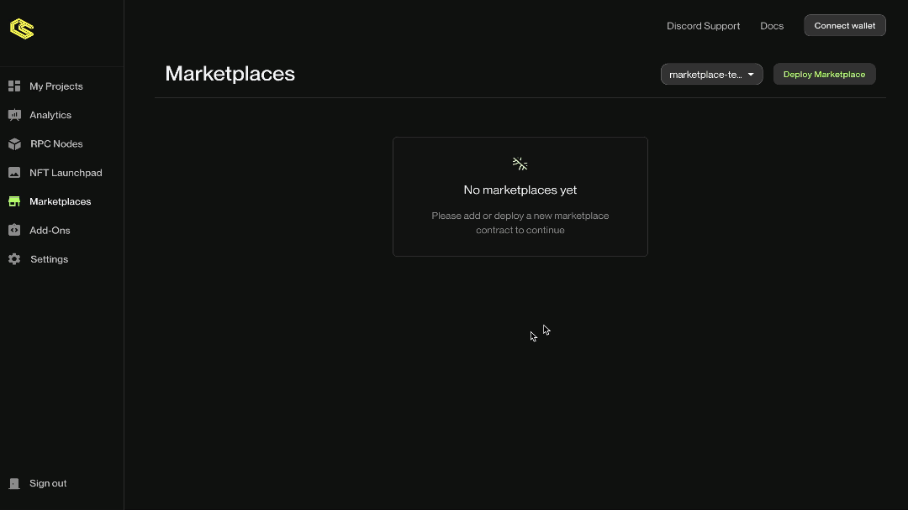
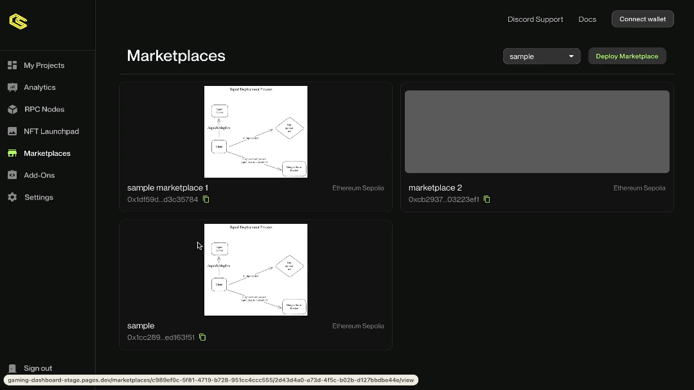
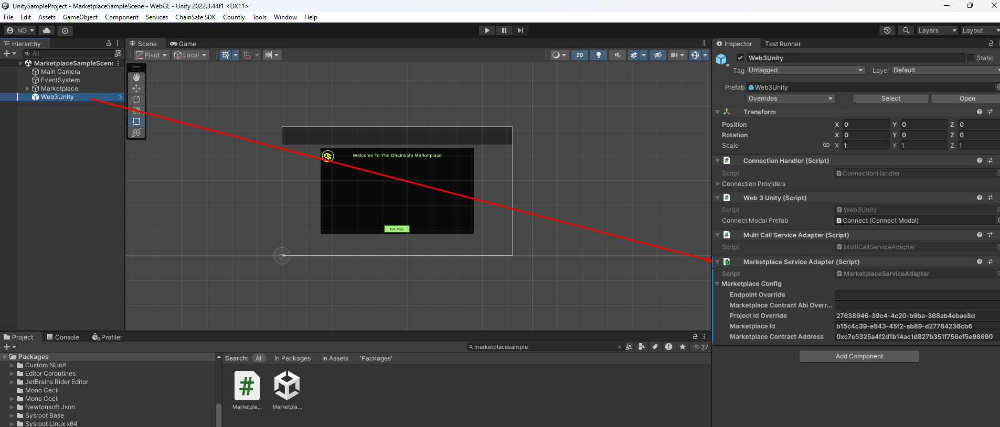
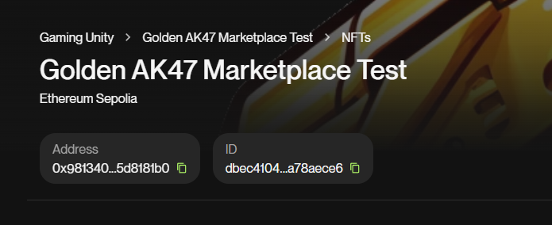

# Marketplace Tutorial

This guide will help you to create an on-chain marketplace for your game and list NFTs for sale in marketplace.

## Prerequisites

Before you begin, ensure you have the following:

- A project created for your game. If you don't have one, you can create one [here](https://dashboard.gaming.chainsafe.io/dashboard).

- You should have already created some nfts for your game inside of the project. If you haven't, you can create some [here](https://dashboard.gaming.chainsafe.io/nfts/entry).

- Connect your wallet to the ChainSafe Gaming Dashboard. You can connect your wallet by clicking on the `Connect Wallet` button on the top right corner of the dashboard.

## 1. Select Project

- Select the project for which you want to create a marketplace.



## 2. Deploy Marketplace

- Click on the `Deploy Marketplace` tab on the right top corner.


- Fill in the details for your marketplace and click on `Create Marketplace` button.

:::info
Please wait for few seconds, it will take some time to deploy the marketplace on the blockchain.
:::




### Marketplace Details

- **Name**: The name of your marketplace.
- **Description**: A brief description of your marketplace.
- **Network**: The chain for which you want to create the marketplace.

:::info
Make sure you have minted the NFTs for the same network inside of NFT Launchpad.
:::
- **Logo Image**: The logo for your marketplace.

### Marketplace ABI

Remember marketplace is an on chain contract, so you will need the ABI to interact with the marketplace contract. Below you can find the ABI of
marketplace contract.

[Marketplace ABI](./assets/marketplace_abi.json)

## 3. List NFT For Sale

Once you have created a marketplace, its time to list some NFTs for sale in the marketplace.

- Select the marketplace where you want to list the NFTs for sale.


- Click on the `List New NFT` tab on the right top corner.


- Select the NFTs that you want to list for sale in the marketplace and input the price at which you want to list the NFT.




## 4. Use marketplace inside of your Unity game
Add the Chainsafe marketplace package as a git package: 
`https://github.com/ChainSafe/web3.unity.git?path=/Packages/io.chainsafe.web3-unity.marketplace`
Add Marketplace Service Adapter to the Web3Unity prefab



Fill out the necessary details





- Marketplace ID: Labeled as ID on the page of your marketplace.
- Marketplace contract address: Labeled as Address on the page of your marketplace.
- Project ID override: Override this value if you want to use a project ID that is different from the one that you have in your Chainsafe SDK settings.
- Marketplace ABI override: Override this if you have created a custom version of our marketplace smart contract.
- Endpoint override: Override this if you are hosting marketplace somewhere else other than on the Chainsafes dashboard.

Once you fill out all the details you can list the items from the marketplace by simply calling

```csharp
var marketplacePage = await Web3Unity.Web3.Marketplace().LoadPage();
```
This will retrieve you a marketplace page, and not all the items that you have listed, because marketplace supports pagination, so you can add pagination support on your Unity client as well. 
The basic sample can be found in the Samples section of the Marketplace package, but for the sake of simplicity I'll add the listing code snippet in here.
```csharp
namespace ChainSafe.Gaming.Marketplace.Samples
{
    public class MarketplaceSample : MonoBehaviour
    {
        [SerializeField] private Transform parentForItems;
        [SerializeField] private UI_MarketplaceItem marketplaceItem;
        [SerializeField] private Button nextPageButton;

        private MarketplacePage _currentPage;
        private async void Start()
        {
            //Always make sure to initialize the Web3Unity instance first.
            await Web3Unity.Instance.Initialize(false);
            try
            {
                LoadingOverlay.ShowLoadingOverlay();
                //This gets all items from the marketplace
                //LoadPage has a lot of parameters that you can fill out in order to filter out the results.
                _currentPage = await Web3Unity.Web3.Marketplace().LoadPage();
        
                nextPageButton.interactable = !string.IsNullOrEmpty(_currentPage.Cursor);
                
                await DisplayItems();
            }
            catch (Exception e)
            {
                Debug.LogError("Caught an exception whilst loading the marketplace page " + e.Message);
            }
            finally
            {
                LoadingOverlay.HideLoadingOverlay();
            }
        }

        private async Task DisplayItems()
        {
            for (int i = parentForItems.childCount - 1; i >= 0; i--)
            {
                Destroy(parentForItems.GetChild(i).gameObject);
            }
            //_currentPage.Items holds the reference to all the items fetched from the marketplace
            foreach (var pageItem in _currentPage.Items)
            {
                var item = Instantiate(marketplaceItem, parentForItems);
                await item.Initialize(pageItem);
            }
        }
    }
}
```

## 5. Use marketplace with the Rest API

If you prefer to access your items without our official Marketplace plugin, once you have listed NFTs for your marketplace, you can access your marketplace items via RESTful set of APIs provided by the ChainSafe.
Head over to the [Marketplace API Specification](./../marketplace-api/docs/marketplaceapi.mdx) to know more about how to interact with the marketplace items. 

