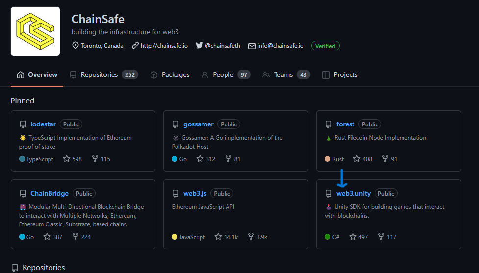
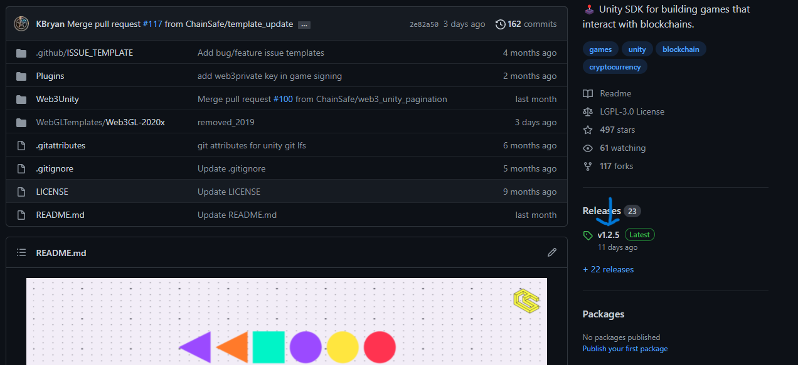
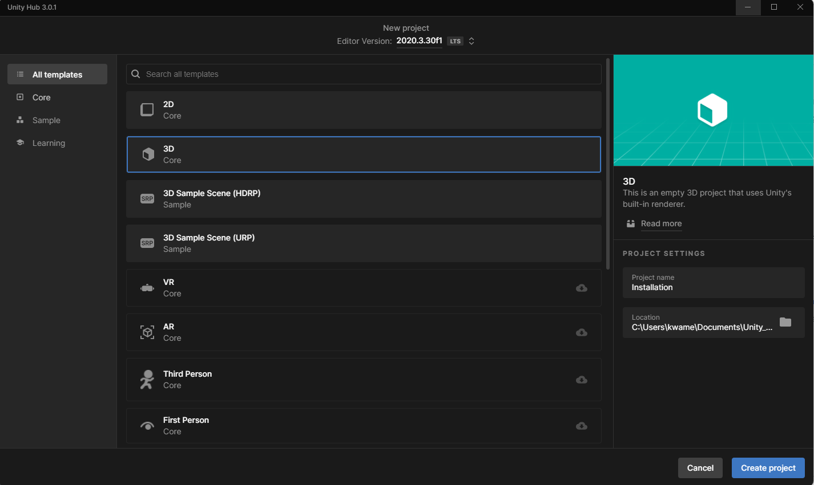
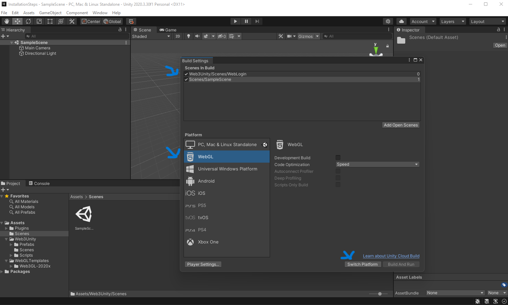
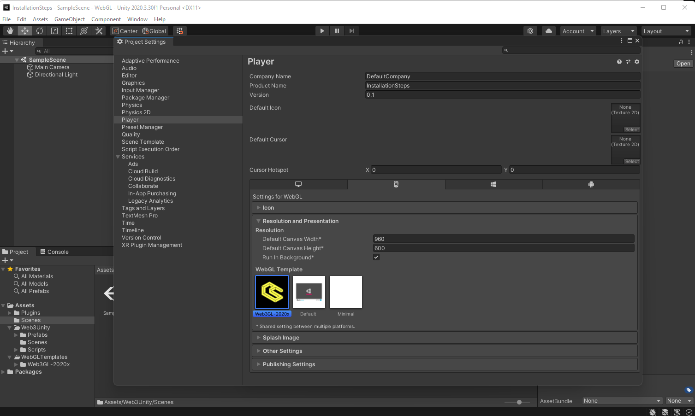
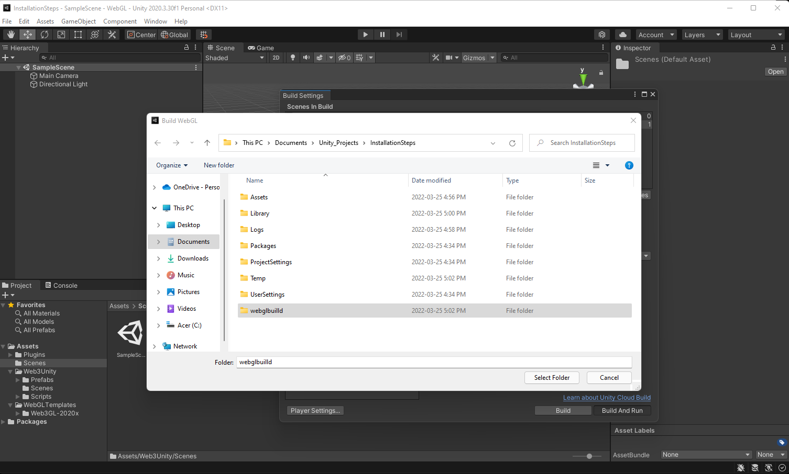
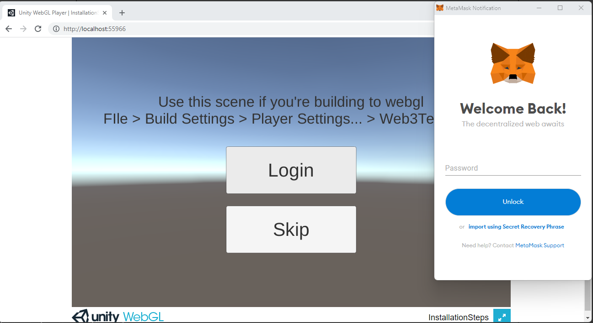
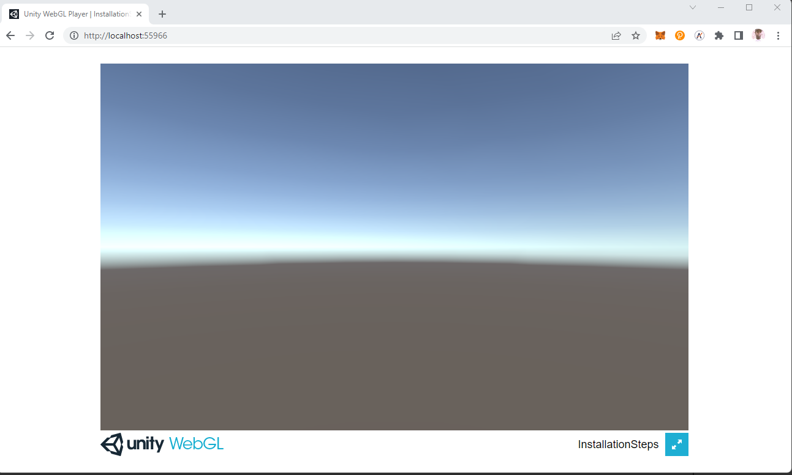

# Installation

:::info

In this section, we will go through the steps necessary to install the
ChainSafe Gaming SDK into the Unity3D game engine.

:::

### Install MetaMask

You will need to have MetaMask installed in order to make Web3 enabled games. If you already have MetaMask Installed you can skip this section and navigate to the Downloading SDK section. If you have not installed a Web3 wallet. Please visit MetaMask for installation instructions provided by following this link and following the installation instructions.&#x20;

[https://metamask.io/](https://metamask.io/)&#x20;

### Downloading the SDK

You will first need to download the ChainSafe Gaming SDK from our GitHub repository. This can be found by following this link [ChainSafe gaming SDK GitHub](https://github.com/chainsafe).&#x20;

After clicking on the web3.unity link you will be at our releases page. There you will be able to download the web3.unitypackage to install into the Unity3D game engine.

Here you will find our latest release. On clicking on the web3.unitypackage. This will download this to your computer.

### Creating a new Unity3D project

Once you have downloaded the web3.unitypackage you will need to create a new Unity3D project. In this example, we will create an empty 3D project. The SDK / Unity plugin supports all Unity project types. In this example, we will use a 3D scene.

&#x20;

Now that we have created a new project and have a clean interface to work with, we can import the SDK into our project. If you see a newtonsoft error you can manually install the package by going to window->package manager->pressing the + button on the top left, pressing add via git url and pasting in "com.unity.nuget.newtonsoft-json@3.0.1".

### Importing the ChainSafe Gaming SDK

Now, that we have a new Unity3D project. We are ready to install the ChainSafe gaming SDK package. Dragging the package in the assets directory will bring up the following dialogue shown on the screen below.

### Building a WebGL Project

Now, we are going to build out our game scene. We will only add the necessary components to build and connect the SDK to a sample Unity3D scene. The SDK provides a WebLogin scene that connects your Web3 wallet to Unity. The is found in the Web3Unity -> Scenes folder and is name WebLogin. This is going to be the first scene that game developers will use.

### Building out our Sample Scene

The ChainSafe gaming SDK is Multi-Chain. Meaning, that our SDK can connect to many different versions of the Ethereum Virtual Machine. This is an important step that is often missed when deploying your project. This is found in the **WebGL Templates -> Web3GL - 2020x -> network.js** file. You will simply replace the value with the ChainId of the EVM blockchain you wish to connect to. The SDK however will detect the network your Web3 wallet has selected and will change without you having to configure it.

&#x20;

Now, we are ready to build out our sample project. This will need the WebLogin scene and the default scene provided by Unity. It's important to have a second scene as the SDK expects there to be a connecting screen. This is found by clicking **File -> Build Settings.** You will need to drag/import the WebLogin scene into the first build index. The WebLogin scene is found in the Web3Unity -> Scenes folder.

And make sure it is in the first index followed by the sample scene found in the scenes folder provided by Unity3D. We are also going to need to change our platform the WebGL.

### **Connecting the ChainSafe WebGL Template**

In order to connect the ChainSafe gaming SDK to Web3. We are going to need to select the custom template provided by the SDK.  On selecting the Player Settings and navigating to Player -> Resolution and Presentation select the Web4GL-2020x template.&#x20;

Now we are ready to build out our project and test it in the browser. This will require us to create a folder for our build. This can be named anything you wish.

### Viewing the project in the browser

Unity provides a built-in webserver for our Web3GL enabled games. On selecting the build and run option. Unity will create a built-out project and launch it in your browser. Selecting the login button will prompt MetaMask to open.&#x20;

After entering your password and selecting an account. The SDK will automatically navigate you to the SampleScene we added to the build index.

### Congratulations

You have successfully installed the ChainSafe Gaming SDK. We look forward to seeing what you build.

