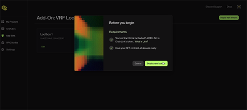

# LootBoxes

:::info

This page will walk you through our newest feature, lootboxes. It's a nifty little way to offer in game sales of items with a sense of randomness.

:::

Lootboxes are a great way to offer your users NFTs, tokens & variety of other things in a gamified way. Many things from cosmetics to in game items can be offered with a sense of randomness to help facilitate anticipation and hopefully a fun way to bring developers some much needed revenue.

## Solidity Contracts
The repo for the lootbox contracts can be found [here](https://github.com/ChainSafe/vrf-lootbox-contracts)


## Explaining The Lootbox Dashboard
There is a great video [here](https://www.loom.com/share/e06bd85195f546db9d8311b7654257f0?sid=8b8b9fbb-6bbb-4c2a-bf1f-909f07c64896) Explaining how lootbox functionality works via our marketplace.

## Addons Area
This addons area will be used to grant you access to all of our new features as we implements them. Upon entering you'll see an option to connect a wallet. You'll then be displayed with any lootbox you already have and presented with the option to create a new one.


## Deploying a new Lootbox
New lootboxes can be deployed by press the green deploy button on the top right of the dashboard in the addons area. This will give you a brief explanation on what lootboxes are as well as the requirements needed to use them.



## Adding Token Contracts To Your Lootbox
Token contracts for use within your lootboxes may be added here, you can see more of they function in the lootbox rewards area below.


## Granting Depositor Access To Your Lootbox
These addresses can be nominated as suppliers for your lootbox content.


## Sending Loot To A Contract
This area can be used to send loot to a contract.


## Updating Your Lootbox Rewards
Here you can update all of the various reward amounts that your lootboxes contain as well as any remaining balances from your suppliers.


## Minting & Transferring
Here you can send some lootboxes with reward amounts out to your friends as they are created.


## Review Summary
This section contains a summary of everything inside your lootboxes.


# Lootbox Functions Within The SDK

## Get Loot box Types
This method returns all lootbox type ids registered in the smart-contract. Lootbox type id also represents the number of rewards, that can be claimed by user when he opens the lootbox.

```csharp
    public async Task<List<uint>> GetLootboxTypes()
    {
        var response = await contract.Call("getLootboxTypes");
        var bigIntTypes = (List<BigInteger>)response[0];

        if (bigIntTypes.Any(v => v > int.MaxValue))
        {
            throw new Web3Exception(
                "Internal Error. Lootbox type is greater than int.MaxValue.");
        }

        var types = bigIntTypes.Select(bigInt => (uint)bigInt).ToList();

        return types;
    }
```

## Balance Of
This method returns the balance of lootboxes by type or specific user. Similar to how some games work, this may be used to display lootboxes in an inventory.

```csharp
    public async Task<uint> BalanceOf(uint lootboxType)
    {
        if (signer is null)
        {
            throw new Web3Exception($"No {nameof(ISigner)} was registered. Can't get current user's address.");
        }

        var playerAddress = await signer.GetAddress();

        return await BalanceOf(playerAddress, lootboxType);
    }

    public async Task<uint> BalanceOf(string account, uint lootboxType)
    {
        var response = await contract.Call(
            "balanceOf",
            new object[] { account, lootboxType });
        var bigIntBalance = (BigInteger)response[0];

        if (bigIntBalance > int.MaxValue)
        {
            throw new Web3Exception(
                "Internal Error. Balance is greater than int.MaxValue.");
        }

        var balance = (uint)bigIntBalance;

        return balance;
    }
```

## Calculate Open Price
Calculates open price for the player. This can be used to display the total cost a user would need to pay for opening X amount of lootboxes.

```csharp
    public async Task<BigInteger> CalculateOpenPrice(uint lootboxType, uint lootboxCount)
    {
        var rewardCount = lootboxType * lootboxCount;
        var rawGasPrice = (await rpcProvider.GetGasPrice()).AssertNotNull("gasPrice").Value;
        var safeGasPrice = rawGasPrice + BigInteger.Divide(rawGasPrice, new BigInteger(10)); // 110%

        var response = await contract.Call(
            "calculateOpenPrice",
            new object[] { GasPerUnit * rewardCount, safeGasPrice, rewardCount, });
        var openPrice = (BigInteger)response[0];

        return openPrice;
    }
```

## Can Claim Rewards
This method checks if a user can claim their lootbox rewards. It's a great little security check you can run before claiming.

```csharp
    public async Task<bool> CanClaimRewards(string account)
    {
        var response = await contract.Call(
            "canClaimRewards",
            new object[] { account });
        var canClaimRewards = (bool)response[0];

        return canClaimRewards;
    }
```

## Claim Rewards
This method allows a user to claim their lootbox rewards. This can be placed after the call for payment.

```csharp
    public async Task<LootboxRewards> ClaimRewards(string account)
    {
        var (_, receipt) = await contract.SendWithReceipt("claimRewards", new object[] { account });
        var logs = receipt.Logs.Select(jToken => JsonConvert.DeserializeObject<FilterLog>(jToken.ToString()));
        var eventAbi = EventExtensions.GetEventABI<RewardsClaimedEvent>();
        var eventLogs = logs
            .Select(log => eventAbi.DecodeEvent<RewardsClaimedEvent>(log))
            .Where(l => l != null);

        if (!eventLogs.Any())
        {
            throw new Web3Exception("No \"RewardsClaimed\" events were found in log's receipt.");
        }

        return ExtractRewards(eventLogs);

        LootboxRewards ExtractRewards(IEnumerable<EventLog<RewardsClaimedEvent>> eventLogs)
        {
            var rewards = LootboxRewards.Empty;

            foreach (var eventLog in eventLogs)
            {
                var eventData = eventLog.Event;
                var rewardType = rewardTypeByTokenAddress[eventData.TokenAddress];

                switch (rewardType)
                {
                    case RewardType.Erc20:
                        rewards.Erc20Rewards.Add(new Erc20Reward
                        {
                            ContractAddress = eventData.TokenAddress,
                            AmountRaw = eventData.Amount,
                        });
                        break;
                    case RewardType.Erc721:
                        rewards.Erc721Rewards.Add(new Erc721Reward
                        {
                            ContractAddress = eventData.TokenAddress,
                            TokenId = eventData.TokenId,
                        });
                        break;
                    case RewardType.Erc1155:
                        rewards.Erc1155Rewards.Add(new Erc1155Reward
                        {
                            ContractAddress = eventData.TokenAddress,
                            TokenId = eventData.TokenId,
                            Amount = eventData.Amount,
                        });
                        break;
                    case RewardType.Erc1155Nft:
                        rewards.Erc1155NftRewards.Add(new Erc1155NftReward
                        {
                            ContractAddress = eventData.TokenAddress,
                            TokenId = eventData.TokenId,
                        });
                        break;
                    case RewardType.Unset:
                    default:
                        throw new ArgumentOutOfRangeException();
                }
            }

            return rewards;
        }
    }
```

## Open Lootbox
This method allows a user to open a lootbox. This should be called last after all of the payment steps have been completed.

```csharp
    public async Task OpenLootbox(uint lootboxType, uint lootboxCount = 1)
    {
        var rewardCount = lootboxType * lootboxCount;
        var openPrice = await CalculateOpenPrice(lootboxCount, lootboxCount);

        await contract.Send(
            "open",
            new object[] { GasPerUnit * rewardCount, new[] { lootboxType }, new[] { lootboxCount } },
            new TransactionRequest { Value = new HexBigInteger(openPrice) });
    }
```

We hope you enjoy bringing our new feature to life! We've found it's a great way to easily offer virtual items to any and all users with a gamified feel.