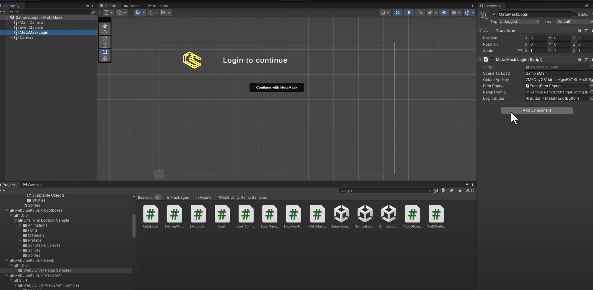
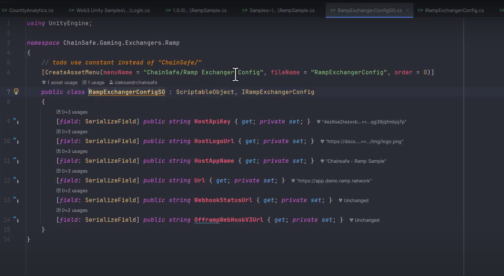
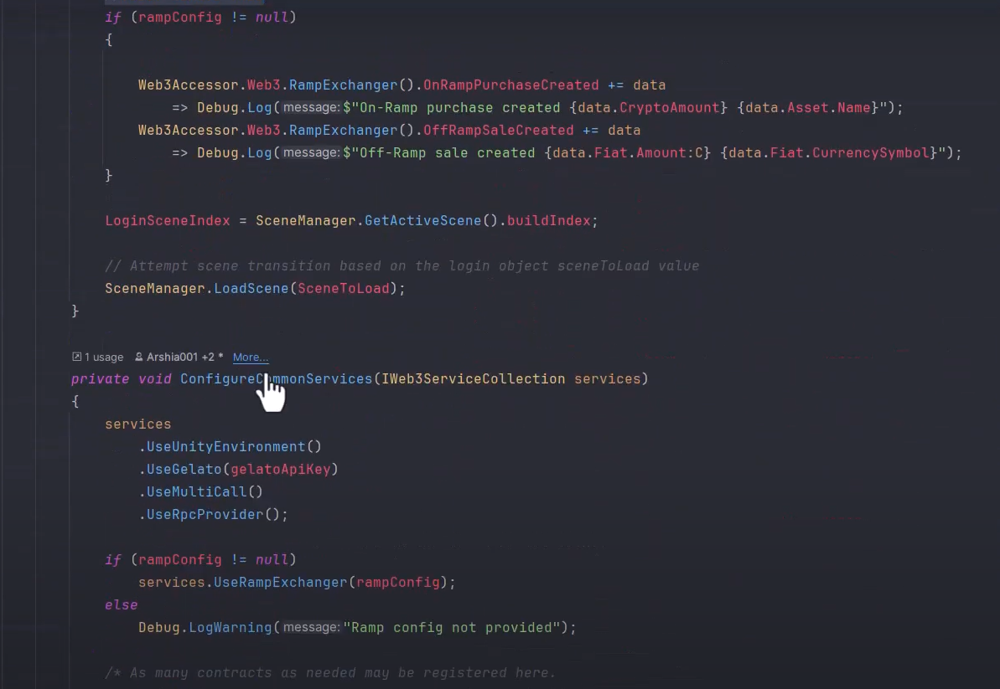
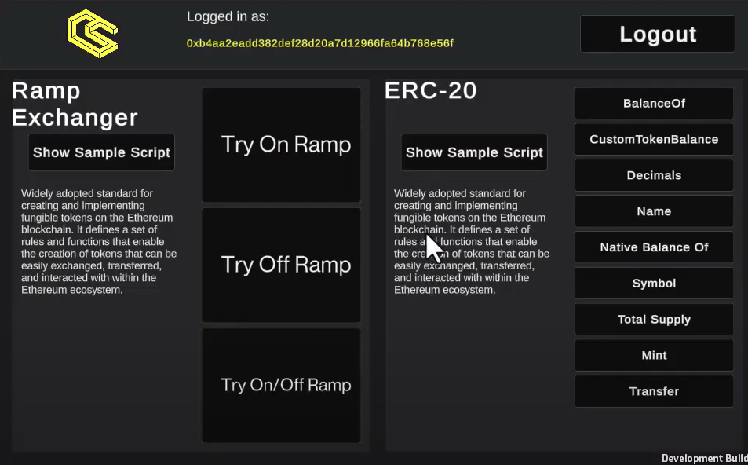
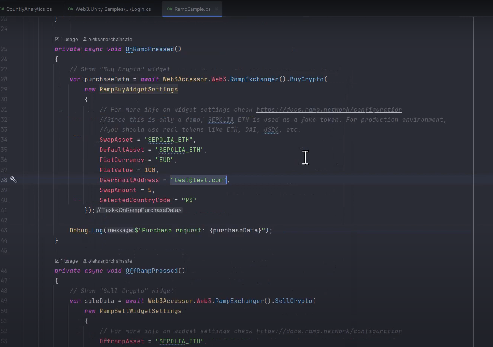
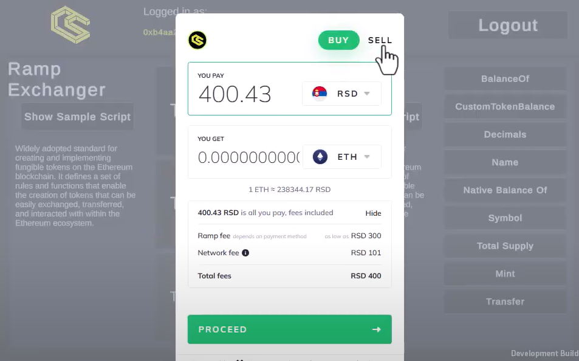
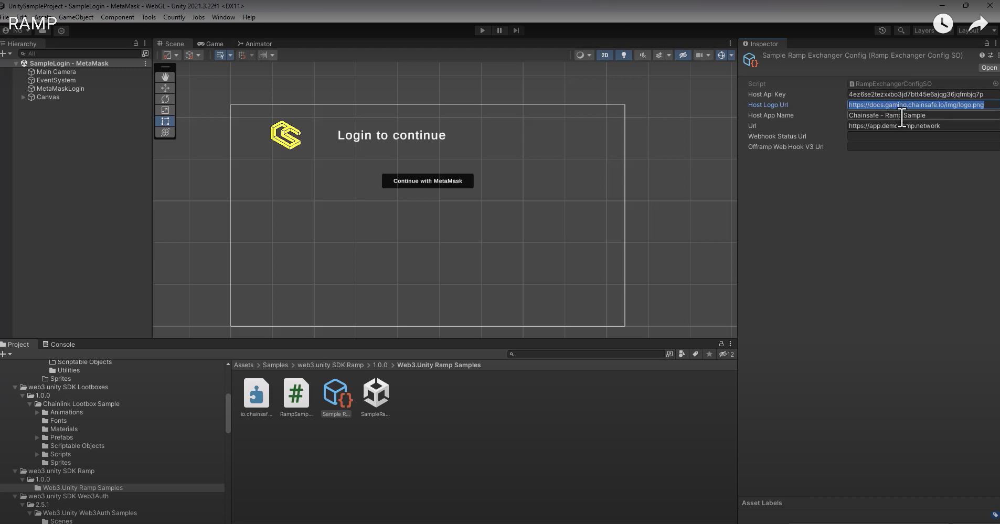

---
slug: /current/ramp
sidebar_position: 15
sidebar_label: Ramp
---


# Ramp

:::info

This page explains what Ramp is & how to use it.

:::

## What is Ramp?

Ramp is a quick and easy way to purchase crypto with Fiat currency if your country supports it.

## Why would you choose this over an exchange?

Utilizing ramp will ease the onboarding process for your users as many exchanges have a lengthy signup process before anyone can purchase native tokens, which are needed for gas or even to purchase custom tokens. Instead of having to walk your users through this process, you can simply point your users at this service and get them into your game sooner.

## Ramp video explanation

This video will show you how to initialize Ramp as well as how to use it. Below we will dissect this video into steps but if you prefer a visual approach please feel free to follow the video here.

<iframe width="800" height="450" src="https://www.youtube.com/embed/FDZXrlusmi4?si=xQ5P4oKAy8rdJhvO" title="YouTube video player" frameborder="0" allow="accelerometer; autoplay; clipboard-write; encrypted-media; gyroscope; picture-in-picture" allowfullscreen></iframe>

## Accessing Ramp from the login scene



After loading up the login scene and selecting the login object, you'll be able to see the Ramp config property in the hierarchy on the right of the editor in the inspector. Please select this script to see the Ramp object.

## The ramp scriptable object



This object contains all the configuration you'll need to begin testing out ramp in your project. You can also see that we've utilized an interface here for ease of use. Feel free to explore around and see what you can do.

## Initializing the ramp service



In the login.cs script, you can see the scriptable object above being initialized, you can add this to your custom login scene also and initialize the service as you see here. For testing purposes, we've included it in the login script so you don't have to worry about any of this.

## Ramp sample scene

Once logged in you'll be presented with our famous sample scene page which you'll notice has a new area to showcase ramp functionality. As these are testnet tokens please feel free to click around to see the functionality of the 3 functions mentioned above.



## Ramp functions



As you can see from the functions here in ramp.cs, we're providing 3 different types of ramp functionality for use with your project. This can be accessed through the Web3 object as needed. You can also check out the ramp configuration docs [here](https://docs.ramp.network/configuration) if you would like to add additional settings or use other tokens besides sepolia eth.

### On ramp

This will allow your users to purchase crypto currency with Fiat through your app.

```csharp
private async void OnRampPressed()
{
    // Show "Buy Crypto" widget
    var purchaseData = await Web3Accessor.Web3.RampExchanger().BuyCrypto(
        new RampBuyWidgetSettings
        {
            // For more info on widget settings check https://docs.ramp.network/configuration
            //Since this is only a demo, SEPOLIA_ETH is used as a fake token. For production environment,
            //you should use real tokens like ETH, DAI, USDC, etc.
            SwapAsset = "SEPOLIA_ETH",
            DefaultAsset = "SEPOLIA_ETH",
            FiatCurrency = "EUR",
            FiatValue = 100,
            UserEmailAddress = "test@test.com",
            SwapAmount = 5,
            SelectedCountryCode = "RS"
        });

    Debug.Log($"Purchase request: {purchaseData}");
}
```

### Off ramp

This will allow your users to sell crypto currency for Fiat through your app.

```csharp
private async void OffRampPressed()
{
    // Show "Sell Crypto" widget
    var saleData = await Web3Accessor.Web3.RampExchanger().SellCrypto(
        new RampSellWidgetSettings
        {
            // For more info on widget settings check https://docs.ramp.network/configuration
            OfframpAsset = "SEPOLIA_ETH",
            DefaultAsset = "SEPOLIA_ETH",
            FiatCurrency = "EUR",
            FiatValue = 100,
            UserEmailAddress = "test@test.com",
            SwapAmount = 5,
            SelectedCountryCode = "RS"            
        });

    Debug.Log($"OffRamp: {saleData}");
}
```

### On & Off Ramp

This will allow your users to both buy & sell crypto currency with Fiat through your app.

```csharp
private async void OnRampOffRampPressed()
{
    // Show "Buy or Sell Crypto" widget
    var rampTransactionData = await Web3Accessor.Web3.RampExchanger().BuyOrSellCrypto(
        new RampBuyOrSellWidgetSettings
        {
            // For more info on widget settings check https://docs.ramp.network/configuration 
            SwapAsset = "SEPOLIA_ETH",
            OfframpAsset = "SEPOLIA_ETH",
            DefaultAsset = "SEPOLIA_ETH",
            FiatCurrency = "EUR",
            FiatValue = 100,
            UserEmailAddress = "test@test.com",
            SwapAmount = 5,
            SelectedCountryCode = "RS"
        });

    Debug.Log(rampTransactionData.ToString());
}
```



As some projects will only want to facilitate purchases, others will want sales and some will want to use both. We've provided all the necessary functionality to do so. All of these functions are set up asynchronously and are being passed through event systems which you can subscribe to as needed.

```csharp
if (rampConfig != null)
{
    
    Web3Accessor.Web3.RampExchanger().OnRampPurchaseCreated += data 
        => Debug.Log($"On-Ramp purchase created {data.CryptoAmount} {data.Asset.Name}");
    Web3Accessor.Web3.RampExchanger().OffRampSaleCreated += data
        => Debug.Log($"Off-Ramp sale created {data.Fiat.Amount:C} {data.Fiat.CurrencySymbol}");
}
```

## Changing the company logo, app name & API key

By selecting the ramp object you're able to customize the logo (currently we're using the ChainSafe logo) You can place whichever logo & app name you'd like in here along with your API key which you can get from [here](https://docs.ramp.network/configuration) as needed.



We hope you enjoy our new ramp service & the functionality it provides in terms of easing user onboarding. Happy coding!