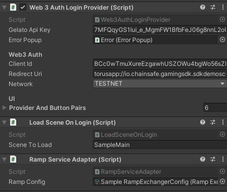

# Ramp

:::info

This page explains what Ramp is & how to use it.

:::

## What is Ramp?

Ramp is a quick and easy way to purchase crypto with Fiat currency if your country supports it.

## Why would you choose this over an exchange?

Utilizing ramp will ease the onboarding process for your users as many exchanges have a lengthy sign up process before anyone can purchase native tokens, which are needed for gas or even to purchase custom tokens. Instead of having to walk your users through this process, you can simply point your users at this service and get them into your game sooner.

## Acquiring Ramps API Key
Before you can utilize Ramp, you will need the API key. Currently, the only possible way to do that is to go trough ramp.network and register there. After the KYB process, you should get your key.
More straightforward process is coming soon to our dashboard, where you'd be able to acquire the API key trough our own dashboard.

## Ramp video explanation

This video will show you how to initialize Ramp as well as how to use it. Below we will dissect this video into steps but if you prefer a visual approach please feel free to follow the video here.

<iframe width="800" height="450" src="https://www.youtube.com/embed/oOxc52AIRkk" title="YouTube video player" frameborder="0" allow="accelerometer; autoplay; clipboard-write; encrypted-media; gyroscope; picture-in-picture" allowfullscreen></iframe>

## Initializing Ramp


As you can see, there is a `RampServiceAdapter` attached to the game object that is responsible for logging in your user. We highly encourage to attach all the necessary services you want to add to the login object itself, because we're retrieving the `IWeb3BuilderServiceAdapter` from the object that implements the `ILoginProvider`, in this case, that's `Web3AuthLoginProvider`.

As you can see, the `RampServiceAdapter`has one field, and that's the ramp scriptable object. We're providing the Scriptable Object as part of the Ramp Package sample.

## The Ramp scriptable object


This object contains all the configuration you'll need to begin testing out Ramp in your project. You can also see that we've utilized an interface here for ease of use. Feel free to explore around and see what you can do.

## Changing the company logo, app name & API key

By selecting the ramp scriptable object you're able to customize the logo (currently we're using the ChainSafe logo) You can place whichever logo & app name you'd like in here along with your API key which you can get from [here](https://docs.ramp.network/configuration) as needed.


## Accessing Ramp Trough Sample Scene

Once logged in you'll be presented with our famous sample scene page, which you'll notice has a new area to showcase Ramp functionality. As these are testnet tokens please feel free to click around to see the functionality of the 3 functions mentioned above.


## Ramp functions


As you can see from the functions here in ramp.cs, we're providing 3 different types of ramp functionality for use with your project. This can be accessed through the Web3 object as needed. You can also check out the ramp configuration docs [here](https://docs.ramp.network/configuration) if you would like to add additional settings or use other tokens besides sepolia eth.

### On-ramp

This will allow your users to purchase crypto currency with Fiat through your app.

```csharp
private async void OnRampPressed()
{
    // Show "Buy Crypto" widget
    var purchaseData = await Web3Accessor.Web3.RampExchanger().BuyCrypto(
        new RampBuyWidgetSettings
        {
            // For more info on widget settings check https://docs.ramp.network/configuration
            //Since this is only a demo, SEPOLIA_ETH is used as a fake token. For production environment,
            //you should use real tokens like ETH, DAI, USDC, etc.
            SwapAsset = "SEPOLIA_ETH",
            DefaultAsset = "SEPOLIA_ETH",
            FiatCurrency = "EUR",
            FiatValue = 100,
            UserEmailAddress = "test@test.com",
            SwapAmount = 5,
            SelectedCountryCode = "RS"
        });

    Debug.Log($"Purchase request: {purchaseData}");
}
```

### Off-ramp

This will allow your users to sell crypto currency for Fiat through your app.

```csharp
private async void OffRampPressed()
{
    // Show "Sell Crypto" widget
    var saleData = await Web3Accessor.Web3.RampExchanger().SellCrypto(
        new RampSellWidgetSettings
        {
            // For more info on widget settings check https://docs.ramp.network/configuration
            OfframpAsset = "SEPOLIA_ETH",
            DefaultAsset = "SEPOLIA_ETH",
            FiatCurrency = "EUR",
            FiatValue = 100,
            UserEmailAddress = "test@test.com",
            SwapAmount = 5,
            SelectedCountryCode = "RS"            
        });

    Debug.Log($"OffRamp: {saleData}");
}
```

### On- & Off-ramp

This will allow your users to both buy & sell crypto currency with Fiat through your app.

```csharp
private async void OnRampOffRampPressed()
{
    // Show "Buy or Sell Crypto" widget
    var rampTransactionData = await Web3Accessor.Web3.RampExchanger().BuyOrSellCrypto(
        new RampBuyOrSellWidgetSettings
        {
            // For more info on widget settings check https://docs.ramp.network/configuration 
            SwapAsset = "SEPOLIA_ETH",
            OfframpAsset = "SEPOLIA_ETH",
            DefaultAsset = "SEPOLIA_ETH",
            FiatCurrency = "EUR",
            FiatValue = 100,
            UserEmailAddress = "test@test.com",
            SwapAmount = 5,
            SelectedCountryCode = "RS"
        });

    Debug.Log(rampTransactionData.ToString());
}
```


As some projects will only want to facilitate purchases, others will want sales and some will want to use both. We've provided all the necessary functionality to do so. All of these functions are set up asynchronously and are being passed through event systems which you can subscribe to as needed.

## Subscribing To Events
Our Ramp integration comes with two events `OnRampPurchaseCreated` and `OffRampSaleCreated` which happen when your user buys or sells crypto.

```csharp

Web3Accessor.Web3.RampExchanger().OnRampPurchaseCreated += data 
    => Debug.Log($"On-Ramp purchase created {data.CryptoAmount} {data.Asset.Name}");
Web3Accessor.Web3.RampExchanger().OffRampSaleCreated += data
    => Debug.Log($"Off-Ramp sale created {data.Fiat.Amount:C} {data.Fiat.CurrencySymbol}");
```

## Ramp on WebGL

Ramp on WebGL Builds on Unity v2022.3 and up throws an error while loading the Ramp Widget, the exact error message is 
```
Specify a Cross-Origin Resource Policy to prevent a resource from being blocked
```
This is a local/localhost specific error and doesn't happen on real domains during deployment. If you want to test ramp locally follow these steps
1. Make a WebGL build **NOT** Build And Run, Make sure `Player Settings > WebGL > Compression Format` isn't set to Brotli
2. Navigate to the build directory and setup a server on port 8000
   Windows: Navigate to Build directory open terminal and run command `"[Unity Editor Directory]/Editor/Data/MonoBleedingEdge/bin/mono.exe" "[Unity Editor Directory]/Editor/Data/PlaybackEngines/WebGLSupport/BuildTools/SimpleWebServer.exe" "[Build Directory]" 8000` [Unity Editor Directory] is usually `C:/Program Files/Unity/Hub/Editor/2022.3.../`
   Mac/Linux: Install [Python](https://www.python.org/downloads/) and in the Build directory open terminal and run command `py -m http.server`
3. Run build using [https://localhost:8000](https://localhost:8000)

Now you should be able to test Ramp locally on WebGL!

We hope you enjoy our new Ramp service & the functionality it provides in terms of easing user onboarding. Happy coding!
