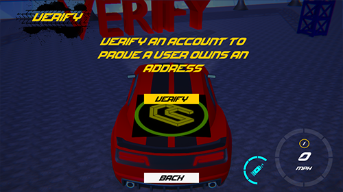
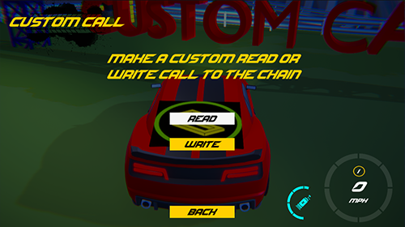
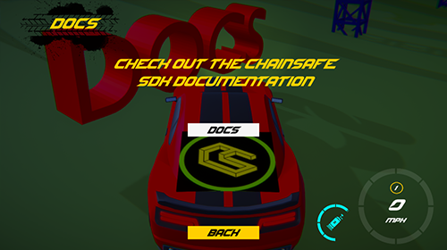

# Example Scene

:::info

This example scene was built to show off working functions for your reference.

:::

By going to the login screen in web3unity/scenes/ you can see the SDK's functions with working examples.

## Connecting To A Wallet 
In the login scene you'll be presented with a few different login options. You may choose either Web3Auth options, gelato, standard wallet connections or wallet connect if you're on WebGL.

## Web3Auth Functionality
Most functions will work with Web3Auth. If your chain is supported by Gelato and you have an API key you may use them as well.

## Gelato Functionality
If you have an API key present with some native tokens set you'll be able to call the Gelato functions.


## Scene Layout
Continuing on, there are a bunch of standard functions which we'll go through below.


## Signing
This will generate a unique signature from a user that you may use for authorization purposes.


```csharp
// Csharp here
```

## Verify
This will verify a signature from a wallet to prove its owners address.



```csharp
// Csharp here
```

## Mint
This can be used to mint ERC20 Race tokens or even native tokens via the faucet to pay for things within game.


```csharp
// Csharp here
```

## Transfer
This will allow you to transfer ERC20 Race tokens between wallets.


```csharp
// Csharp here
```

## Custom Call
This will allow you to make a custom call, we've included 2 examples here. 1 being read which checks a contracts state variable and another being write which adds to the sate variable of a contract. You may read it again after to see changes.



```csharp
// Csharp here
```

## Docs
Clicking this button will take you to ChainSafe's documentation [here](https://docs.gaming.chainsafe.io/)



```csharp
// Csharp here
```