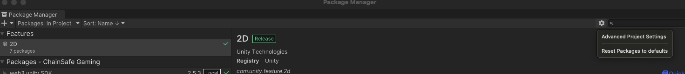
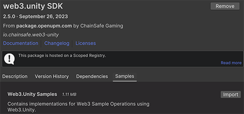
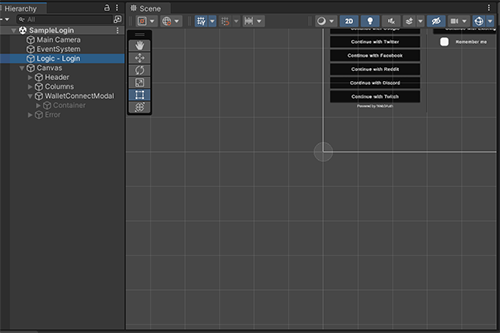
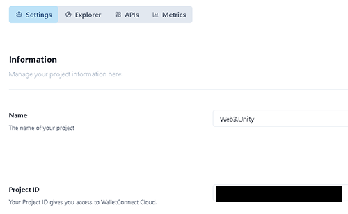
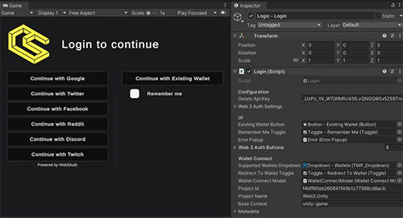
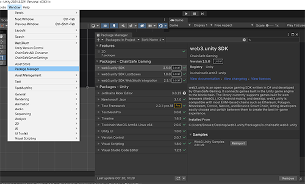
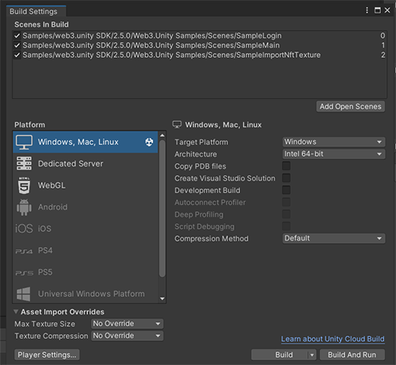
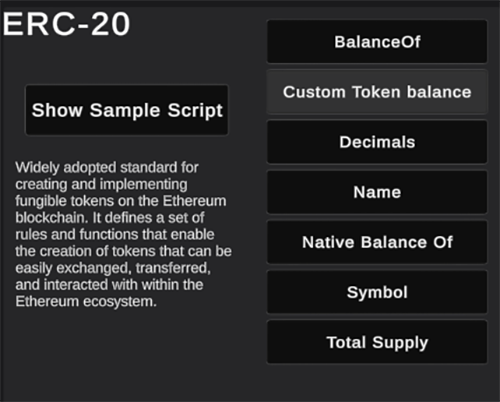
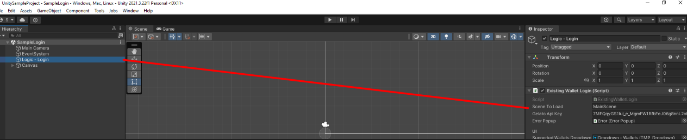

---
slug: /current/getting-started
sidebar_position: 1
sidebar_label: Getting Started
---


# Getting Started

:::info

This page will walk you through the process of setting up a project ID and using the new API.

:::

<!-- ### Install via UPM


1. Open up your project in editor
2. Go to Windows/Package Manager
3. Click on "+", "Add package from git url"
4. Paste "%GIT_URL_HERE%"
5. Package will be installed -->

### Install via Package Manager With Open UPM

1. On the top bar in unity, navigate to Window -> Package Manager -> Gear icon -> Advanced Project Settings.

2. Add a new scoped registry or edit the existing OpenUPM entry if it's already there.
3. Save the following details to the scope:
```csharp
Name: package.openupm.com
URL: https://package.openupm.com
Scope: io.chainsafe.web3-unity
```
4. Add a new package by name by pressing + -> Add package by name & entering ```io.chainsafe.web3-unity```.
5. Next go to the web3.unity SDK package and install the examples by going the samples tab and pressing import.


### Install via Open UPM CLI

1. Open up your project in editor
2. Follow the OpenUPM guide here to install openupm-cli
3. Navigate to your Unity Project folder and run the commands ```openupm add io.chainsafe.web3-unity``` & ```openupm add io.chainsafe.web3-unity.web3auth```
4. Follow step 5 above to install the sample packages and explore the SDK.

### Install via Tool

Alternatively if you'd like an easier install process you can check out the repo from NFTPixels [here](https://github.com/nftpixels/Web3-Unity-Package-Downloader/releases). Simply install the package into your project, then go to Tools -> Web3.Unity Package Manager and press download. After installation you can follow step 5 above to install the sample packages and explore the SDK.

### Updating via The Package Manager

Updating the SDK is easy. Simply go to window -> package manager -> select the ChainSafe SDK package & press update. The same can be done for any additional packages you have installed, web3auth, lootboxes etc.

### Set Project ID

As the package is installed, you'll be prompted with settings window.
First of all you have to setup your Project ID. You can get one [here](https://dashboard.gaming.chainsafe.io/).

For more information on Project ID, see [Project ID Registration](https://docs.gaming.chainsafe.io/current/project-id-registration).

After you've completed the registration process, copy your Project ID into the project settings
window. Save settings. You should see a message in the console saying your project id is valid.

### Other Settings


You should also setup default settings for the RPC node you're going to use.

- Chain ID - search using you chain name here https://chainlist.org, 11155111 for sepolia.
- Chain name - i.e Sepolia
- Network - i.e Ethereum
- Symbol - i.e SETH
- Rpc - enter URL to your RPC node here. For information on setting up an RPC Node visit [this page](https://docs.gaming.chainsafe.io/current/setting-up-an-rpc-node).

### Wallet Connect

When you open the login scene you'll see a login object in the hierarchy on the left under the canvas. Select it and you'll see wallet connect configuration inputs in the inspector on the right. Please note that wallet connect webgl is currently not 100% functional for most chains. A fix is coming early next year for this. 



We've already given you some default values for the wallet connect configuration so if you're fine with using the same endpoint as everyone else just leave it as is. Otherwise head on over to the dashboard at [Wallet Connect](https://cloud.walletconnect.com/sign-in) to sign up and get your own details.


Once you're in the Wallet Connect dashboard area, you can press the button on the top right to create a new project, it will ask you to give the project a name.


Once you've created the project you'll be taken to the settings area. Here you'll find the input details you need, the project name and the project id.



Just place these into the editor values, press save and you're good to go.



### Example Scene

If you navigate to Window -> Package Manager -> Web3Unity SDK -> Samples, you can import an example package to help you understand the SDK. Press import and let it load into the project. You'll see some new files in your project under samples, these files contain everything we need to get started with the SDK. Have a look around, check out the script and the scene locations.



You'll notice when you import the samples into the project that some scenes are added to your build configuration. This is to show you a demo of how all the functions in the SDK work. Simply go to the sample log in scene and press play to connect a wallet to get started with some examples.



Once you've logged in it will take you to the main scene. You can play around in the menus and check out each scripts functionality by pressing the show script button, this will highlight the script in the editor and allow you to inspect it further. If you're an advanced developer you should have enough to work with from the sample scripts in front of you. If you're just beginning we suggest you take a look at our easy to use prefabs below.



### Altering Login Scene Transition
If you would like to have the login screen go to a custom scene after authorization, you can alter the inspector value on the login object in the scenes hierarchy to your scene name as show below. By default it will be set the sample scene for examples sake.



### Prefab Scripts

We've created some easy to use prefab scripts, think of it as a beginner friendly layer. Feel free to check out the prefab scripts area of the docs [here](https://docs.gaming.chainsafe.io/current/prefab-scripts), you'll find helpful snippets of code that you can drop in and out of your scenes. Please note that you must have the samples package above installed to use the prefab scripts or they'll be missing some dependencies.