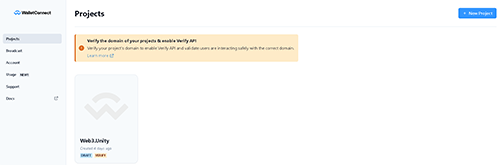
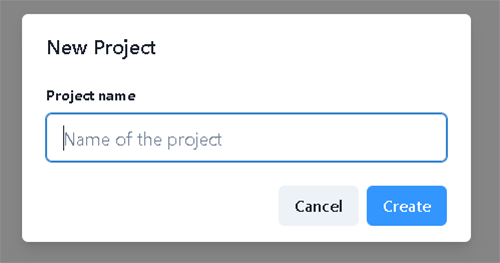

# Getting Started

:::info

This page will walk you through the process of setting up a project ID and using the new API.

:::

<!-- ### Install via UPM


1. Open up your project in editor
2. Go to Windows/Package Manager
3. Click on "+", "Add package from git url"
4. Paste "%GIT_URL_HERE%"
5. Package will be installed -->

### Install via Open UPM

1. Open up your project in editor
2. Follow the OpenUPM guide [here](https://openupm.com/docs/getting-started.html) to install openupm-cli
3. Navigate to your Unity Project folder and run the commands ```openupm add io.chainsafe.web3-unity``` & ```openupm add io.chainsafe.web3-unity.web3auth```
4. Import Samples from Package Manager web3.unity Package Page

5. Packages will be installed and the SDK will be available to you.

### Updating via The Package Manager
Updating the SDK is easy. Simply go to window -> package manager -> select the ChainSafe SDK package & press update. The same can be done for any additional packages you have installed, web3auth, lootboxes etc.

### Set Project ID

As the package is installed, you'll be prompted with settings window.
First of all you have to setup your Project ID. You can get one [here](https://dashboard.gaming.chainsafe.io/).

For more information on Project ID, see [Project ID Registration](https://docs.gaming.chainsafe.io/current/project-id-registration).

After you've completed the registration process, copy your Project ID into the project settings
window. Save settings. You should see a message in the console saying your project id is valid.

### Other Settings


You should also setup default settings for the RPC node you're going to use.

- Chain ID - search using you chain name here https://chainlist.org, 11155111 for sepolia.
- Chain name - i.e Sepolia
- Network - i.e Ethereum
- Symbol - i.e SETH
- Rpc - enter URL to your RPC node here. For information on setting up an RPC Node visit [this page](https://docs.gaming.chainsafe.io/current/setting-up-an-rpc-node).

### Wallet Connect

When you open the login scene you'll see a login object in the hierarchy on the left under the canvas. Select it and you'll see wallet connect configuration inputs in the inspector on the right. Please note that wallet connect webgl is currently not 100% functional for most chains. A fix is coming early next year for this. 


We've already given you some default values for the wallet connect configuration so if you're fine with using the same endpoint as everyone else just leave it as is. Otherwise head on over to the dashboard at [Wallet Connect](https://cloud.walletconnect.com/sign-in) to sign up and get your own details.



Once you're in the Wallet Connect dashboard area, you can press the button on the top right to create a new project, it will ask you to give the project a name.



Once you've created the project you'll be taken to the settings area. Here you'll find the input details you need, the project name and the project id.


Just place these into the editor values, press save and you're good to go.


### Example Scene

If you navigate to Window -> Package Manager -> Web3Unity SDK -> Samples, you can import an example package to help you understand the SDK. Press import and let it load into the project. You'll see some new files in your project under samples, these files contain everything we need to get started with the SDK. Have a look around, check out the script and the scene locations.


You'll notice when you import the samples into the project that some scenes are added to your build configuration. This is to show you a demo of how all the functions in the SDK work. Simply go to the sample log in scene and press play to connect a wallet to get started with some examples.


Once you've logged in it will take you to the main scene. You can play around in the menus and check out each scripts functionality by pressing the show script button, this will highlight the script in the editor and allow you to inspect it further. If you're an advanced developer you should have enough to work with from the sample scripts in front of you. If you're just beginning we suggest you take a look at our easy to use prefabs below.


### Prefab Scripts

We've created some easy to use prefab scripts, think of it as a beginner friendly layer. Feel free to check out the prefab scripts area of the docs [here](https://docs.gaming.chainsafe.io/current/prefab-scripts), you'll find helpful snippets of code that you can drop in and out of your scenes. Please note that you must have the samples package above installed to use the prefab scripts or they'll be missing some dependencies.

### Introduction to API

Now let's create a script that will access user's eth balance with the account address provided.
Create new MonoBehaviour class. Use "Start" method to initialize your web3 instance.

```csharp
public class MyWeb3Behaviour : MonoBehaviour
{
    private async void Start()
    {
        var projectConfig = ProjectConfigUtilities.Load();
        var web3 = await new Web3Builder(projectConfig)
            .Configure(services => { })
            .BuildAsync();
    }
}
```

Notice that Start method is marked as `async` to be able to build web3 instance 
as it is an asynchronous operation.

Next let's configure our web3 instance for our specific purposes. 
We would need to bind a UnityEnvironment and a JsonRpcProvider services to be able
to do basic read operations.

```csharp
var web3 = await new Web3Builder(projectConfig)
    .Configure(services =>
    {
        services.UseUnityEnvironment();
        services.UseJsonRpcProvider();
    })
    .BuildAsync();
```

Configuration complete. Now let's get eth balance for the provided account address.

```csharp
var address = "0xaBed4239E4855E120fDA34aDBEABDd2911626BA1";
var ethBalance = await web3.RpcProvider.GetBalance(address);
```

That's how you configure a web3 instance and get balance using ChainSafe Gaming SDK.
You can find more cool features with examples in this documentation.

Complete script file for this section:

```csharp
using ChainSafe.Gaming.Build;
using ChainSafe.Gaming.Evm.JsonRpcProvider;
using ChainSafe.Gaming.Unity.Environment;
using ChainSafe.Gaming.UnityPackage;
using UnityEngine;

public class MyWeb3Behaviour : MonoBehaviour
{
    private async void Start()
    {
        var projectConfig = ProjectConfigUtilities.Load();
        var web3 = await new Web3Builder(projectConfig)
            .Configure(services =>
            {
                services.UseUnityEnvironment();
                services.UseJsonRpcProvider();
            })
            .BuildAsync();

        var address = "0xaBed4239E4855E120fDA34aDBEABDd2911626BA1";
        var ethBalance = await web3.RpcProvider.GetBalance(address);
    }
}
```