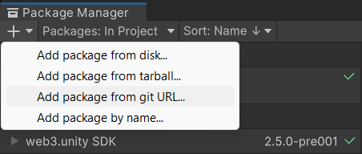
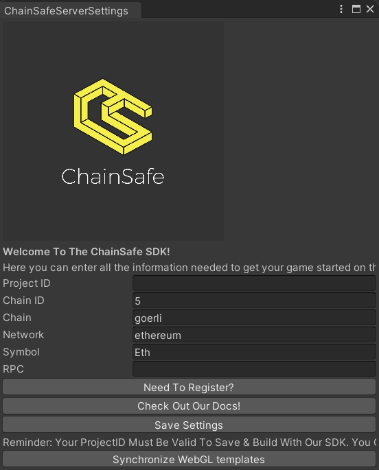

---
slug: /current/getting-started
sidebar_position: 2
sidebar_label: Getting Started
---


# Getting Started

### Install via UPM



1. Open up your project in editor
2. Go to Windows/Package Manager
3. Click on "+", "Add package from git url"
4. Paste "%GIT_URL_HERE%"
5. Package will be installed

### Set Project ID

As the package is installed, you'll be prompted with settings window.
First of all you have to setup your Project ID. You can [get one here](https://dashboard.gaming.chainsafe.io/).

For more information on Project ID, see [Project ID Registration](https://docs.gaming.chainsafe.io/current/project-id-registration).

After you've completed the registration process, copy your Project ID into the project settings
window. Save settings. You should see a message in the console saying your project id is valid.

### Other settings



You should also setup default settings for the RPC node you're going to use.

- Chain ID - search using you chain name here https://chainlist.org, 5 for goerli.
- Chain name - To Do description
- Network - To Do description
- Symbol - To Do description
- Rpc - enter URL to your RPC node here. For information on setting up an RPC Node visit [this page](https://docs.gaming.chainsafe.io/current/setting-up-an-rpc-node).

### Introduction to API

Now let's create a script that will access user's eth balance with the account address provided.
Create new MonoBehaviour class. Use "Start" method to initialize your web3 instance.

```csharp
public class MyWeb3Behaviour : MonoBehaviour
{
    private async void Start()
    {
        var projectConfig = ProjectConfigUtilities.Load();
        var web3 = await new Web3Builder(projectConfig)
            .Configure(services => { })
            .BuildAsync();
    }
}
```

Notice that Start method is marked as `async` to be able to build web3 instance 
as it is an asynchronous operation.

Next let's configure our web3 instance for our specific purposes. 
We would need to bind a UnityEnvironment and a JsonRpcProvider services to be able
to do basic read operations.

```csharp
var web3 = await new Web3Builder(projectConfig)
    .Configure(services =>
    {
        services.UseUnityEnvironment();
        services.UseJsonRpcProvider();
    })
    .BuildAsync();
```

Configuration complete. Now let's get eth balance for the provided account address.

```csharp
var address = "0xaBed4239E4855E120fDA34aDBEABDd2911626BA1";
var ethBalance = await web3.RpcProvider.GetBalance(address);
```

That's how you configure a web3 instance and get balance using ChainSafe Gaming SDK.
You can find more cool features with examples in this documentation.

Complete script file for this section:

```csharp
using ChainSafe.Gaming.Build;
using ChainSafe.Gaming.Evm.JsonRpcProvider;
using ChainSafe.Gaming.Unity.Environment;
using ChainSafe.Gaming.UnityPackage;
using UnityEngine;

public class MyWeb3Behaviour : MonoBehaviour
{
    private async void Start()
    {
        var projectConfig = ProjectConfigUtilities.Load();
        var web3 = await new Web3Builder(projectConfig)
            .Configure(services =>
            {
                services.UseUnityEnvironment();
                services.UseJsonRpcProvider();
            })
            .BuildAsync();

        var address = "0xaBed4239E4855E120fDA34aDBEABDd2911626BA1";
        var ethBalance = await web3.RpcProvider.GetBalance(address);
    }
}
```