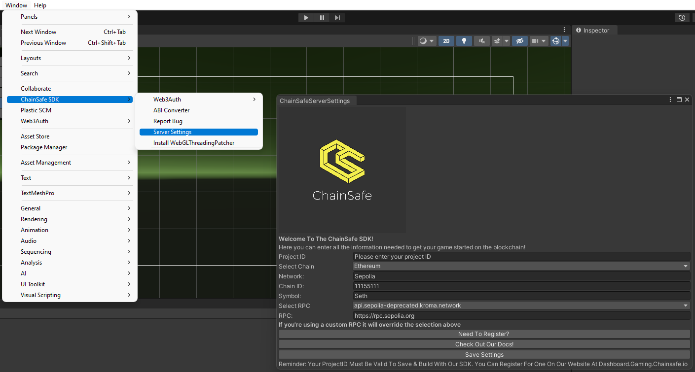

# Project ID Registration

:::info

In order to configure the web3.unity SDK properly, you must first register your projects with ChainSafe Gaming, and then setup your own RPC node.
The following section goes over how to register your projects with ChainSafe Gaming to gain access to various features in the web3.unity SDK.
:::

### Setting The Context

As the user base for web3.unity grows and we look toward decentralizing the SDK, we’re finding it more important than ever to scale our ability to keep in touch with users. We want to continue learning what features and bug fixes matter most to you, share important security and feature updates, assess web3.unity’s impact as a public good, and start building more substantial relationships with studios and devs so we can help you succeed.

Historically, we’ve relied on a combination of Discord conversations and API-level aggregate analytics to understand how devs use our tools and get in touch with updates. To make sure we’re getting a clear picture of user patterns and reliable contact info on a per-game basis (including devs who aren’t here in Discord often), we need your help registering projects you create.

### Registering Your Project With ChainSafe Gaming

Registration of your Unity game project will allow us to offer a more hands-on approach when it comes to debugging and catching errors in your blockchain calls. In the following sections, we will walk you through signing up and validating your Project ID within Unity, as well as all of the initial project steps you will need to follow in order to get started with your Unity NFT game project.

### Sign-up On The Dashboard Via Email 

Please sign up via email. You can get to our sign-up dashboard by clicking the link [here](https://dashboard.gaming.chainsafe.io/).

The email you provide will be used for ChainSafe Gaming feature and security updates, onboarding support, requesting your product feedback, and exploring partnership opportunities with ChainSafe for your game. We will also eventually deploy a developer dashboard as a place to give you visibility on your games’ performance, add details about your game so we can showcase and drive traffic to it, and organize your assets to make building even easier.

### Enter The Verification Code Sent To Your Email

Our sign-up process is password-free for security purposes. You will be sent an authorization code to your chosen email. Please enter this verification code during registration to unlock your dashboard. This verification process is implemented in a way that mitigates opportunities for malicious third parties from stealing your data.

### Press The Create Button To Create Your Project

### Enter A Project Name

Please enter your game title and press create.

### You Will Be Presented With A Project ID

This is your Project ID. Copy it and please keep it safe! Please don't give it away to other users. We use this to help identify and support you within the blockchain gaming space. You can press the edit or delete buttons to alter your project name or delete the ID as needed.

Please keep your Project ID handy as you'll need it once you've installed the SDK package from our [GitHub](https://github.com/ChainSafe/web3.unity/releases).

### Open Unity And Install The web3.unity Package

Upon installing the newest release, you'll be presented with a debug error that will stop you from editing or building. This is where you will enter your Project ID to unlock all of web3.unity's build features.

### Saving Your Project ID Within Unity

In the menu bar near the top, you can press `Window` -> `ChainSafe Server Settings`, which will prompt a pop-up. From here, you can enter your Project ID along with chain information associated with your game. Once complete, press save, and that's it! You're ready to start building with web3.unity!

### Additional Support

Thank you for signing up with us. You're now free to explore the web3.unity SDK at your own pace. We hope you enjoy the build experience with ChainSafe Gaming, and we are looking forward to exploring the frontiers of blockchain gaming with you.

### How To Register A Project With web3.unity Video Tutorial

Here is NFTPixels with a video tutorial on signing up and registering for a project ID with web3.unity:

<iframe width="800" height="450" src="https://www.youtube.com/embed/TbDGaySQ1Io?list=PLPn3rQCo3XrMkgAqFRtih9xGIKciD0b0N" title="How To Register A Project With web3.unity" frameborder="0" allow="accelerometer; autoplay; clipboard-write; encrypted-media; gyroscope; picture-in-picture; web-share" allowfullscreen></iframe>