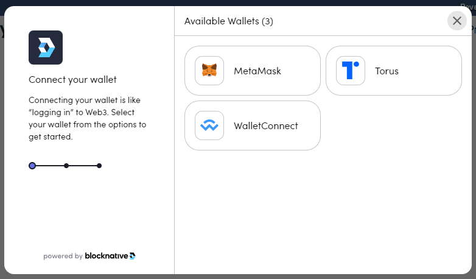

# Signers and Wallets

As we learned in the previous section wallet is essentially Signer + Transaction executor.
Meaning it has access to key pairs of the currently active user and it can also send a transaction 
for execution.

It's not always the case, but when it is, you should use `Use$Name$Wallet()` to bind the wallet implementation.
This would bind both Signer & Transaction Executor.

There are 2 implementations of wallet available at the moment: WebPageWallet and WebGLWallet.

### WebPageWallet

WebPageWallet is a cross-platform implementation, that you can use on most platforms.
It works by opening up a new browser page which delegates all calls to a wallet extension installed
in the browser. User than copies the result of the operation and when he comes back to the game,
result is read from the buffer and operation completes.

You can bind it with `services.UseWebPageWallet()`:
```csharp
using ChainSafe.Gaming.Build;
using ChainSafe.Gaming.Wallets.WebPage;

var web3 = await new Web3Builder(projectConfig)
    .Configure(services =>
    {
        ...
        services.UseWebPageWallet();
    })
    .BuildAsync();
```

You can also configure WebPageWallet like this:

```csharp
services.UseWebPageWallet(
    new WebPageWalletConfig
    {
        // Build a message that will be shown to user when he's prompted to sign a message
        ConnectMessageBuilder = expireTime => $"Sign me till {expireTime:hh:mm:ss}}",
        
        // Timeout for a wallet connection request
        ConnectRequestExpiresAfter = TimeSpan.FromMinutes(5),
        
        // Provide last connected user address if you want to skip authentication
        SavedUserAddress = lastUserAddress,
        
        // How often should we check clipboard for the result
        ClipboardCheckPeriod = TimeSpan.FromSeconds(0.1f),
        
        // Provide your own web service instead of Chainsafe's (complex topic)
        ServiceUrl = "myawesomegame.com/webpagewallet"
    });
```

Notice `SavedUserAddress` property. You can use it to enable 'Remember Me' option for your players.
If a player enabled the 'Remember Me' toggle, store his public address somewhere and provide it
using `SavedUserAddress` next time when he starts the game. 
Send null if you want to initiate wallet connection process.

Note: We know this is not the best cross-platform wallet implementation, but that's the only one 
available at the moment. Don't worry we are already working on a new, better version ;)

### WebGLWallet

Use WebGLWallet if you're targeting WebGL platform. When user first connects his account, 
he'll be prompted to choose the wallet software. Later on all signing and sending operations 
will be delegated to this wallet.



To bind WebGLWallet call `services.UseWebGLWallet()`:
```csharp
using ChainSafe.Gaming.Build;
using ChainSafe.Gaming.Wallets.WebGLWallet;

var web3 = await new Web3Builder(projectConfig)
    .Configure(services =>
    {
        ...
        services.UseWebGLWallet();
    })
    .BuildAsync();
```

### Web3AuthSigner

In version 2.5 we've introduced a new type of signer. It provides simple Web2-like authentication
user experience for those who are new to ethereum or just don't wanna spend time creating new wallets.
You can learn what is Web3Auth and how to integrate it into your project using this link.
(TODO: add link to Web3Auth section)