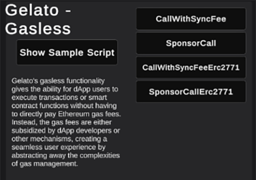

---
slug: /current/gasless-transactions-using-Gelato
sidebar_position: 11
sidebar_label: Gasless Transactions Using Gelato
---


# Gasless Transactions Using The SDK

:::info

This area will explain basic interactions for using Gelato and gasless transactions with the SDK.

:::

We've now integrated Gelato gasless transactions into the SDK to help reduce friction that some users any face when entering the blockchain world. You simply need a Gelato API key which can be obtained [here](https://relay.gelato.network/?utm_source=Referrals&utm_medium=chainsafe&utm_campaign=referrals) We have an example API key for testing purposes but this shouldn't be used in a production app. Please ensure that you're replacing this with your own key before going to production.

## Logging In With Gelato
In order to make use of our Gelato functions you need to ensure the chain has Gelato capability enabled. You can check this by logging into our sample scene. If the Gelato functions are there then you're good to go, if not you will need to wait for Gelato to update on their end in order to provide functionality for your chain. Our SDKs sample scene provides a variety of Gelato functions for you to test out.

 

## Call With Sync Fee
Once logged in you can scroll to the Gelato area in the cool new scrollable canvas that we've created for example purposes. Here you find our Gelato functions, the first being Call with sync fee.

```csharp
public async Task<TaskResult> CallWithSyncFee()
    {
        const string vitalik = "0xd8da6bf26964af9d7eed9e03e53415d37aa96045";
        const string target = "0xA045eb75e78f4988d42c3cd201365bDD5D76D406";
        const string feeToken = "0xEeeeeEeeeEeEeeEeEeEeeEEEeeeeEeeeeeeeEEeE";
        const string abi = "[{\"inputs\": [" +
                           "{\"internalType\":\"address\",\"name\":\"_token\",\"type\":\"address\"}," +
                           "{\"internalType\":\"address\",\"name\":\"_to\",\"type\":\"address\"}," +
                           "{\"internalType\":\"uint256\",\"name\":\"_amount\",\"type\":\"uint256\"}" +
                           "]," +
                           "\"name\":\"sendToFriend\"," +
                           "\"outputs\":[]," +
                           "\"stateMutability\":\"nonpayable\"," +
                           "\"type\":\"function\"" +
                           "}]";
        var contract = _web3.ContractBuilder.Build(abi, target);
        var data = contract.Calldata("sendToFriend", new object[]
        {
            feeToken,
            vitalik,
            new BigInteger(5 * 10E12),
        });

        var relayResponse = await _web3.Gelato().CallWithSyncFee(new CallWithSyncFeeRequest()
        {
            Data = data,
            FeeToken = feeToken,
            IsRelayContext = true,
            Target = target,
        });

        while (true)
        {
            var status = await _web3.Gelato().GetTaskStatus(relayResponse.TaskId);

            switch (status.TaskState)
            {
                case TaskState.ExecSuccess:
                case TaskState.ExecReverted:
                case TaskState.Cancelled:
                    return new TaskResult(relayResponse.TaskId, status);
                default:
                    await WaitForSeconds(2);
                    continue;
            }
        }
    }
```

## Sponsor Call
The second function you will find is Sponsor call.

```csharp
public async Task<TaskResult> SponsorCall()
    {
        const string counterContract = "0x763D37aB388C5cdd2Fb0849d6275802F959fbF30";

        const string abi = "[{\"inputs\": []," +
                           "\"name\":\"increment\"," +
                           "\"outputs\":[]," +
                           "\"stateMutability\":\"nonpayable\"," +
                           "\"type\":\"function\"" +
                           "}]";
        var contract = _web3.ContractBuilder.Build(abi, counterContract);

        var data = contract.Calldata("increment");

        var relayResponse = await _web3.Gelato().SponsoredCall(new SponsoredCallRequest()
        {
            Target = counterContract,
            Data = data,
        });

        while (true)
        {
            var status = await _web3.Gelato().GetTaskStatus(relayResponse.TaskId);

            switch (status.TaskState)
            {
                case TaskState.ExecSuccess:
                case TaskState.ExecReverted:
                case TaskState.Cancelled:
                    return new TaskResult(relayResponse.TaskId, status);
                default:
                    await WaitForSeconds(2);
                    continue;
            }
        }
    }
```

## Call With Sync Fee Erc2771
The third function you will find is Call with sync fee Erc2771.

```csharp
public async Task<TaskResult> CallWithSyncFeeErc2771()
    {
        const string target = "0x5dD1100f23278e0e27972eacb4F1B81D97D071B7";
        const string feeToken = "0xEeeeeEeeeEeEeeEeEeEeeEEEeeeeEeeeeeeeEEeE";
        const string abi = "[{\"inputs\": []," +
                           "\"name\":\"increment\"," +
                           "\"outputs\":[]," +
                           "\"stateMutability\":\"nonpayable\"," +
                           "\"type\":\"function\"" +
                           "}]";
        var contract = _web3.ContractBuilder.Build(abi, target);

        var data = contract.Calldata("increment", new object[]
        {
        });

        var relayResponse = await _web3.Gelato().CallWithSyncFeeErc2771(new CallWithSyncFeeErc2771Request()
        {
            Target = target,
            Data = data,
            FeeToken = feeToken,
            IsRelayContext = true,
        });

        while (true)
        {
            var status = await _web3.Gelato().GetTaskStatus(relayResponse.TaskId);

            switch (status.TaskState)
            {
                case TaskState.ExecSuccess:
                case TaskState.ExecReverted:
                case TaskState.Cancelled:
                    return new TaskResult(relayResponse.TaskId, status);
                default:
                    await WaitForSeconds(2);
                    continue;
            }
        }
    }
```

## Sponsor Call Erc2771
The last function you will find in the example area is Sponsor call Erc2771.

```csharp
public async Task<TaskResult> SponsorCallErc2771()
    {
        const string target = "0x00172f67db60E5fA346e599cdE675f0ca213b47b";

        const string abi = "[{\"inputs\": []," +
                  "\"name\":\"increment\"," +
                  "\"outputs\":[]," +
                  "\"stateMutability\":\"nonpayable\"," +
                  "\"type\":\"function\"" +
                  "}]";

        var contract = _web3.ContractBuilder.Build(abi, target);

        var data = contract.Calldata("increment");

        var relayResponse = await _web3.Gelato().SponsoredCallErc2771(new SponsoredCallErc2771Request()
        {
            Target = target,
            Data = data,
            User = await _web3.Signer.GetAddress(),
        });

        while (true)
        {
            var status = await _web3.Gelato().GetTaskStatus(relayResponse.TaskId);

            switch (status.TaskState)
            {
                case TaskState.ExecSuccess:
                case TaskState.ExecReverted:
                case TaskState.Cancelled:
                    return new TaskResult(relayResponse.TaskId, status);
                default:
                    await WaitForSeconds(2);
                    continue;
            }
        }
    }
```

## A Frictionless Experience For Users
These functions will allow a developer to grant access to games without the user needing to have gas funds. This will overall provide a frictionless experience for users that are either new to the crypto space. It also opens up gameplay for other countries who may not be able to pay for gas themselves.