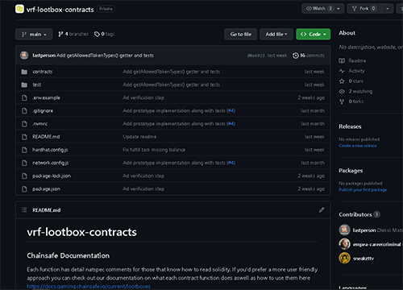
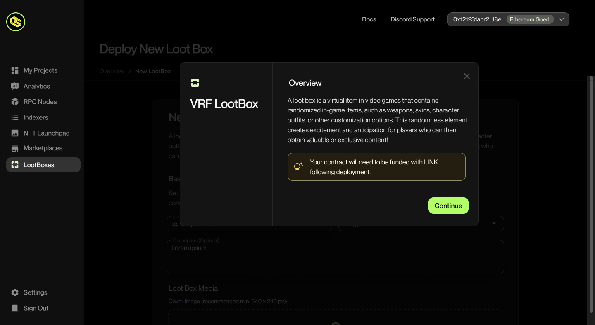
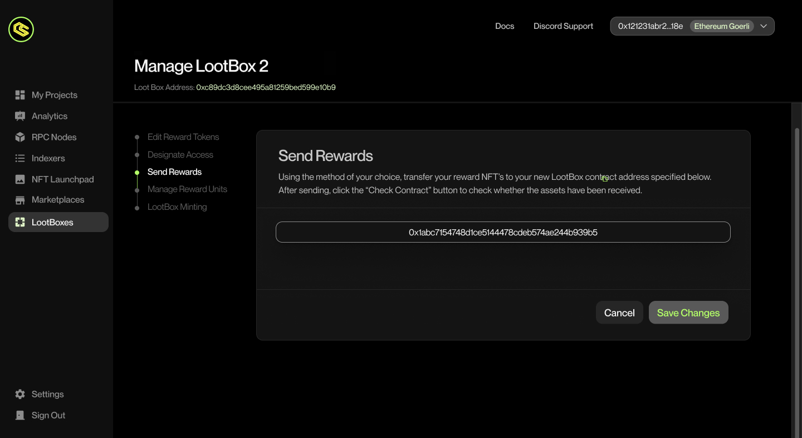
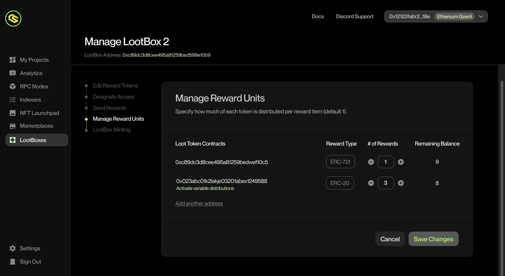
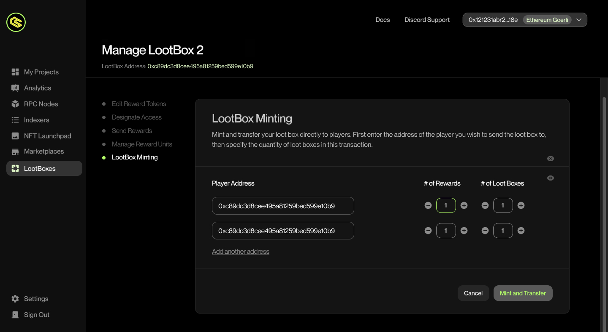
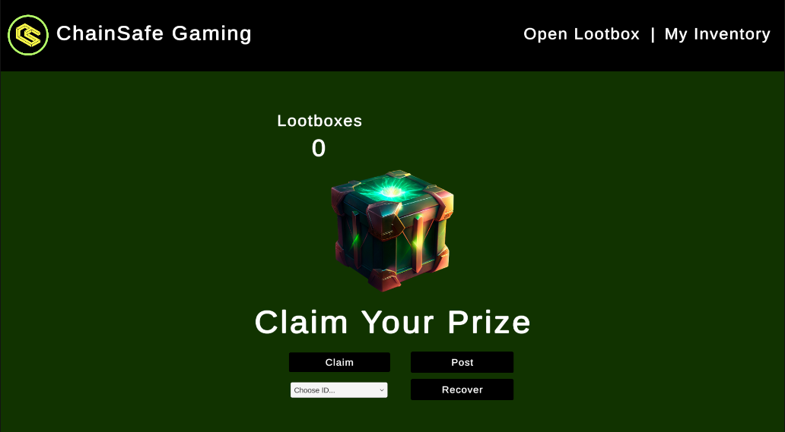
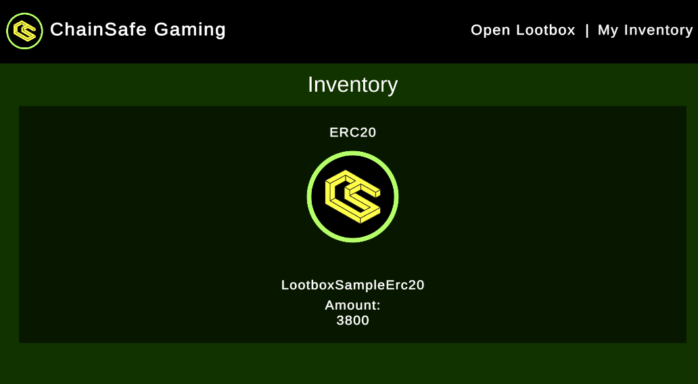
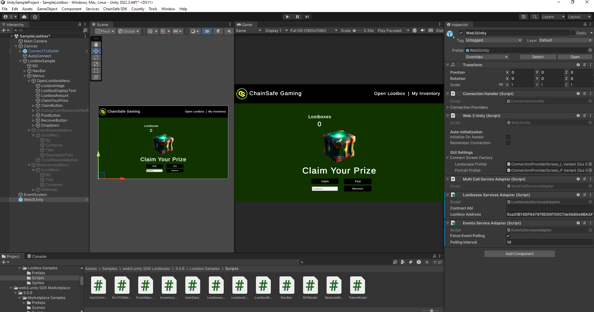

---
slug: /current/lootboxes
sidebar_position: 13
sidebar_label: Lootboxes
---

# LootBoxes

:::info

This page will walk you through our newest feature, lootboxes. It's a nifty little way to offer in game sales of items with a sense of randomness.

:::

## What Are Lootboxes?

Lootboxes are a great way to offer your users NFTs, tokens & variety of other things in a gamified way. Many things from cosmetics to in game items can be offered with a sense of randomness via the Chainlink VRF to help facilitate anticipation and hopefully a fun way to bring developers some much needed revenue.

1. You can import our Lootboxes sample scene by navigating to Window → Package Manager.
2. Add a new package by name by pressing + and adding via git url and entering `https://github.com/ChainSafe/web3.unity.git?path=/Packages/io.chainsafe.web3-unity.lootboxes`
3. Once the package is installed, click on the Samples tab. Import the samples.
4. Once imported, you can find the scene by navigating to Samples → web3.unity SDK → 3.0.X → Web3.Unity Samples → Scenes → SampleLogin - Lootboxes.

## What is Chainlink VRF?

VRF stands for Verifiable Random Function, the team over at [Chainlink](https://chain.link/) have created this number generator. It generates random numbers along with verification on chain before any consuming applications can get their hands on it. This amazing number generator is built for blockchains, it provides cryptographically secure randomness for your contract functions. To find out more about Chainlink VRF you can check out the documentation [here](https://docs.chain.link/vrf).

## Solidity Contracts

The repo for the lootbox contracts can be found [here](https://github.com/ChainSafe/vrf-lootbox-contracts).



<!-- ## Explaining The Lootbox Dashboard

There is a great video [here](https://www.loom.com/share/e06bd85195f546db9d8311b7654257f0?sid=8b8b9fbb-6bbb-4c2a-bf1f-909f07c64896) explaining how lootbox functionality works via our marketplace. -->

## Deploying a new Lootbox

New lootboxes can be deployed by navigating to the Lootbox section. When you click on the section you will see a brief explanation on what lootboxes are as well as the requirements needed to use them. Press Continue to get started.



## Adding Token Contracts To Your Lootbox

The first step is to whitelist the tokens you want to place into the lootboxes. This ensures that only approved tokens can become available in your lootboxes.


## Granting Depositor Access To Your Lootbox

Add approved addresses to prevent unauthorized deposits.


## Sending Loot To A Contract

This area can be used to send loot to a contract.



## Updating Your Lootbox Rewards

Here you can update all of the various reward amounts that your lootboxes contain as well as any remaining balances from your suppliers.



## Minting & Transferring

Here you can send lootboxes with reward amounts out to your friends, Dapps, and other smart contracts.



# Lootbox Functions Within The SDK

## Lootbox Sample Scene

To use the lootbox example scene simply open it and press play to check out how our lootboxes function within unity. You can claim lootboxes & even browse your inventory to see any existing rewards. The service adapter for the lootboxes can be found on the Web3 object in the scene. It's already set up with an example contract but you can change this out as you wish. The content generated from the rewards and the inventory are pulled dynamically from the lootbox contract so you don't need to worry about manual updates.



### Open lootbox area

Upon opening the lootbox sample scene you'll be presented with a lootbox image and a few menu options. The underlying code of the menu can be dropped straight into a scene of your choosing or you can alter piece of it as use what you like as needed to create your own lootbox experience for your game.

### Lootbox Quantity

There is a quantity of lootboxes displayed just above the lootbox image, this is the amount of lootboxes the current connect account holds that are ready to be opened.

### Claim

This button will claim a lootbox if there is an amount available to be claimed. By default it will open 1 at a time but if you go into the open function you can alter the amount parameter to open more.

```csharp
private async Task ClaimLootbox()
{
    var selectedText = lootboxDropdown.options[lootboxDropdown.value].text;
    Debug.Log("Claiming Lootbox");
    if (uint.TryParse(selectedText.Replace("ID: ", ""), out uint selectedId) && lootboxBalances.TryGetValue(selectedId, out uint selectedAmount))
    {
        uint amountToOpen = 1;
        await lootboxService.OpenLootbox(selectedId, amountToOpen);
    }
    Debug.Log("Claiming rewards");
    await new WaitForSeconds(30);
    await lootboxService.ClaimRewards();
}
```

### Drop down menu

The drop down menu below the claim button lets you choose which type of lootbox to open. These are numbered in ascending order beginning from 1 based on the amount of loot assigned to the box from the dashboard. Whilst we've kept it logical here, you can change these to display rarities instead of numbers if you wish such as common, rare, epic etc to add a little bit more of a gamified feel.

### Post

This function opens up a social media post to twitter in the browser, this can be altered for any platform, bluesky, tiktok, Facebook etc etc. This is a great opportunity to offer your users more rewards for posting about the loot found on their socials. Free publicity is always good for any game new & old.

### Recover

The recover function has been included here, it's there for debugging in the instance that a lootbox fails to open due to gas issues. If claiming a lootbox keeps failing it could be because there is a pending option to open a lootbox already that hasn't been fulfilled. Pressing recover will attempt to solve this.

### Rewards

When claiming rewards, after the VRF has processed the proof the user will be presented with a pop up modal with the rewards in the lootbox. The display has been kept simple here in order for you to build on top it. For example you can then use this data along side camera transitions to make a captivating lootbox open animation that suits your game. 

### Inventory area

On the top navigation bar you'll find the My Inventory menu item, this opens the users inventory and scans for all lootbox items owned by the user. These contract options are also dynamically populated from the lootbox contract set in the web3 object at the start. These items will spawn and populate with token information such as token type, id, name, amount, the image within the NFTs metadata (721/1155) will also be fetched and displayed.



### Lootbox Service Adapter

On the left side of the screen in the object hierarchy you can find the Web3Unity object, click on it and have a look at the components in the inspector on the right side of the screen. The example scenes object has a Lootboxes Service Adapter script and Events Service Adapter script. Both of these are used to facilitate events as well as creating an access point to the lootbox methods.



This service adapter registers the contract in the serialized field within the editor with our default ABI, if you're using a custom implementation of our lootbox contract you will need to replace the ABI here, if you're using a lootbox from our dashboard you can just leave it as is, only the contract address will need updating as this one points to the example lootboxes on sepolia.

```csharp
public class LootboxesServicesAdapter : MonoBehaviour, IServiceAdapter
    {
        // Default values for Sepolia, modify as needed.
        [SerializeField] private string contractAbi = "ABI goes here";
        [SerializeField] private string lootboxAddress = "0xa31B74DF647979D50f155C7de5b80e9BA3A0C979";

        public Web3Builder ConfigureServices(Web3Builder web3Builder)
        {
            return web3Builder.Configure(services =>
            {
                services.UseChainlinkLootboxService(new LootboxServiceConfig
                {
                    LootboxAddress = lootboxAddress,
                    ContractAbi = contractAbi 
                });
                services.AddSingleton<Erc1155MetaDataReader>();
            });
        }
    }
```

### Accessing the service adapter

Once logged in, you can access the service adapter quite easily using the code snippet below. We can then save the service locally and reuse it as much as we like within a script to gain access to the methods below. I've included the initialization steps with events below to avoid errors as the service wont exist before the web3 object is built.

```csharp
public class LootboxManager : MonoBehaviour
{
    private ILootboxService lootboxService;

    private void Awake()
    {
        Web3Unity.Web3Initialized += Web3Initialized;
    }

    private void Web3Initialized((Web3 web3, bool isLightweight) valueTuple)
    {
        if (valueTuple.isLightweight) return;
        lootboxService = Web3Unity.Web3.Chainlink().Lootboxes();
        // access functions from the service i.e
        // await lootboxService.OpenLootbox(selectedId, amountToOpen);
    }

    public void OnDestroy()
    {
        Web3Unity.Web3Initialized -= Web3Initialized;
    }
```

## Lootbox Methods

Below we'll list some of the functions the lootbox service has access to as well as clarifying and what they do. These functions can be accessed via the lootboxService using dot notation as seen above. These is also a debug checkbox in the lootbox sample object "Open Lootbox Menu" object, toggle it on or off to see some additional options.

## Get Loot box Types

This method returns all lootbox type ids registered in the smart-contract. Lootbox type id also represents the number of rewards, that can be claimed by user when he opens the lootbox.

```csharp
    public async Task<List<int>> GetLootboxTypes()
    {
        var response = await this.contract.Call("getLootboxTypes");
        var bigIntTypes = (List<BigInteger>)response[0];

        if (bigIntTypes.Any(v => v > int.MaxValue))
        {
            throw new Web3Exception(
                "Internal Error. Lootbox type is greater than int.MaxValue.");
        }

        var types = bigIntTypes.Select(bigInt => (int)bigInt).ToList();

        return types;
    }
```

## Balance Of

This method returns the balance of lootboxes by type or specific user. Similar to how some games work, this may be used to display lootboxes in an inventory.

```csharp
    // Uses the connected wallet as the target account.
    public async Task<int> BalanceOf(int lootboxType)
    {
        var playerAddress = this.GetCurrentPlayerAddress();

        return await this.BalanceOf(playerAddress, lootboxType);
    }

    // Overload that takes an account address.
    public async Task<int> BalanceOf(string account, int lootboxType)
    {
        var response = await this.contract.Call(
            "balanceOf",
            new object[] { account, lootboxType });
        var bigIntBalance = (BigInteger)response[0];

        if (bigIntBalance > int.MaxValue)
        {
            throw new Web3Exception(
                "Internal Error. Balance is greater than int.MaxValue.");
        }

        var balance = (int)bigIntBalance;

        return balance;
    }
```

## Calculate Open Price

Calculates open price for the player. This can be used to display the total cost a user would need to pay for opening X amount of lootboxes.

```csharp
    public async Task<BigInteger> CalculateOpenPrice(int lootboxType, int lootboxCount)
    {
        var rewardCount = lootboxType * lootboxCount;
        var rawGasPrice = (await this.rpcProvider.GetGasPrice()).AssertNotNull("gasPrice").Value;
        var safeGasPrice = (rawGasPrice * 2) + BigInteger.Divide(rawGasPrice, new BigInteger(2)); // 300%

        var response = await this.contract.Call(
            "calculateOpenPrice",
            new object[] { 100000 + (GasPerUnit * rewardCount), safeGasPrice, rewardCount, });
        var openPrice = (BigInteger)response[0];

        return openPrice;
    }
```

## Can Claim Rewards

This method checks if a user can claim their lootbox rewards. It's a great little security check you can run before claiming.

```csharp
    public async Task<bool> CanClaimRewards(string account)
    {
        var response = await contract.Call(
            "canClaimRewards",
            new object[] { account });
        var canClaimRewards = (bool)response[0];

        return canClaimRewards;
    }
```

## Claim Rewards

This method allows a user to claim their lootbox rewards. This can be placed after the call for payment.

```csharp
    private void ExtractRewards(RewardsClaimedEvent rewardsClaimedEvent)
        {
            var rewards = LootboxRewards.Empty;
            var rewardType = this.rewardTypeByTokenAddress[rewardsClaimedEvent.TokenAddress];
            switch (rewardType)
            {
                case RewardType.Erc20:
                    rewards.Erc20Rewards.Add(new Erc20Reward
                    {
                        ContractAddress = rewardsClaimedEvent.TokenAddress,
                        AmountRaw = rewardsClaimedEvent.Amount,
                    });
                    break;
                case RewardType.Erc721:
                    rewards.Erc721Rewards.Add(new Erc721Reward
                    {
                        ContractAddress = rewardsClaimedEvent.TokenAddress,
                        TokenId = rewardsClaimedEvent.TokenId,
                    });
                    break;
                case RewardType.Erc1155:
                    rewards.Erc1155Rewards.Add(new Erc1155Reward
                    {
                        ContractAddress = rewardsClaimedEvent.TokenAddress,
                        TokenId = rewardsClaimedEvent.TokenId,
                        Amount = rewardsClaimedEvent.Amount,
                    });
                    break;
                case RewardType.Erc1155Nft:
                    rewards.Erc1155NftRewards.Add(new Erc1155NftReward
                    {
                        ContractAddress = rewardsClaimedEvent.TokenAddress,
                        TokenId = rewardsClaimedEvent.TokenId,
                    });
                    break;
                case RewardType.Unset:
                default:
                    throw new ArgumentOutOfRangeException();
            }

            OnRewardsClaimed?.Invoke(rewards);
        }
```

## Open Lootbox

This method allows a user to open a lootbox. This should be called last after all of the payment steps have been completed.

```csharp
    public async Task OpenLootbox(int lootboxType, int lootboxCount = 1)
    {
        var rewardCount = lootboxType * lootboxCount;
        var openPrice = await this.CalculateOpenPrice(lootboxCount, lootboxCount);

        await this.contract.Send(
            "open",
            new object[] { 100000 + (GasPerUnit * rewardCount), new[] { lootboxType }, new[] { lootboxCount } },
            new TransactionRequest { Value = new HexBigInteger(openPrice) });
    }
```

## Get Price

This method gets the current lootbox price.

```csharp
public async Task<BigInteger> GetPrice()
{
    var response = await this.contract.Call("getPrice", new object[] { });
    return BigInteger.Parse(response[0].ToString());
}
```

## Set Price

This method sets the price to purchase a lootbox, it can only be called by the person that deployed the lootboxes.

```csharp
public async Task SetPrice(BigInteger price)
{
    await this.contract.Send("setPrice", new object[] { price });
}
```

## Buy Lootbox

Allows a user to purchase a lootbox granted the price has been set by the lootbox owner.

```csharp
public async Task Buy(int amount, BigInteger maxPrice)
{
    // Gets the current lootbox price
    var pricePerLootbox = await GetPrice();
    var priceToSend = pricePerLootbox * amount;
    await this.contract.Send("buy", new object[] { amount, maxPrice }, new TransactionRequest { Value = new HexBigInteger(priceToSend) });
}
```

## Get inventory

This method fetches all of the NFTs in the connected wallets inventory based on the contract supplied to the service adapter.

```csharp
public async Task<LootboxItemList> GetInventory()
{
    var result = await this.contract.Call("getInventory");
    var jsonResult = JsonConvert.DeserializeObject<LootboxItemList>(JsonConvert.SerializeObject(result));
    return jsonResult;
}
```

Please check out the sample scene to see how these functions work.