---
slug: /current/lootboxes
sidebar_position: 13
sidebar_label: Lootboxes
---

# LootBoxes

:::info

This page will walk you through our newest feature, lootboxes. It's a nifty little way to offer in game sales of items with a sense of randomness.

:::

## What Are Lootboxes?

Lootboxes are a great way to offer your users NFTs, tokens & variety of other things in a gamified way. Many things from cosmetics to in game items can be offered with a sense of randomness via the Chainlink VRF to help facilitate anticipation and hopefully a fun way to bring developers some much needed revenue.

1. You can import our Lootboxes sample scene by navigating to Window → Package Manager.
2. Add a new package by name by pressing + and adding via git url and entering `https://github.com/ChainSafe/web3.unity.git?path=/Packages/io.chainsafe.web3-unity.lootboxes`
3. Once the package is installed, click on the Samples tab. Import the samples.
4. Once imported, you can find the scene by navigating to Samples → web3.unity SDK → 2.6 → Web3.Unity Samples → Scenes → SampleLogin - Lootboxes.
5. Click on the Login Logic - Ramp object and in the inspector, modify the Scene To Load to your preferred scene.
6. Add the Lootboxes scene and your scene to the build settings, and you’re done.

## What is Chainlink VRF?

VRF stands for Verifiable Random Function, the team over at [Chainlink](https://chain.link/) have created this number generator. It generates random numbers along with verification on chain before any consuming applications can get their hands on it. This amazing number generator is built for blockchains, it provides cryptographically secure randomness for your contract functions. To find out more about Chainlink VRF you can check out the documentation [here](https://docs.chain.link/vrf).

## Solidity Contracts

The repo for the lootbox contracts can be found [here](https://github.com/ChainSafe/vrf-lootbox-contracts).

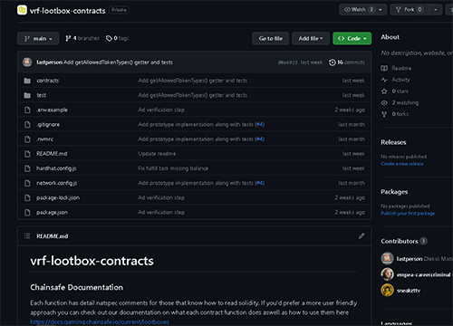

## Explaining The Lootbox Dashboard

There is a great video [here](https://www.loom.com/share/e06bd85195f546db9d8311b7654257f0?sid=8b8b9fbb-6bbb-4c2a-bf1f-909f07c64896) Explaining how lootbox functionality works via our marketplace.

## Deploying a new Lootbox

New lootboxes can be deployed by press the green deploy button on the top right of the dashboard in the addons area. This will give you a brief explanation on what lootboxes are as well as the requirements needed to use them.

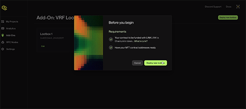

## Adding Token Contracts To Your Lootbox

Token contracts for use within your lootboxes may be added here, you can see more of they function in the lootbox rewards area below.

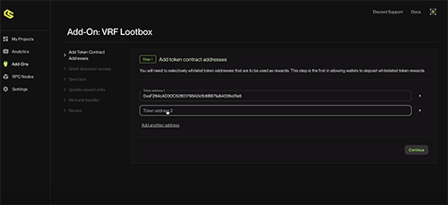

## Granting Depositor Access To Your Lootbox

These addresses can be nominated as suppliers for your lootbox content.


## Sending Loot To A Contract

This area can be used to send loot to a contract.

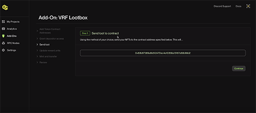

## Updating Your Lootbox Rewards

Here you can update all of the various reward amounts that your lootboxes contain as well as any remaining balances from your suppliers.

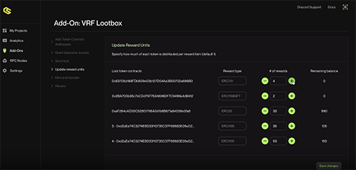

## Minting & Transferring

Here you can send some lootboxes with reward amounts out to your friends as they are created.


## Review Summary

This section contains a summary of everything inside your lootboxes.

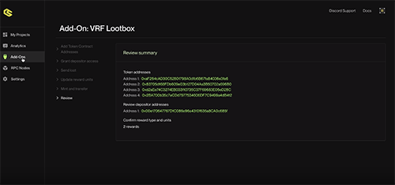

# Lootbox Functions Within The SDK

## Altering Login Scene Transition

To use the lootbox example scene with the login scene you'll need to alter the inspector value on the login object in the login scene hierarchy to your scene name as show below. By default it will be set the sample scene for examples sake.

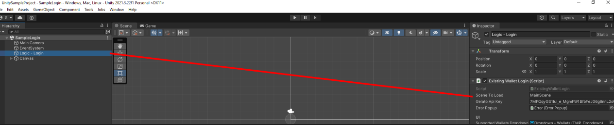

## Get Loot box Types

This method returns all lootbox type ids registered in the smart-contract. Lootbox type id also represents the number of rewards, that can be claimed by user when he opens the lootbox.

```csharp
    public async Task<List<uint>> GetLootboxTypes()
    {
        var response = await contract.Call("getLootboxTypes");
        var bigIntTypes = (List<BigInteger>)response[0];

        if (bigIntTypes.Any(v => v > int.MaxValue))
        {
            throw new Web3Exception(
                "Internal Error. Lootbox type is greater than int.MaxValue.");
        }

        var types = bigIntTypes.Select(bigInt => (uint)bigInt).ToList();

        return types;
    }
```

## Balance Of

This method returns the balance of lootboxes by type or specific user. Similar to how some games work, this may be used to display lootboxes in an inventory.

```csharp
    public async Task<uint> BalanceOf(uint lootboxType)
    {
        if (signer is null)
        {
            throw new Web3Exception($"No {nameof(ISigner)} was registered. Can't get current user's address.");
        }

        var playerAddress = await signer.GetAddress();

        return await BalanceOf(playerAddress, lootboxType);
    }

    public async Task<uint> BalanceOf(string account, uint lootboxType)
    {
        var response = await contract.Call(
            "balanceOf",
            new object[] { account, lootboxType });
        var bigIntBalance = (BigInteger)response[0];

        if (bigIntBalance > int.MaxValue)
        {
            throw new Web3Exception(
                "Internal Error. Balance is greater than int.MaxValue.");
        }

        var balance = (uint)bigIntBalance;

        return balance;
    }
```

## Calculate Open Price

Calculates open price for the player. This can be used to display the total cost a user would need to pay for opening X amount of lootboxes.

```csharp
    public async Task<BigInteger> CalculateOpenPrice(uint lootboxType, uint lootboxCount)
    {
        var rewardCount = lootboxType * lootboxCount;
        var rawGasPrice = (await rpcProvider.GetGasPrice()).AssertNotNull("gasPrice").Value;
        var safeGasPrice = rawGasPrice + BigInteger.Divide(rawGasPrice, new BigInteger(10)); // 110%

        var response = await contract.Call(
            "calculateOpenPrice",
            new object[] { 50000 + GasPerUnit * rewardCount, safeGasPrice, rewardCount, });
        var openPrice = (BigInteger)response[0];

        return openPrice;
    }
```

## Can Claim Rewards

This method checks if a user can claim their lootbox rewards. It's a great little security check you can run before claiming.

```csharp
    public async Task<bool> CanClaimRewards(string account)
    {
        var response = await contract.Call(
            "canClaimRewards",
            new object[] { account });
        var canClaimRewards = (bool)response[0];

        return canClaimRewards;
    }
```

## Claim Rewards

This method allows a user to claim their lootbox rewards. This can be placed after the call for payment.

```csharp
    public async Task<LootboxRewards> ClaimRewards(string account)
    {
        var (_, receipt) = await contract.SendWithReceipt("claimRewards", new object[] { account });
        var logs = receipt.Logs.Select(jToken => JsonConvert.DeserializeObject<FilterLog>(jToken.ToString()));
        var eventAbi = EventExtensions.GetEventABI<RewardsClaimedEvent>();
        var eventLogs = logs
            .Select(log => eventAbi.DecodeEvent<RewardsClaimedEvent>(log))
            .Where(l => l != null);

        if (!eventLogs.Any())
        {
            throw new Web3Exception("No \"RewardsClaimed\" events were found in log's receipt.");
        }

        return ExtractRewards(eventLogs);

        LootboxRewards ExtractRewards(IEnumerable<EventLog<RewardsClaimedEvent>> eventLogs)
        {
            var rewards = LootboxRewards.Empty;

            foreach (var eventLog in eventLogs)
            {
                var eventData = eventLog.Event;
                var rewardType = rewardTypeByTokenAddress[eventData.TokenAddress];

                switch (rewardType)
                {
                    // Erc20 Tokens
                    case RewardType.Erc20:
                        rewards.Erc20Rewards.Add(new Erc20Reward
                        {
                            ContractAddress = eventData.TokenAddress,
                            AmountRaw = eventData.Amount,
                        });
                        break;
                    // Erc721 NFTs
                    case RewardType.Erc721:
                        rewards.Erc721Rewards.Add(new Erc721Reward
                        {
                            ContractAddress = eventData.TokenAddress,
                            TokenId = eventData.TokenId,
                        });
                        break;
                    // Erc1155 NFTs
                    case RewardType.Erc1155:
                        rewards.Erc1155Rewards.Add(new Erc1155Reward
                        {
                            ContractAddress = eventData.TokenAddress,
                            TokenId = eventData.TokenId,
                            Amount = eventData.Amount,
                        });
                        break;
                    // Single Erc1155 NFT
                    case RewardType.Erc1155Nft:
                        rewards.Erc1155NftRewards.Add(new Erc1155NftReward
                        {
                            ContractAddress = eventData.TokenAddress,
                            TokenId = eventData.TokenId,
                        });
                        break;
                    case RewardType.Unset:
                    default:
                        throw new ArgumentOutOfRangeException();
                }
            }

            return rewards;
        }
    }
```

## Open Lootbox

This method allows a user to open a lootbox. This should be called last after all of the payment steps have been completed.

```csharp
    public async Task OpenLootbox(uint lootboxType, uint lootboxCount = 1)
    {
        var rewardCount = lootboxType * lootboxCount;
        var openPrice = await CalculateOpenPrice(lootboxCount, lootboxCount);

        await contract.Send(
            "open",
            new object[] { 50000 + GasPerUnit * rewardCount, new[] { lootboxType }, new[] { lootboxCount } },
            new TransactionRequest { Value = new HexBigInteger(openPrice) });
    }
```

## Lootbox Example Scene

We have an example scene setup if you want to check it out. It goes through different lootbox rarities and allows you to see what happens during the lootbox process. This will be converted to an addon for modularization purposes and a prefab for ease of use. For now you can check the example scene by cloning the lootboxes branch of the SDK and opening up assets/lootboxes/Lootboxes/LootBoxes.scene.

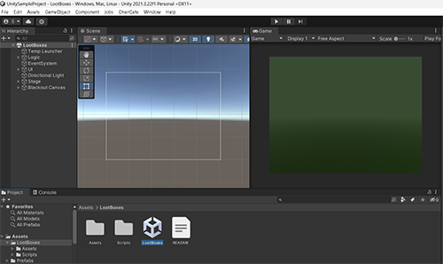

# Setting Up A Local Node For Testing With The Example Scene

Once you've cloned the contracts repo, go ahead and run `npm run node` to boot up a local chain.

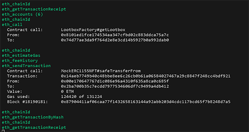

After this node is active you can open up another terminal and run `npm run hardhat -- devsetup` to initialize everything.

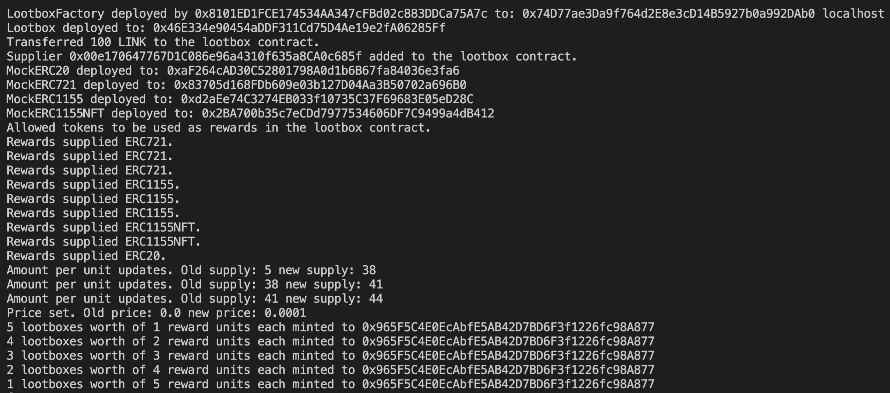

If you check the node window you can see everything that's happening during this process. Once complete, hit play within unity on the lootbox example scene and you'll be presented with a nice display area to test out. Here you can check different rarity levels of each lootbox and what they may contain as well as some great animations to go along with it.

## Opening LootBoxes & Rarity

Now in Unity you can click play and interact with the lootboxes.
You can switch between different lootboxes using the keys "A" and "D" and switch between rarity using "W" and "S"

Once you find your box, select it by pressing "space" key and open it by pressing "enter" key.
You need to wait a little bit on the Unity scene so the transaction goes through

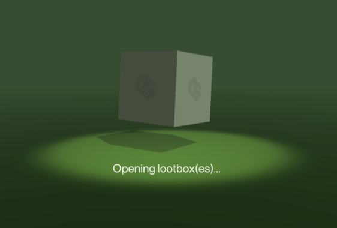

Next, in the terminal, run `npx hardhat compile` and then `npm run hardhat -- fulfill` to manually open the lootboxes.

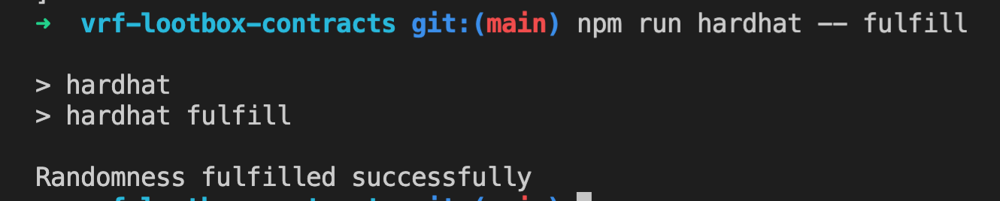

Go back to Unity and the lootboxes will be ready to open

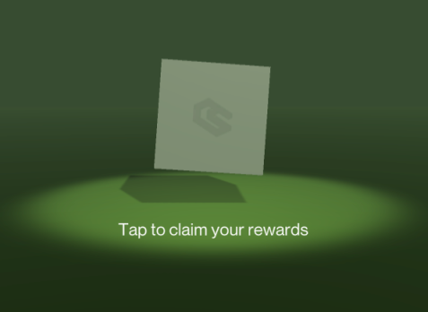

Click on the lootbox and you will receive the rewards!


We hope you enjoy bringing our new feature to life! We've found it's a great way to easily offer virtual items to any and all users with a gamified feel.

:::caution Unity Lootbox Demo Scene

When building the Lootbox Sample Scene, just make it a 0th scene in the build index. If you want to build the auth sample, make SampleLogin 0th index and then build. Since we don't support (yet) running both samples (so auth and Lootboxes) at the same time, and that can cause some unexpected behavior, especially on Lootbox scene.

:::
