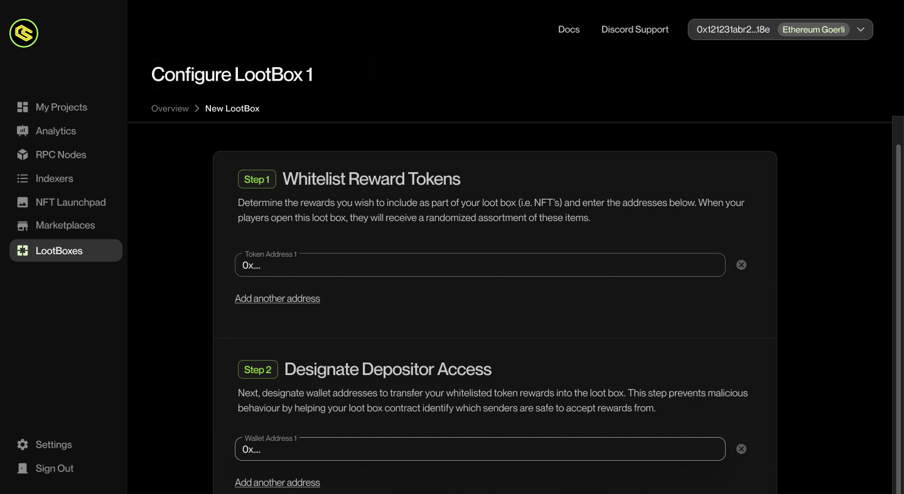

# LootBoxes

:::info

This page will walk you through our newest feature, lootboxes. It's a nifty little way to offer in game sales of items with a sense of randomness.

:::

## What Are Lootboxes?

Lootboxes are a great way to offer your users NFTs, tokens & variety of other things in a gamified way. Many things from cosmetics to in game items can be offered with a sense of randomness via the Chainlink VRF to help facilitate anticipation and hopefully a fun way to bring developers some much needed revenue.

1. You can import our Lootboxes sample scene by navigating to Window → Package Manager.
2. Add a new package by name by pressing + and adding via git url and entering `https://github.com/ChainSafe/web3.unity.git?path=/Packages/io.chainsafe.web3-unity.lootboxes`
3. Once the package is installed, click on the Samples tab. Import the samples.
4. Once imported, you can find the scene by navigating to Samples → web3.unity SDK → 2.6 → Web3.Unity Samples → Scenes → SampleLogin - Lootboxes.
5. Click on the Login Logic - Ramp object and in the inspector, modify the Scene To Load to your preferred scene.
6. Add the Lootboxes scene and your scene to the build settings, and you’re done.

## What is Chainlink VRF?

VRF stands for Verifiable Random Function, the team over at [Chainlink](https://chain.link/) have created this number generator. It generates random numbers along with verification on chain before any consuming applications can get their hands on it. This amazing number generator is built for blockchains, it provides cryptographically secure randomness for your contract functions. To find out more about Chainlink VRF you can check out the documentation [here](https://docs.chain.link/vrf).

## Solidity Contracts

The repo for the lootbox contracts can be found [here](https://github.com/ChainSafe/vrf-lootbox-contracts).


<!-- ## Explaining The Lootbox Dashboard

There is a great video [here](https://www.loom.com/share/e06bd85195f546db9d8311b7654257f0?sid=8b8b9fbb-6bbb-4c2a-bf1f-909f07c64896) explaining how lootbox functionality works via our marketplace. -->

## Deploying a new Lootbox

New lootboxes can be deployed by navigating to the Lootbox section. When you click on the section you will see a brief explanation on what lootboxes are as well as the requirements needed to use them. Press Continue to get started.


## Adding Token Contracts To Your Lootbox

The first step is to whitelist the tokens you want to place into the lootboxes. This ensures that only approved tokens can become available in your lootboxes.



## Granting Depositor Access To Your Lootbox

Add approved addresses to prevent unauthorized deposits.


## Sending Loot To A Contract

This area can be used to send loot to a contract.


## Updating Your Lootbox Rewards

Here you can update all of the various reward amounts that your lootboxes contain as well as any remaining balances from your suppliers.


## Minting & Transferring

Here you can send lootboxes with reward amounts out to your friends, Dapps, and other smart contracts.


# Lootbox Functions Within The SDK

## Lootbox Sample Scene

To use the lootbox example scene simply open it and press play to check out how our lootboxes function on the front end of things within unity. You can claim lootboxes & even browse your inventory to see any existing rewards. The service adapter for the lootboxes can be found on the Web3 object in the scene. It's already set up with an example contract but you can change this out as you wish. The content generated from the rewards and the inventory are pulled dynamically from the lootbox contract entered here too.

## Lootbox Methods

Below we'll list some of the functions the loobox service has access to aswell as clarifying and what they do.


## Get Loot box Types

This method returns all lootbox type ids registered in the smart-contract. Lootbox type id also represents the number of rewards, that can be claimed by user when he opens the lootbox.

```csharp
    public async Task<List<uint>> GetLootboxTypes()
    {
        var response = await contract.Call("getLootboxTypes");
        var bigIntTypes = (List<BigInteger>)response[0];

        if (bigIntTypes.Any(v => v > int.MaxValue))
        {
            throw new Web3Exception(
                "Internal Error. Lootbox type is greater than int.MaxValue.");
        }

        var types = bigIntTypes.Select(bigInt => (uint)bigInt).ToList();

        return types;
    }
```

## Balance Of

This method returns the balance of lootboxes by type or specific user. Similar to how some games work, this may be used to display lootboxes in an inventory.

```csharp
    public async Task<uint> BalanceOf(uint lootboxType)
    {
        if (signer is null)
        {
            throw new Web3Exception($"No {nameof(ISigner)} was registered. Can't get current user's address.");
        }

        var playerAddress = await signer.GetAddress();

        return await BalanceOf(playerAddress, lootboxType);
    }

    public async Task<uint> BalanceOf(string account, uint lootboxType)
    {
        var response = await contract.Call(
            "balanceOf",
            new object[] { account, lootboxType });
        var bigIntBalance = (BigInteger)response[0];

        if (bigIntBalance > int.MaxValue)
        {
            throw new Web3Exception(
                "Internal Error. Balance is greater than int.MaxValue.");
        }

        var balance = (uint)bigIntBalance;

        return balance;
    }
```

## Calculate Open Price

Calculates open price for the player. This can be used to display the total cost a user would need to pay for opening X amount of lootboxes.

```csharp
    public async Task<BigInteger> CalculateOpenPrice(uint lootboxType, uint lootboxCount)
    {
        var rewardCount = lootboxType * lootboxCount;
        var rawGasPrice = (await rpcProvider.GetGasPrice()).AssertNotNull("gasPrice").Value;
        var safeGasPrice = rawGasPrice + BigInteger.Divide(rawGasPrice, new BigInteger(10)); // 110%

        var response = await contract.Call(
            "calculateOpenPrice",
            new object[] { 50000 + GasPerUnit * rewardCount, safeGasPrice, rewardCount, });
        var openPrice = (BigInteger)response[0];

        return openPrice;
    }
```

## Can Claim Rewards

This method checks if a user can claim their lootbox rewards. It's a great little security check you can run before claiming.

```csharp
    public async Task<bool> CanClaimRewards(string account)
    {
        var response = await contract.Call(
            "canClaimRewards",
            new object[] { account });
        var canClaimRewards = (bool)response[0];

        return canClaimRewards;
    }
```

## Claim Rewards

This method allows a user to claim their lootbox rewards. This can be placed after the call for payment.

```csharp
    public async Task<LootboxRewards> ClaimRewards(string account)
    {
        var (_, receipt) = await contract.SendWithReceipt("claimRewards", new object[] { account });
        var logs = receipt.Logs.Select(jToken => JsonConvert.DeserializeObject<FilterLog>(jToken.ToString()));
        var eventAbi = EventExtensions.GetEventABI<RewardsClaimedEvent>();
        var eventLogs = logs
            .Select(log => eventAbi.DecodeEvent<RewardsClaimedEvent>(log))
            .Where(l => l != null);

        if (!eventLogs.Any())
        {
            throw new Web3Exception("No \"RewardsClaimed\" events were found in log's receipt.");
        }

        return ExtractRewards(eventLogs);

        LootboxRewards ExtractRewards(IEnumerable<EventLog<RewardsClaimedEvent>> eventLogs)
        {
            var rewards = LootboxRewards.Empty;

            foreach (var eventLog in eventLogs)
            {
                var eventData = eventLog.Event;
                var rewardType = rewardTypeByTokenAddress[eventData.TokenAddress];

                switch (rewardType)
                {
                    // Erc20 Tokens
                    case RewardType.Erc20:
                        rewards.Erc20Rewards.Add(new Erc20Reward
                        {
                            ContractAddress = eventData.TokenAddress,
                            AmountRaw = eventData.Amount,
                        });
                        break;
                    // Erc721 NFTs
                    case RewardType.Erc721:
                        rewards.Erc721Rewards.Add(new Erc721Reward
                        {
                            ContractAddress = eventData.TokenAddress,
                            TokenId = eventData.TokenId,
                        });
                        break;
                    // Erc1155 NFTs
                    case RewardType.Erc1155:
                        rewards.Erc1155Rewards.Add(new Erc1155Reward
                        {
                            ContractAddress = eventData.TokenAddress,
                            TokenId = eventData.TokenId,
                            Amount = eventData.Amount,
                        });
                        break;
                    // Single Erc1155 NFT
                    case RewardType.Erc1155Nft:
                        rewards.Erc1155NftRewards.Add(new Erc1155NftReward
                        {
                            ContractAddress = eventData.TokenAddress,
                            TokenId = eventData.TokenId,
                        });
                        break;
                    case RewardType.Unset:
                    default:
                        throw new ArgumentOutOfRangeException();
                }
            }

            return rewards;
        }
    }
```

## Open Lootbox

This method allows a user to open a lootbox. This should be called last after all of the payment steps have been completed.

```csharp
    public async Task OpenLootbox(uint lootboxType, uint lootboxCount = 1)
    {
        var rewardCount = lootboxType * lootboxCount;
        var openPrice = await CalculateOpenPrice(lootboxCount, lootboxCount);

        await contract.Send(
            "open",
            new object[] { 50000 + GasPerUnit * rewardCount, new[] { lootboxType }, new[] { lootboxCount } },
            new TransactionRequest { Value = new HexBigInteger(openPrice) });
    }
```
