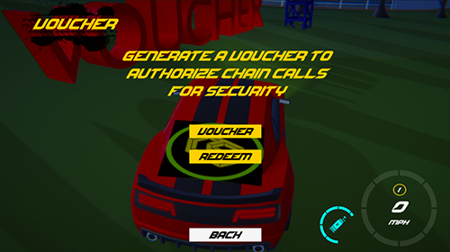
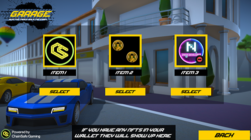
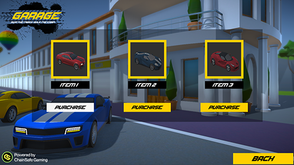

# Block Racers Example Game

:::info

This game was built to show you how our SDK would function in a game environment. Please feel free to use the code as you wish, please don't take any of the assets as they are here entirely for educational purposes and should not be reused for financial gain.

:::

The repo contains a fun multiplayer racing game which was build to help explain the functionality of the SDK complete with code examples.

## Block Racers Project Files
The repo for the Block Racers project files can be found [here](https://github.com/ChainSafe/BlockRacers/)

## Block Racers Playable Demo
The Block Racers game demo can be found [here](https://chainsafe.github.io/BlockRacersGame/)

## Booting Up The Game & Connecting Your Wallet
Once the game has booted up, simply connect your wallet and have a look around through the menus.


## Tutorial Examples
There is a tutorial area which will take you through some of the SDKs basic functions, drive up to one of the floating texts to bring up an example menu.


## Signing A Message
This will generate a unique signature from a user that you may use for authorization purposes.


``` csharp
using UnityEngine;
using ChainSafe.Gaming.UnityPackage;
using Scripts.EVM.Token;

/* This prefab script should be copied & placed on the root of an object in a scene.
Change the class name, variables and add any additional changes at the end of the function.
The scripts function should be called by a method of your choosing - button, function etc */

/// <summary>
/// Signs a message, the response is unique for each user
/// </summary>
public class SignMessage : MonoBehaviour
{
    // Variables
    private string message = "The right man in the wrong place can make all the difference in the world.";
    
    // Function
    public async void SignMessageCall()
    {
        var response = await Evm.SignMessage(Web3Accessor.Web3, message);
        Debug.Log($"Signed Message: {response}");
        // You can make additional changes after this line
    }
}
```

## Sign Verify
This will verify a signature from a wallet to prove its owners address.


``` csharp
using UnityEngine;
using ChainSafe.Gaming.UnityPackage;
using Scripts.EVM.Token;

/* This prefab script should be copied & placed on the root of an object in a scene.
Change the class name, variables and add any additional changes at the end of the function.
The scripts function should be called by a method of your choosing - button, function etc */

/// <summary>
/// Verifies a users account via message sign
/// </summary>
public class SignVerify : MonoBehaviour
{
    // Variables
    private string message = "A man chooses, a slave obeys.";
    
    // Function
    public async void SignVerifyCall()
    {
        var data = await Evm.SignVerify(Web3Accessor.Web3, message);
        var response = data ? "Verified" : "Failed to verify";
        Debug.Log($"Verified: {response}");
        // You can make additional changes after this line
    }
}
```

## Mint
This can be used to mint ERC20 Race tokens or even native tokens via the faucet to pay for things within game.


``` csharp
using UnityEngine;
using System.Numerics;
using ChainSafe.Gaming.UnityPackage;
using Scripts.EVM.Token;

/* This prefab script should be copied & placed on the root of an object in a scene.
Change the class name, variables and add any additional changes at the end of the function.
The scripts function should be called by a method of your choosing - button, function etc */

/// <summary>
/// Mints a 1155 NFT to an account
/// </summary>
public class Erc1155Mint : MonoBehaviour
{
    // Variables
    private string abi = "[ { \"inputs\": [], \"stateMutability\": \"nonpayable\", \"type\": \"constructor\" }, { \"inputs\": [ { \"internalType\": \"address\", \"name\": \"sender\", \"type\": \"address\" }, { \"internalType\": \"uint256\", \"name\": \"balance\", \"type\": \"uint256\" }, { \"internalType\": \"uint256\", \"name\": \"needed\", \"type\": \"uint256\" }, { \"internalType\": \"uint256\", \"name\": \"tokenId\", \"type\": \"uint256\" } ], \"name\": \"ERC1155InsufficientBalance\", \"type\": \"error\" }, { \"inputs\": [ { \"internalType\": \"address\", \"name\": \"approver\", \"type\": \"address\" } ], \"name\": \"ERC1155InvalidApprover\", \"type\": \"error\" }, { \"inputs\": [ { \"internalType\": \"uint256\", \"name\": \"idsLength\", \"type\": \"uint256\" }, { \"internalType\": \"uint256\", \"name\": \"valuesLength\", \"type\": \"uint256\" } ], \"name\": \"ERC1155InvalidArrayLength\", \"type\": \"error\" }, { \"inputs\": [ { \"internalType\": \"address\", \"name\": \"operator\", \"type\": \"address\" } ], \"name\": \"ERC1155InvalidOperator\", \"type\": \"error\" }, { \"inputs\": [ { \"internalType\": \"address\", \"name\": \"receiver\", \"type\": \"address\" } ], \"name\": \"ERC1155InvalidReceiver\", \"type\": \"error\" }, { \"inputs\": [ { \"internalType\": \"address\", \"name\": \"sender\", \"type\": \"address\" } ], \"name\": \"ERC1155InvalidSender\", \"type\": \"error\" }, { \"inputs\": [ { \"internalType\": \"address\", \"name\": \"operator\", \"type\": \"address\" }, { \"internalType\": \"address\", \"name\": \"owner\", \"type\": \"address\" } ], \"name\": \"ERC1155MissingApprovalForAll\", \"type\": \"error\" }, { \"anonymous\": false, \"inputs\": [ { \"indexed\": true, \"internalType\": \"address\", \"name\": \"account\", \"type\": \"address\" }, { \"indexed\": true, \"internalType\": \"address\", \"name\": \"operator\", \"type\": \"address\" }, { \"indexed\": false, \"internalType\": \"bool\", \"name\": \"approved\", \"type\": \"bool\" } ], \"name\": \"ApprovalForAll\", \"type\": \"event\" }, { \"anonymous\": false, \"inputs\": [ { \"indexed\": true, \"internalType\": \"address\", \"name\": \"operator\", \"type\": \"address\" }, { \"indexed\": true, \"internalType\": \"address\", \"name\": \"from\", \"type\": \"address\" }, { \"indexed\": true, \"internalType\": \"address\", \"name\": \"to\", \"type\": \"address\" }, { \"indexed\": false, \"internalType\": \"uint256[]\", \"name\": \"ids\", \"type\": \"uint256[]\" }, { \"indexed\": false, \"internalType\": \"uint256[]\", \"name\": \"values\", \"type\": \"uint256[]\" } ], \"name\": \"TransferBatch\", \"type\": \"event\" }, { \"anonymous\": false, \"inputs\": [ { \"indexed\": true, \"internalType\": \"address\", \"name\": \"operator\", \"type\": \"address\" }, { \"indexed\": true, \"internalType\": \"address\", \"name\": \"from\", \"type\": \"address\" }, { \"indexed\": true, \"internalType\": \"address\", \"name\": \"to\", \"type\": \"address\" }, { \"indexed\": false, \"internalType\": \"uint256\", \"name\": \"id\", \"type\": \"uint256\" }, { \"indexed\": false, \"internalType\": \"uint256\", \"name\": \"value\", \"type\": \"uint256\" } ], \"name\": \"TransferSingle\", \"type\": \"event\" }, { \"anonymous\": false, \"inputs\": [ { \"indexed\": false, \"internalType\": \"string\", \"name\": \"value\", \"type\": \"string\" }, { \"indexed\": true, \"internalType\": \"uint256\", \"name\": \"id\", \"type\": \"uint256\" } ], \"name\": \"URI\", \"type\": \"event\" }, { \"inputs\": [ { \"internalType\": \"address\", \"name\": \"account\", \"type\": \"address\" }, { \"internalType\": \"uint256\", \"name\": \"id\", \"type\": \"uint256\" } ], \"name\": \"balanceOf\", \"outputs\": [ { \"internalType\": \"uint256\", \"name\": \"\", \"type\": \"uint256\" } ], \"stateMutability\": \"view\", \"type\": \"function\" }, { \"inputs\": [ { \"internalType\": \"address[]\", \"name\": \"accounts\", \"type\": \"address[]\" }, { \"internalType\": \"uint256[]\", \"name\": \"ids\", \"type\": \"uint256[]\" } ], \"name\": \"balanceOfBatch\", \"outputs\": [ { \"internalType\": \"uint256[]\", \"name\": \"\", \"type\": \"uint256[]\" } ], \"stateMutability\": \"view\", \"type\": \"function\" }, { \"inputs\": [ { \"internalType\": \"address\", \"name\": \"account\", \"type\": \"address\" }, { \"internalType\": \"address\", \"name\": \"operator\", \"type\": \"address\" } ], \"name\": \"isApprovedForAll\", \"outputs\": [ { \"internalType\": \"bool\", \"name\": \"\", \"type\": \"bool\" } ], \"stateMutability\": \"view\", \"type\": \"function\" }, { \"inputs\": [ { \"internalType\": \"address\", \"name\": \"_to\", \"type\": \"address\" }, { \"internalType\": \"uint256\", \"name\": \"_id\", \"type\": \"uint256\" }, { \"internalType\": \"uint256\", \"name\": \"_amount\", \"type\": \"uint256\" }, { \"internalType\": \"bytes\", \"name\": \"_data\", \"type\": \"bytes\" } ], \"name\": \"mint\", \"outputs\": [], \"stateMutability\": \"nonpayable\", \"type\": \"function\" }, { \"inputs\": [ { \"internalType\": \"address\", \"name\": \"_to\", \"type\": \"address\" }, { \"internalType\": \"uint256[]\", \"name\": \"_ids\", \"type\": \"uint256[]\" }, { \"internalType\": \"uint256[]\", \"name\": \"_amounts\", \"type\": \"uint256[]\" }, { \"internalType\": \"bytes\", \"name\": \"_data\", \"type\": \"bytes\" } ], \"name\": \"mintBatch\", \"outputs\": [], \"stateMutability\": \"nonpayable\", \"type\": \"function\" }, { \"inputs\": [ { \"internalType\": \"address\", \"name\": \"from\", \"type\": \"address\" }, { \"internalType\": \"address\", \"name\": \"to\", \"type\": \"address\" }, { \"internalType\": \"uint256[]\", \"name\": \"ids\", \"type\": \"uint256[]\" }, { \"internalType\": \"uint256[]\", \"name\": \"values\", \"type\": \"uint256[]\" }, { \"internalType\": \"bytes\", \"name\": \"data\", \"type\": \"bytes\" } ], \"name\": \"safeBatchTransferFrom\", \"outputs\": [], \"stateMutability\": \"nonpayable\", \"type\": \"function\" }, { \"inputs\": [ { \"internalType\": \"address\", \"name\": \"from\", \"type\": \"address\" }, { \"internalType\": \"address\", \"name\": \"to\", \"type\": \"address\" }, { \"internalType\": \"uint256\", \"name\": \"id\", \"type\": \"uint256\" }, { \"internalType\": \"uint256\", \"name\": \"value\", \"type\": \"uint256\" }, { \"internalType\": \"bytes\", \"name\": \"data\", \"type\": \"bytes\" } ], \"name\": \"safeTransferFrom\", \"outputs\": [], \"stateMutability\": \"nonpayable\", \"type\": \"function\" }, { \"inputs\": [ { \"internalType\": \"address\", \"name\": \"operator\", \"type\": \"address\" }, { \"internalType\": \"bool\", \"name\": \"approved\", \"type\": \"bool\" } ], \"name\": \"setApprovalForAll\", \"outputs\": [], \"stateMutability\": \"nonpayable\", \"type\": \"function\" }, { \"inputs\": [ { \"internalType\": \"bytes4\", \"name\": \"interfaceId\", \"type\": \"bytes4\" } ], \"name\": \"supportsInterface\", \"outputs\": [ { \"internalType\": \"bool\", \"name\": \"\", \"type\": \"bool\" } ], \"stateMutability\": \"view\", \"type\": \"function\" }, { \"inputs\": [ { \"internalType\": \"uint256\", \"name\": \"\", \"type\": \"uint256\" } ], \"name\": \"uri\", \"outputs\": [ { \"internalType\": \"string\", \"name\": \"\", \"type\": \"string\" } ], \"stateMutability\": \"view\", \"type\": \"function\" } ]";
    private string contractAddress = "0xAA2EbE78aa788d13AfFaaefD38C93333bbC4d51e";
    private BigInteger id = 1;
    private BigInteger amount = 1;

    // Function
    public async void MintErc1155()
    {
        var data = await Erc1155.MintErc1155(Web3Accessor.Web3, abi, contractAddress, id, amount);
        var response = SampleOutputUtil.BuildOutputValue(data);
        Debug.Log($"TX: {response}");
        // You can make additional changes after this line
    }
}
```

## Transfer
This will allow you to transfer ERC20 Race tokens between wallets.


``` csharp
using UnityEngine;
using ChainSafe.Gaming.UnityPackage;
using Scripts.EVM.Token;

/* This prefab script should be copied & placed on the root of an object in a scene.
Change the class name, variables and add any additional changes at the end of the function.
The scripts function should be called by a method of your choosing - button, function etc */

/// <summary>
/// Transfers ERC20 tokens to an account
/// </summary>
public class Erc20Transfer : MonoBehaviour
{
    // Variables
    private string contractAddress = "0x358969310231363CBEcFEFe47323139569D8a88b";
    private string toAccount = "0xdD4c825203f97984e7867F11eeCc813A036089D1";
    private string amount = "1000000000000000";
    
    // Function
    public async void TransferErc20()
    {
        var data = await Erc20.TransferErc20(Web3Accessor.Web3, contractAddress, toAccount, amount);
        var response = SampleOutputUtil.BuildOutputValue(data);
        Debug.Log($"TX: {response}");
        // You can make additional changes after this line
    }
}
```

## Custom Call
This will allow you to make a custom call, we've included 2 examples here. 1 being read which checks a contracts state variable and another being write which adds to the sate variable of a contract. You may read it again after to see changes.


``` csharp
using UnityEngine;
using ChainSafe.Gaming.UnityPackage;
using Scripts.EVM.Token;

/* This prefab script should be copied & placed on the root of an object in a scene.
Change the class name, variables and add any additional changes at the end of the function.
The scripts function should be called by a method of your choosing - button, function etc */

/// <summary>
/// Makes a read call to a contract
/// </summary>
public class ContractCall : MonoBehaviour
{
    // Variables
    private string abi = "[ { \"inputs\": [ { \"internalType\": \"uint256\", \"name\": \"_myArg\", \"type\": \"uint256\" } ], \"name\": \"addTotal\", \"outputs\": [], \"stateMutability\": \"nonpayable\", \"type\": \"function\" }, { \"inputs\": [], \"name\": \"getStore\", \"outputs\": [ { \"internalType\": \"string[]\", \"name\": \"\", \"type\": \"string[]\" } ], \"stateMutability\": \"view\", \"type\": \"function\" }, { \"inputs\": [ { \"internalType\": \"address\", \"name\": \"\", \"type\": \"address\" } ], \"name\": \"myTotal\", \"outputs\": [ { \"internalType\": \"uint256\", \"name\": \"\", \"type\": \"uint256\" } ], \"stateMutability\": \"view\", \"type\": \"function\" }, { \"inputs\": [ { \"internalType\": \"string[]\", \"name\": \"_addresses\", \"type\": \"string[]\" } ], \"name\": \"setStore\", \"outputs\": [], \"stateMutability\": \"nonpayable\", \"type\": \"function\" } ]";
    private string contractAddress = "0x9839293240C535d8009920390b4D3DA256d31177";
    private string method = "myTotal";

    // Function
    public async void CallContract()
    {
        object[] args =
        {
            await Web3Accessor.Web3.Signer.GetAddress()
        };
        var data = await Evm.ContractCall(Web3Accessor.Web3, method, abi, contractAddress, args);
        var response = SampleOutputUtil.BuildOutputValue(data);
        Debug.Log($"Output: {response}");
        // You can make additional changes after this line
    }
}
```

``` csharp
using UnityEngine;
using ChainSafe.Gaming.UnityPackage;
using Scripts.EVM.Token;

/* This prefab script should be copied & placed on the root of an object in a scene.
Change the class name, variables and add any additional changes at the end of the function.
The scripts function should be called by a method of your choosing - button, function etc */

/// <summary>
/// Makes a write call to a contract
/// </summary>
public class ContractSend : MonoBehaviour
{
    // Variables
    private string abi = "[ { \"inputs\": [ { \"internalType\": \"uint256\", \"name\": \"_myArg\", \"type\": \"uint256\" } ], \"name\": \"addTotal\", \"outputs\": [], \"stateMutability\": \"nonpayable\", \"type\": \"function\" }, { \"inputs\": [], \"name\": \"getStore\", \"outputs\": [ { \"internalType\": \"string[]\", \"name\": \"\", \"type\": \"string[]\" } ], \"stateMutability\": \"view\", \"type\": \"function\" }, { \"inputs\": [ { \"internalType\": \"address\", \"name\": \"\", \"type\": \"address\" } ], \"name\": \"myTotal\", \"outputs\": [ { \"internalType\": \"uint256\", \"name\": \"\", \"type\": \"uint256\" } ], \"stateMutability\": \"view\", \"type\": \"function\" }, { \"inputs\": [ { \"internalType\": \"string[]\", \"name\": \"_addresses\", \"type\": \"string[]\" } ], \"name\": \"setStore\", \"outputs\": [], \"stateMutability\": \"nonpayable\", \"type\": \"function\" } ]";
    private string contractAddress = "0x9839293240C535d8009920390b4D3DA256d31177";
    private string method = "addTotal";
    private int increaseAmount = 1;

    // Function
    public async void SendContract()
    {
        object[] args =
        {
            increaseAmount
        };
        var data = await Evm.ContractSend(Web3Accessor.Web3, method, abi, contractAddress, args);
        var response = SampleOutputUtil.BuildOutputValue(data);
        Debug.Log($"TX: {response}");
        // You can make additional changes after this line
    }
}
```

## Docs
Clicking this button will take you to ChainSafe's documentation [here](https://docs.gaming.chainsafe.io/)


## Voucher
This will generate a unique voucher via ECDSA which can be used for things like claims & minting.



``` csharp
using UnityEngine;
using Scripts.EVM.Token;

/* This prefab script should be copied & placed on the root of an object in a scene.
Change the class name, variables and add any additional changes at the end of the function.
The scripts function should be called by a method of your choosing - button, function etc */

/// <summary>
/// Signs a message using a private key
/// </summary>
public class EcdsaSignMessage : MonoBehaviour
{
    // Variables
    private string ecdsaKey = "0x78dae1a22c7507a4ed30c06172e7614eb168d3546c13856340771e63ad3c0081";
    private string message = "secretmessage";
    
    // Function
    public void EcdsaSignMessageCall()
    {
        var response = Evm.EcdsaSignMessage(ecdsaKey, message);
        Debug.Log($"Signed Message: {response}");
        // You can make additional changes after this line
    }
}
```

## Dashboard
Clicking this button will take you to the chainsafe dashboard [here](https://dashboard.gaming.chainsafe.io/) where you can do things like signing up for a project ID and set various other project information.


## Pause & Controls
Pressing tab will bring up the pause menu allowing you to either go back to the main menu, select fullscreen or even view the games controls. We have both keyboard and gamepad inputs available.


## The Garage
The garage will let you change cars which are actually NFTs which is pretty cool.


## Choosing Your Car
By pressing change car you'll be presented with options to change your model, colour, stats and even the NFT displayed on the back of your car.


## Upgrades
In the upgrade area of the garage you may use tokens to upgrade things like your engine, handling and nos levels as the NFTs are also dynamic.


## All NFT Call
To show off our new all NFT call, we're giving you the ability to call any NFT you own and display it as your cars back window too.



## Marketplace
This are will show off our marketplace functionality.



## Ready, Set, Race!
Once you're set and happy with your car feel free to enter the race area, set your region for a lag free experience and search for a multiplayer match!


