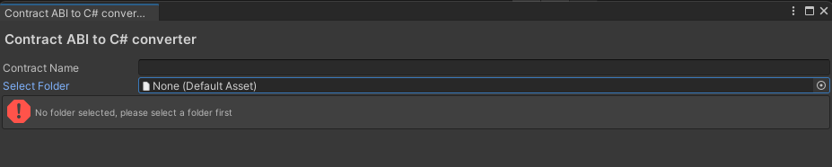
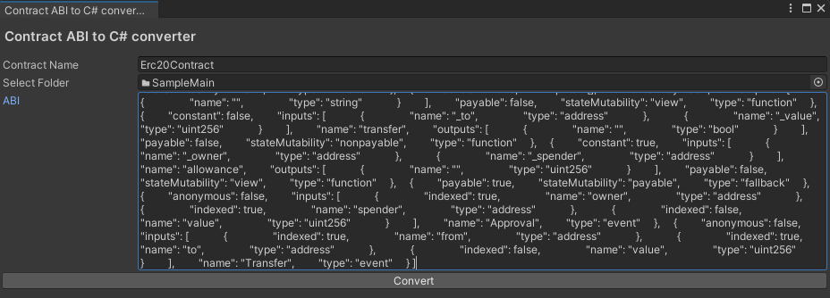

# Contract ABI To C# Generator
In version 3.0, we've made it super easy for you to communicate with the blockchain by introducing the ABI to C# converter. Besides encapsulating all of your contract ABI into more user-friendly, statically typed methods, this utility also allows you to easily subscribe to and unsubscribe from the events happening on the blockchain.

You can access it by clicking on the top menu: Chainsafe SDK > Contract ABI To C# Generator.



Once there, you need to fill out the name of your contract and the folder where you want the C# contract to be generated.




If the data you provided is correct, you can click on Generate. After a few seconds, and once Unity reloads the domain, you should see a newly created C# class inside of your project.

Now, to actually interact with both the events and methods from the contract, the only remaining information needed is the contract address.

Here is a sample script for the Erc20Contract that we've generated in the previous images:

```[csharp]
public class CustomContractSample : MonoBehaviour
{
    [SerializeField] private string contractAddress;
    [SerializeField] private string balanceOfAddress;
    
    Erc20Contract _erc20Contract;

    public async void Start()
    {
        if(Web3Unity.Web3 == null)
            await Web3Unity.Instance.Initialize(false);

       _erc20Contract =  await Web3Unity.Instance.BuildContract<NameOfTheContract>(contractAddress);
       //Calling any read method from the smart contract:
       var balanceOf = await _erc20Contract.BalanceOf(balanceOfAddress);
       _erc20.OnTransfer += Erc20Transfer;       
    }

    public async void OnDestroy()
    {
        _erc20.OnTransfer -= Erc20Transfer;
        await _erc20Contract.DisposeAsync();
    }
    
    private void Erc20Transfer(Erc20Contract.TransferEventDTO obj)
    {
        Debug.Log("Transfer happened");
    }

}
```

Since we subscribe to blockchain events from the ABI during the contract building process behind the scenes, we need to manually dispose of the contract in a method like OnDestroy, which will handle unsubscribing from those events.
