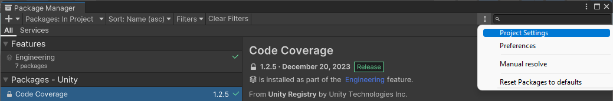
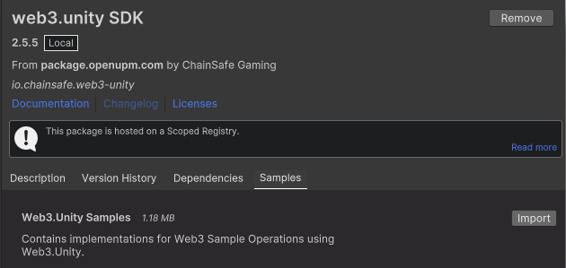
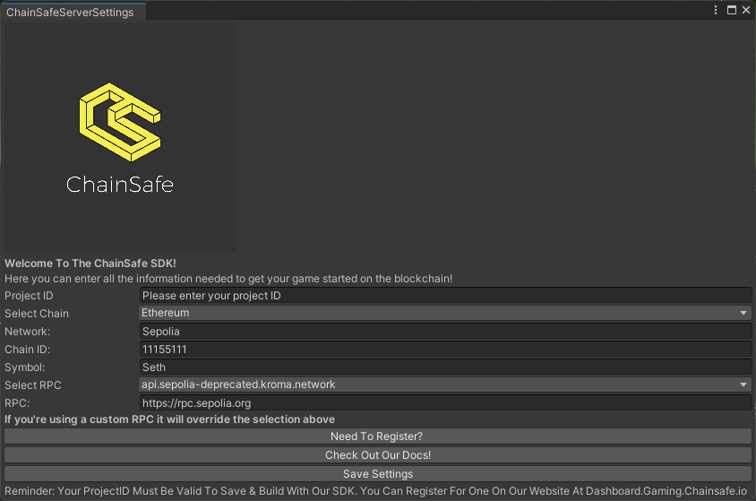

---
slug: /current/getting-started
sidebar_position: 1
sidebar_label: Getting Started
---


# Getting Started

:::info

This page will walk you through the process of installing the Web3 Unity SDK, setting up a project ID, and installing the ChainSafe Gaming sample scenes.

:::


## Install the Web3.Unity SDK via Package Manager With Open UPM

1. On the top bar in unity, navigate to Window → Package Manager → Three Vertical Dots → Project Settings.
   


2. Add a new scoped registry or edit the existing OpenUPM entry if it's already there.
3. Save the following details to the scope then close the window:
- Name: package.openupm.com
- URL: [https://package.openupm.com](https://package.openupm.com/)
- Scope: io.chainsafe.web3-unity

4. Add a new package by name by pressing + and adding ```io.chainsafe.web3-unity```.
5. Next go to the web3.unity SDK package and install the examples by going to the samples tab and pressing import.



Please note that unity versions 2021 and below may require a restart if you experience assembly errors.

### Updating via The Package Manager

Go to window → package manager → select the web3.unity SDK package and press update. The same can be done for any additional packages you have installed, web3auth, lootboxes etc.

## ChainSafe Server Settings
### Set Project ID

As the package is installed, you'll be prompted with the ChainSafe server settings. First you have to setup your Project ID. You can create one [here](https://dashboard.gaming.chainsafe.io/) or you can click on the need to register button in the server settings.



After you've completed the registration process, copy your Project ID into the project settings
window. Save settings. You should see a message in the console saying your project id is valid.

### Other Server Settings

Select the chain you would like to use and the rest of the fields will auto populate. If you would like to set up your own RPC node, visit [this page](https://docs.gaming.chainsafe.io/current/setting-up-an-rpc-node).

Once your project is set up you can choose the wallet you want your players to use.