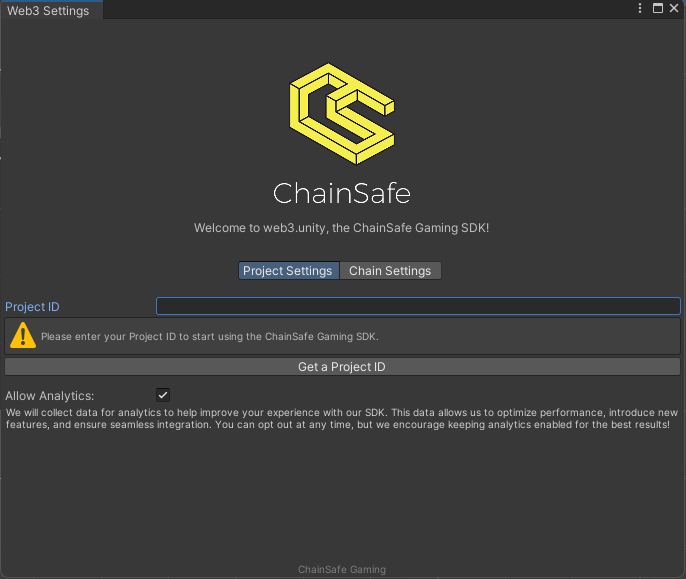

# Getting Started

:::info

This page will walk you through the process of installing the Web3 Unity SDK, setting up a project ID, and installing the ChainSafe Gaming sample scenes.

:::

## Install the Web3.Unity SDK via Unity Package Manager

On the top bar in unity, navigate to Window → Package Manager → Press the plus button on the top left → Add via Git URL.
   

Our packages are modular so your project wont bloat out with SDK files and you can have a lean development environment. The first piece you will need to begin your development journey is the core SDK package. This package contains everything you need for standard chain interactions. Simply enter this url into the add path field of the package manager.

Core SDK:
`https://github.com/ChainSafe/web3.unity.git?path=/Packages/io.chainsafe.web3-unity`

If you prefer to download packages trough openUPM you can do it trough the following link:
`https://openupm.com/packages/io.chainsafe.web3-unity/?subPage=readme`

If you want to add other modules to the core SDK, just copy and paste these links inside of the Package Manager -> + -> Add trough git URL and paste in any of the packages:
Web3Auth Login Provider: `https://github.com/ChainSafe/web3.unity.git?path=/Packages/io.chainsafe.web3-unity.web3auth`
Hyperplay Login Provider: `https://github.com/ChainSafe/web3.unity.git?path=/Packages/io.chainsafe.web3-unity.hyperplay`

Lootboxes: `https://github.com/ChainSafe/web3.unity.git?path=/Packages/io.chainsafe.web3-unity.lootboxes`
Marketplace: `https://github.com/ChainSafe/web3.unity.git?path=/Packages/io.chainsafe.web3-unity.marketplace`
MUD: `https://github.com/ChainSafe/web3.unity.git?path=/Packages/io.chainsafe.web3-unity.mud`
Fiat On/Off Ramp: `https://github.com/ChainSafe/web3.unity.git?path=/Packages/io.chainsafe.web3-unity.ramp`

Please note that each package has samples that can be installed, these samples are built to give you a working example on the packages calls. You will also need the CORE SDK samples package if you want to work with the sample scripts seen [here](/current/sample-scripts)

### Updating via The Package Manager

Go to window → package manager → select the web3.unity SDK package and press update. The same can be done for any additional packages you have installed, web3auth, lootboxes etc.

## ChainSafe Server Settings

### Set Project ID

As the package is installed, you'll be prompted with the ChainSafe server settings. First you have to setup your Project ID. You can create one [here](https://dashboard.gaming.chainsafe.io/) or you can click on the "Get a Project ID" button in the server settings.

After you've completed the registration process, copy your Project ID into the project settings window. You should see a message in the console saying your project id is valid. 
Next up, you need to set up the list of chains you want to interact with inside of your project:

You need a minimum of 1 chain for the SDK to work normally.

Small note: All of our samples are made on the Ethereum Sepolia network. If you run the samples whilst you are on another chain, you will get an exception.

If you need to refer to the ChainSafe server settings area again, you can find it on the top navigation bar. Simply select it and press server settings to view the menu.

### Drag and drop Web3Unity Prefab into your scene. 
You can find the Web3Unity Prefab by typing Web3Unity in the project search bar. From the Search: Choose either 'All' or 'In Packages' 

