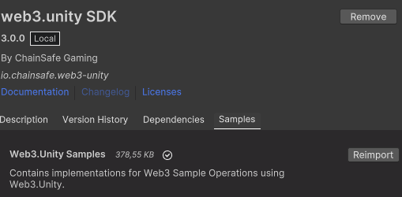

# Getting Started

:::info

This page will walk you through the process of installing the Web3 Unity SDK, setting up a project ID, and installing the ChainSafe Gaming sample scenes.

:::

## Install the Web3.Unity SDK via Unity Package Manager

On the top bar in unity, navigate to Window → Package Manager → Press the plus button on the top left → Add via Git Url.
   

Our packages are modular so your project wont bloat out with SDK files and you can have a lean development environment. The first piece you will need to begin your development journey is the core SDK package. This package contains everything you need for standard chain interactions. Simply enter this url into the add path field of the package manager.

Core SDK:
`https://github.com/ChainSafe/web3.unity.git?path=/Packages/io.chainsafe.web3-unity`

Please note that each package has samples that can be installed, these samples are built to give you a working example on the packages calls. You will also need the CORE SDK samples package if you want to work with the prefab scripts seen [here](https://docs.gaming.chainsafe.io/current/prefab-scripts)

### Updating via The Package Manager

Go to window → package manager → select the web3.unity SDK package and press update. The same can be done for any additional packages you have installed, web3auth, lootboxes etc.

## ChainSafe Server Settings

### Set Project ID

As the package is installed, you'll be prompted with the ChainSafe server settings. First you have to setup your Project ID. You can create one [here](https://dashboard.gaming.chainsafe.io/) or you can click on the "Need To Register?" button in the server settings.

After you've completed the registration process, copy your Project ID into the project settings window. You should see a message in the console saying your project id is valid. Select the chain you would like to use and the rest of the fields will auto populate. If you would like to set up your own RPC node, visit [this page](https://docs.gaming.chainsafe.io/current/setting-up-an-rpc-node).

If you need to refer to the ChainSafe server settings area again, you can find it on the top naviagation bar. Simply select it and press server settings to view the menu.

