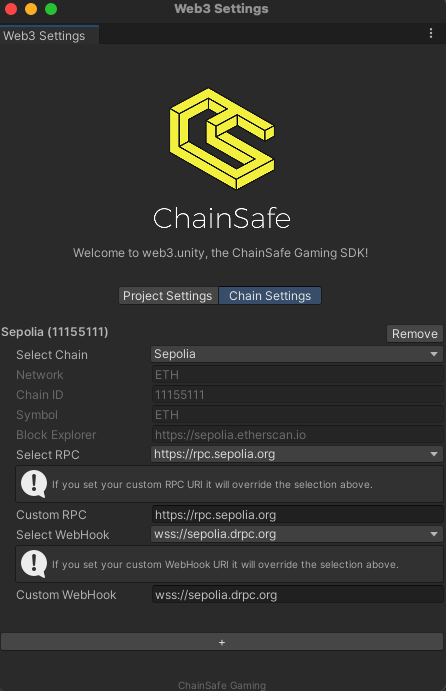

# Chain Switching

In version 3.0, we've added the most requested feature from the community — chain switching.

Chain switching allows you to seamlessly switch between chains if you need to interact with smart contracts that are deployed on a different chains.



In the Chain Settings inside the ChainSafe SDK → Project Settings, you can add as many chains as you'd like. 

The first chain in the list will always be the initial one that Web3Unity connects to.

The API for switching between chains is simple—just call `await Web3Unity.Web3.SwitchChain(newChainId);`. A more detailed example follows:

```csharp
public class ChainSwitchingSample : MonoBehaviour
{
    [SerializeField] private string newChainId;
    [SerializeField] private string newChainContractAddress;
    [SerializeField] private string newChainContractAbi;

    async void Start()
    {
        //Make sure web3 instance is initialized
        var currentChainId = Web3Unity.Web3.Chains.Current.ChainId;
        await Web3Unity.Web3.SwitchChain(newChainId);
        //For the sake of simplicity, we're demonstrating the 'old-fashioned' way of building contracts.
        var contract = await Web3Unity.Web3.ContractBuilder.Build(newChainContractAbi, newChainContractAddress);
        //Use the return value however you want. You can always call the contract.Call method even if you don't have the wallet bound to the web3 instance.
        var returnValue = await contract.Call("exampleMethod");
        //It's recommended to return back to the old chain as soon as you finish interaction with contracts on the other chains.
        await Web3Unity.Web3.SwitchChain(currentChainId);
    }


}

```