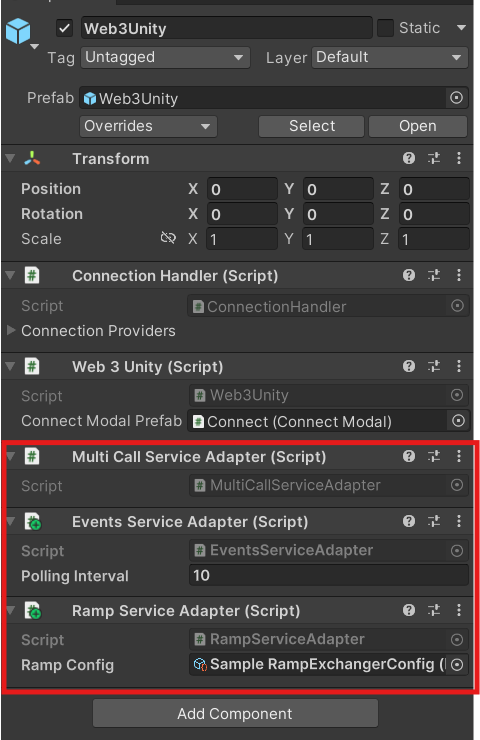

---
slug: /current/service-adapters
sidebar_position: 22
sidebar_label: Service Adapters
---

# Service Adapters

:::info

This page shows you how to add additional functionality to your project using service adapters.

:::

Service Adapters are used to inject additional services to your Web3 instance. You can do this by attaching `ServiceAdapter` scripts to `Web3Unity` in your scene hierarchy.

We have multiple service adapters available for you to use in the core package:
- [Events](/current/blockchain-events) service adapter
- MultiCall service adapter - Allows you to batch multiple calls into a single call.
- [Gelato](/current/gasless-transactions-using-Gelato) service adapter

We have additional service adapters available in our additional packages:
- [Ramp](/current/ramp) service adapter



## Implementing your own Service Adapter

If you would like to implement your own service adapter you can do so by creating a new script that inherits from the MonoBehaviour class `ServiceAdapter` and implementing the `ConfigureServices` method. Here is an example of how you can create your own service adapter:

```csharp

public class SampleServiceAdapter : ServiceAdapter, ISampleService
{
    public override Web3Builder ConfigureServices(Web3Builder web3Builder)
    {
        return web3Builder.Configure(services =>
        {
            services.AddSingleton<ISampleService>(this);
        });
    }
}

```

In the example above, we have created a new service adapter called `SampleServiceAdapter` that is also an `ISampleService`. We then override the `ConfigureServices` method and add the `ISampleService` to the service collection to be injected during initialization. Service adapters must be present in the scene hierarchy during initialization to be injected into the Web3 instance. They can be attached anywhere in the scene hierarchy, but we recommend attaching them to the `Web3Unity` GameObject. If you would like your services to be injected without a connection present (during initialization) then your service adapter should also implement `ILightweightServiceAdapter` interface.
