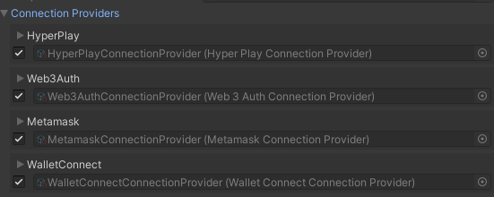

import Link from '@docusaurus/Link';

# Choose Your Wallet Provider

:::info

This page will walk you through your options for wallet providers.

:::

Players will use wallets to manage their assets and interact with your games. The Web3 Unity SDK offers four wallet providers to choose from. The following table details the platforms they can be deployed on.

<table className="transparent-table">
  <thead>
    <tr>
      <th></th>
      <th>Metamask</th>
      <th>Reown (Wallet Connect)</th>
      <th>Web3 Auth</th>
      <th>Hyperplay</th>
    </tr>
  </thead>
  <tbody>
    <tr>
      <th className="table-cell-bold-green">Browser</th>
      <td className="center-content">✓</td>
      <td className="center-content">✓</td>
      <td className="center-content">✓</td>
      <td className="center-content greyed-out">✗</td>
    </tr>
    <tr>
      <th className="table-cell-bold-green">Desktop</th>
      <td className="center-content greyed-out">✗</td>
      <td className="center-content">✓</td>
      <td className="center-content">✓</td>
      <td className="center-content">✓</td>
    </tr>
    <tr>
      <th className="table-cell-bold-green">Android</th>
      <td className="center-content greyed-out">✗</td>
      <td className="center-content">✓</td>
      <td className="center-content">✓</td>
      <td className="center-content greyed-out">✗</td>
    </tr>
    <tr>
      <th className="table-cell-bold-green">iOS</th>
      <td className="center-content greyed-out">✗</td>
      <td className="center-content">✓</td>
      <td className="center-content">✓</td>
      <td className="center-content greyed-out">✗</td>
    </tr>
    <tr>
      <th className="table-cell-bold-green">VR</th>
      <td className="center-content greyed-out">✗</td>
      <td className="center-content greyed-out">✗</td>
      <td className="center-content">✓</td>
      <td className="center-content greyed-out">✗</td>
    </tr>
    <tr>
      <th className="table-cell-bold-green">Social Sign Ons</th>
      <td className="center-content greyed-out">✗</td>
      <td className="center-content greyed-out">✗</td>
      <td className="center-content">✓</td>
      <td className="center-content">✓</td>
    </tr>
    <tr>
      <td></td>
      <td><Link className="custom-button" to="/current/metamask" style={{ margin: '5px' }}>Metamask</Link></td>
      <td><Link className="custom-button" to="/current/reown" style={{ margin: '5px' }}>Reown (Wallet Connect)</Link></td>
      <td><Link className="custom-button" to="/current/web3auth" style={{ margin: '5px' }}>Web3 Auth</Link></td>
      <td><Link className="custom-button" to="/current/hyperplay" style={{ margin: '5px' }}>Hyperplay</Link></td>
    </tr>
  </tbody>
</table>

# Add Wallets to Your Unity Game

Adding wallet providers to your games is simpler than ever. Open the `SampleMain` scene, click Web3Unity, and in the inspector navigate to the Connection Handler component. In the Connection Providers drop down you can choose all the wallets you want to include in your game.

You no longer need to choose between wallets, you can add as many as you want to your game!
