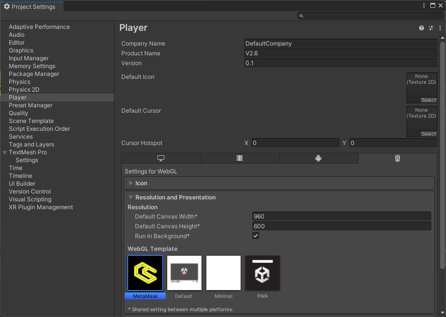

# MetaMask

## What is Metamask?

MetaMask is a digital wallet and browser extension that allows users to securely interact with EVM-based games. It acts as a bridge between your browser and the EVM chains, making it easy to send, receive, and swap digital assets. You can learn more about MetaMask [here](https://metamask.io/).

:::note

MetaMask will only work with WebGL builds that are built out locally or published in the browser. You can use Reown to login and scan the QR code on your device to connect with MetaMask if needed for desktop builds.

:::

## WebGL Builds

MetaMask uses a custom WebGL template to display your game in your browser. It should be selected by default but if you run into issues you can navigate to File → Build Settings → Player Settings. In player settings, set your resolution to the Web3.Unity template.

Now you are ready to build your WebGL game.
