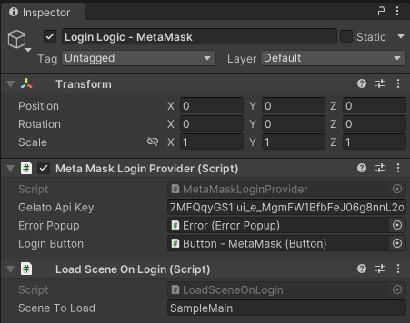
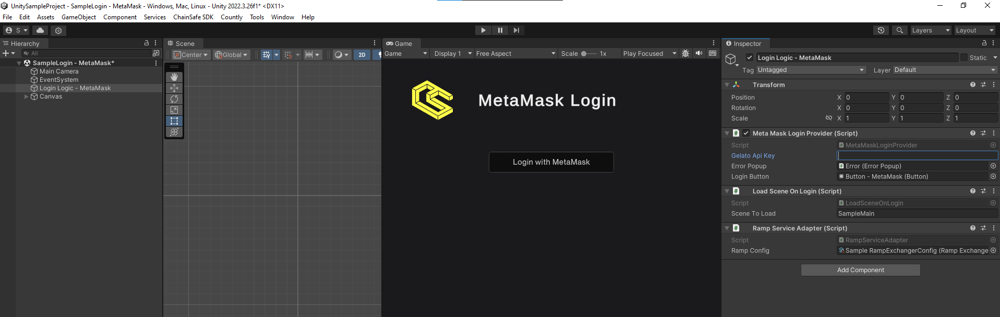

# Metamask

:::info

Please note that metamask will only work with WebGL builds that are built out locally or published in the browser. You can use wallet connect to login and scan the QR code on your device to connect with MetaMask if needed for desktop builds.

:::

Here’s how you can include MetaMask in your video games.
1. You can find the scene by navigating to Samples → web3.unity SDK → 2.6 → Web3.Unity Samples → Scenes → SampleLogin - MetaMask.
2. Click on the Login Logic - MetaMask object and in the inspector, modify the Scene To Load to your preferred scene.

3. Add the Metamask scene and your scene to the build settings, and you’re done.

Simply login with a local or published WebGL build and connect your MetaMask.