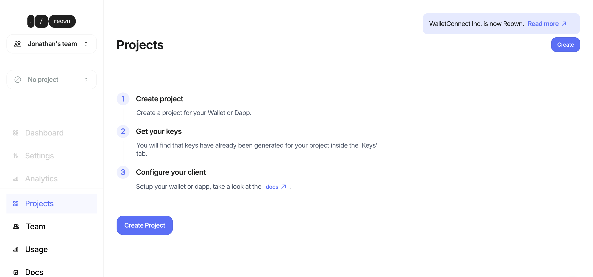
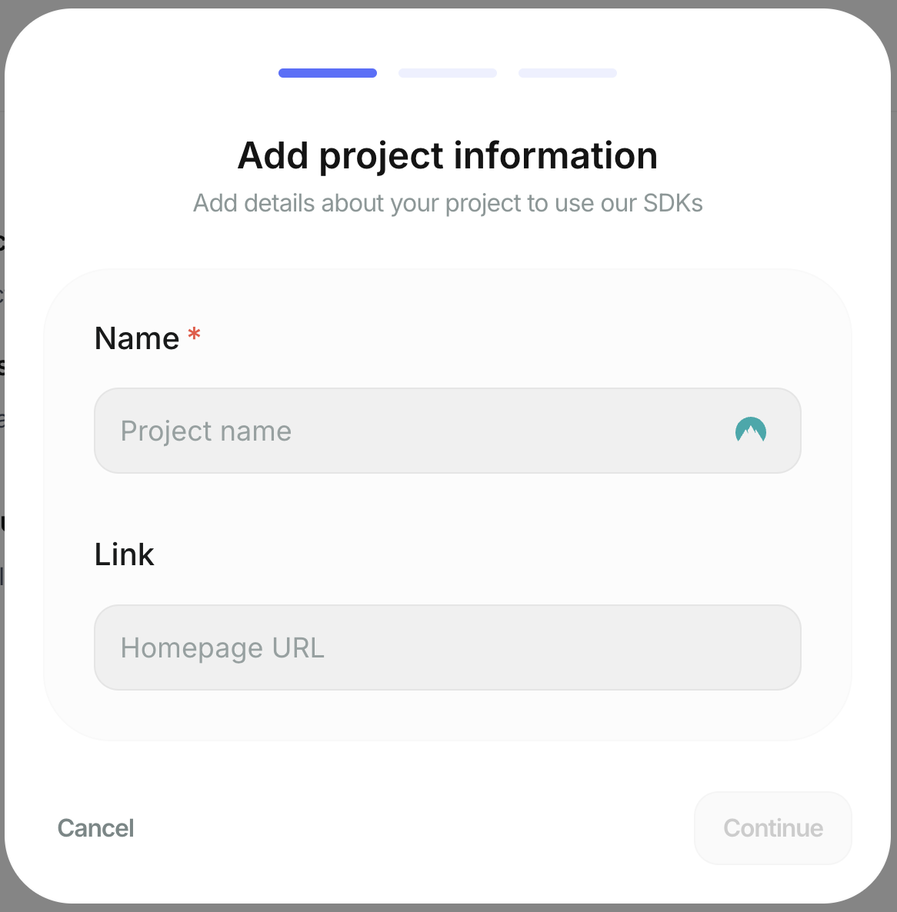
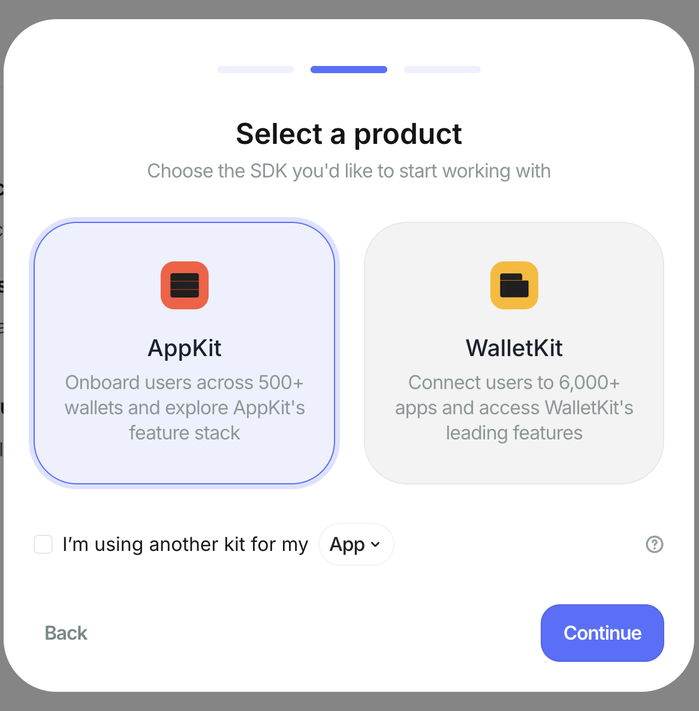
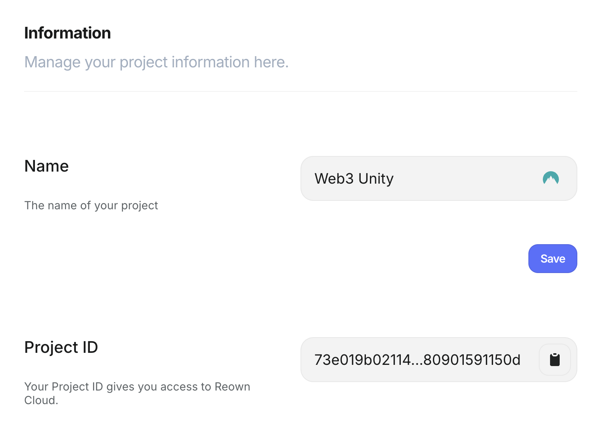
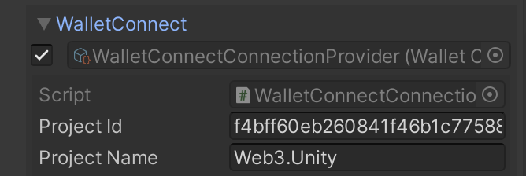

# Reown (Wallet Connect)

## What is Reown (Wallet Connect)?

Reown is an open protocol that allows users to connect their crypto wallets to games through a QR code or deep link. It enables secure interactions between mobile wallets and Web3 games, making it easy to authorize transactions and access blockchain features from any device.

:::note

You must create an account and project in the Reown (Wallet Connect) dashboard to use this feature.

:::

## Custom Reown (Wallet Connect) Endpoint

Head on over to the dashboard at [Reown (Wallet Connect)](https://cloud.walletconnect.com/sign-in?utm_source=docs&utm_medium=documentation&utm_campaign=chainsafe_gaming_docs) to sign up and get your details.

Once you're in the Reown (Wallet Connect) dashboard area, you can press the button on the top right to create a new project, it will ask you to give the project a name.

Next select Appkit and then Unity.

Once you've created the project you'll be taken to the settings area. Here you'll find the input details you need. Scroll down to the Information section and there you can grab the project name and the project id.

Just place these into the editor values, press save and you're good to go.

