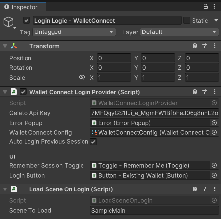
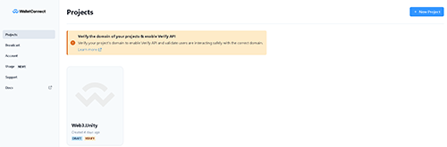
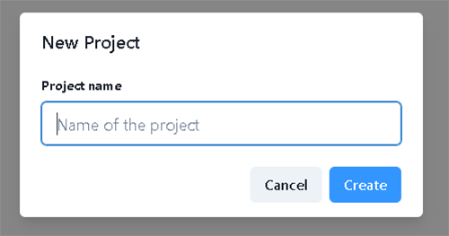
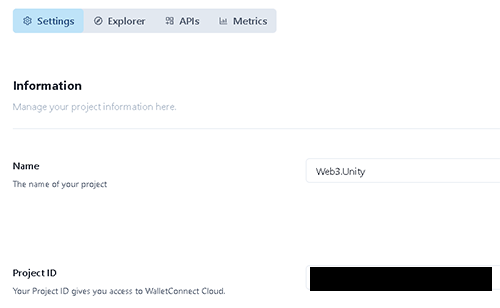
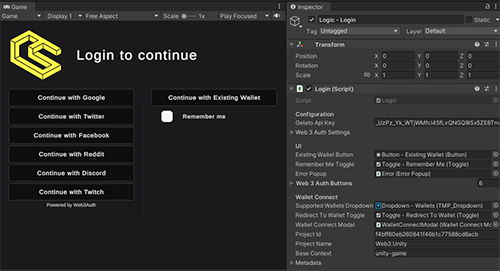

# Reown (Wallet Connect)

Here’s how you can include Reown (Wallet Connect) in your video games.

1. Once imported, you can find the scene by navigating to Samples → web3.unity SDK → 2.6 → Web3.Unity Samples → Scenes → SampleLogin - WalletConnect.
2. Click on the Login Logic - WalletConnect object and in the inspector, modify the Scene To Load to your preferred scene.

3. Add the Reown (Wallet Connect) scene and your scene to the build settings, and you’re done.

## Custom Reown (Wallet Connect) Endpoint

We've already given you some default values for the Reown (Wallet Connect) configuration so if you're fine with using the same endpoint as everyone else just leave it as is. Otherwise head on over to the dashboard at [Reown (Wallet Connect)](https://cloud.walletconnect.com/sign-in) to sign up and get your own details.

Once you're in the Reown (Wallet Connect) dashboard area, you can press the button on the top right to create a new project, it will ask you to give the project a name.

Once you've created the project you'll be taken to the settings area. Here you'll find the input details you need, the project name and the project id.

Just place these into the editor values, press save and you're good to go.

