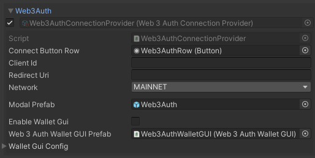
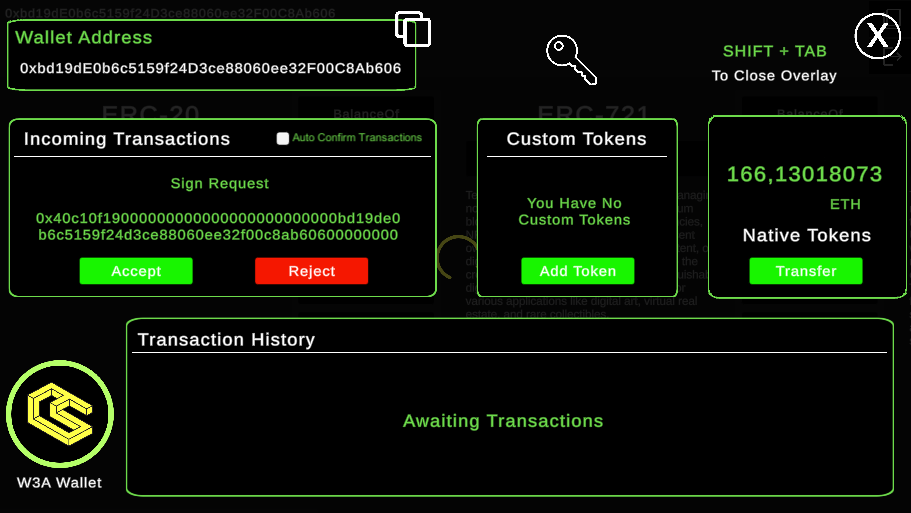
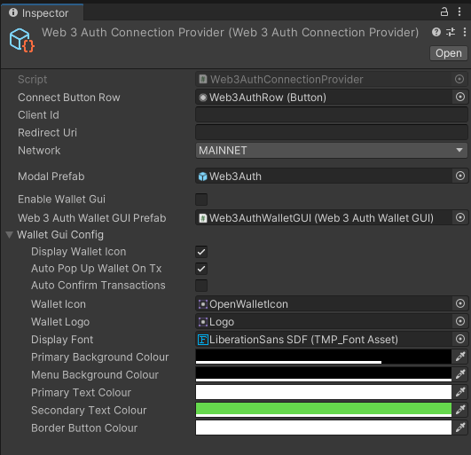
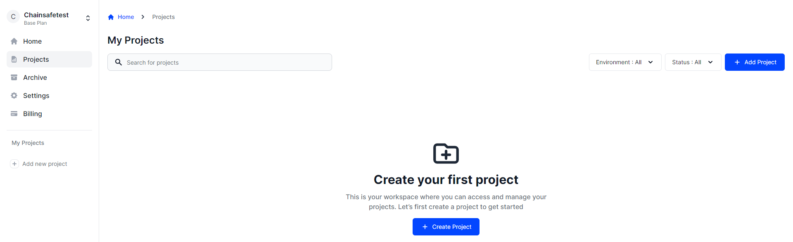
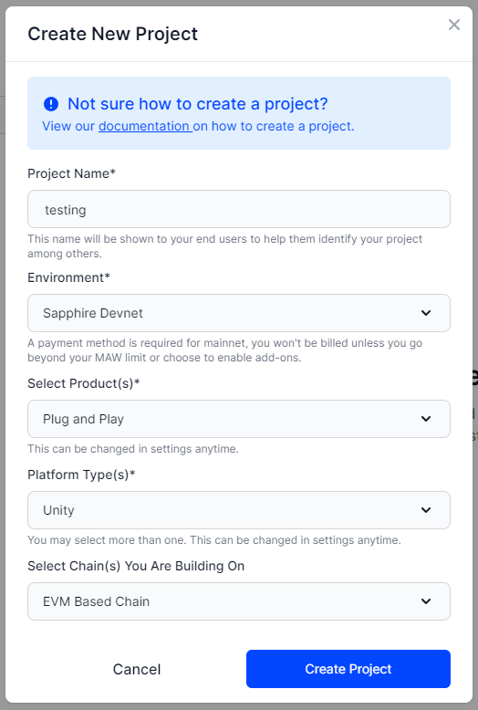
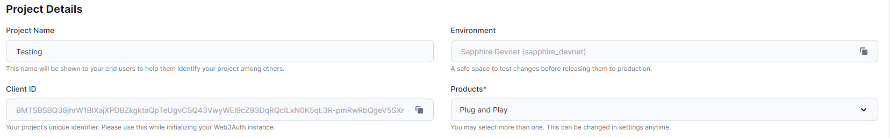

# Web3Auth

## What is Web3Auth?

Web3Auth is a wallet solution that allows users to connect to the blockchain via social logins. Upon logging in you'll receive a wallet that is fully functional and able to make calls with our SDK.

## Populating the Configuration file

Once you have imported the package, Web3Auth entry will be available in the Connection Handler script in the inspector. Click on Add Provider to generate the Web3Auth configuration file.

### Web3Auth Wallet GUI
Before showing you the process on how to add your own Client Id, we just want to introduce you to the new feature we've added in the 3.0.0 and that is Web3Auth Wallet GUI.
We got a lot of requests to make the social logins with web3auth also feel like the regular wallets, where you would also be able to approve and decline transactions, see the latest transactions you've done in this session and also check balances of some of your native tokens and read the balance of the chain that you are on.

#### Web3Auth Wallet GUI configuration

In the connection provider settings, you have the <b>Enable Wallet GUI toggle</b>, which, when turned on, will instantiate the wallet GUI once the user is logged in.

In the Wallet GUI Config, you can fine-tune the behavior and appearance of the Wallet GUI by modifying the colors and deciding if you want to auto-confirm transactions. You can also choose to view the transaction hash history in the GUI without requiring the end user to approve every write call to the blockchain.

### Getting Client Id

In order to properly populate the Client Id and redirect URL go to [Web3Auth dashboard](https://dashboard.web3auth.io/?utm_source=docs&utm_medium=documentation&utm_campaign=chainsafe_gaming_docs)

In the dashboard, click on project navigation column on the left, and click "Create Project".

In the create new project menu, be sure to choose "Plug and Play" for your product, "Unity" for your platform types, and "EVM Based Chain" for the Chains you are building on.

When you create your project, you'll be redirected to the project page. Copy your client ID and open Unity.

