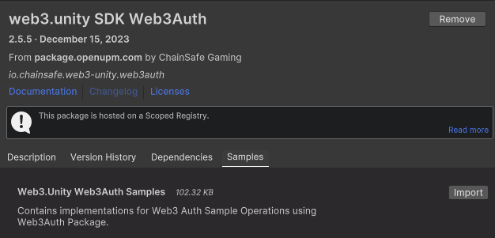
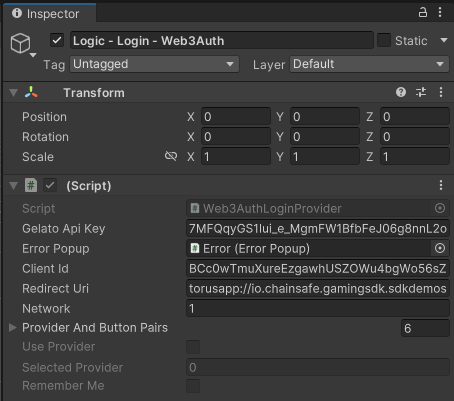

# Web3Auth

## What is Web3Auth?
Web3Auth is a wallet solution that allows users to connect to the blockchain via social logins. Upon logging in you'll receive a wallet that is fully functional and able to make calls with our SDK.

Here’s how you can include Web3Auth in your video games.

1. You can import our Web3Auth sample scene by navigating to Window → Package Manager.
2. Add a new package by name by pressing + and pressing add via git url entering `https://github.com/ChainSafe/web3.unity.git?path=/Packages/io.chainsafe.web3-unity.web3auth`
3. Once the package is installed, click on the Samples tab. Import the samples.

4. Once imported, you can find the scene by navigating to Samples → web3.unity SDK Web3Auth → 2.6 → Web3.Unity Web3Auth Samples → Scenes → SampleLogin - Web3Auth.
5. Click on the Login Logic - Web3Auth object and in the inspector, modify the Scene To Load to your preferred scene.

6. Add the Web3Auth scene and your scene to the build settings, and you’re done.

We hope you enjoy social logins as it offers a unique way to onboard users to the blockchain without actually requiring a wallet.

## Moving to Production
The default settings for Web3Auth are great for testing but once you're ready to move to production you will want to manage your won API key. To get started, visit the [Web3Auth dashboard](https://dashboard.web3auth.io/) and create your account.

In the dashboard, click on project navigation column on the left, and click "Create Project".

In the create new project menu, be sure to choose "Plug and Play" for your product, "Unity" for your platform types, and "EVM Based Chain" for the Chains you are building on.

When you create your project, you'll be redirected to the project page. Copy your client ID and open Unity.

Click on the Login Logic - Web3Auth object and in the inspector, paste in your client ID in the client ID field under the Web3Auth section.

Now you are all set to move to production!