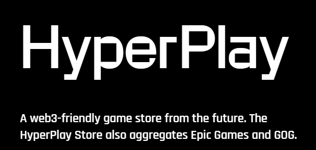
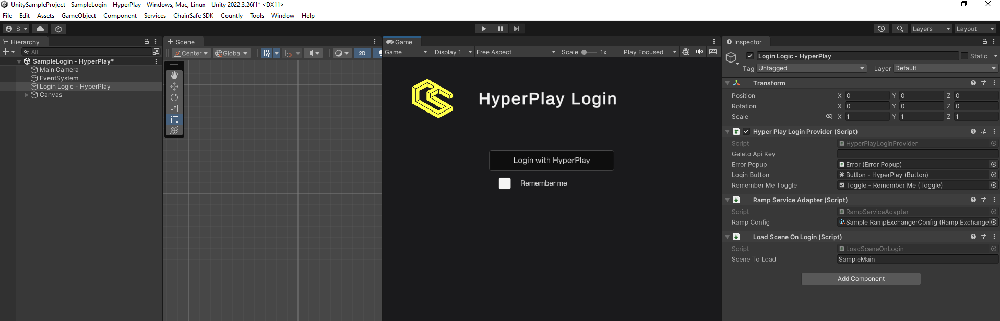
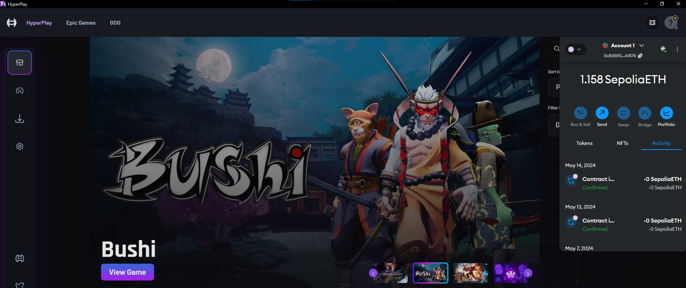

# Hyperplay

## What is HyperPlay?
HyperPlay is a wallet solution that runs in a desktop client, it uses web requests to communicate with the wallet with the client and makes connecting to games easy and simple.

Here’s how you can include Hyperplay in your video games.

1. You can import our Hyperplay sample scene by navigating to Window → Package Manager.
2. Add a new package by name by pressing + and adding via git url and entering `https://github.com/ChainSafe/web3.unity.git?path=/Packages/io.chainsafe.web3-unity.hyperplay`
3. Once the package is installed, click on the Samples tab. Import the samples.
4. Once imported, you can find the scene by navigating to Samples → web3.unity SDK → 2.6 → Web3.Unity Samples → Scenes → SampleLogin - Hyperplay.
5. Click on the Login Logic - Hyperplay object and in the inspector, modify the Scene To Load to your preferred scene.
6. Add the Hyperplay scene and your scene to the build settings, and you’re done.

## HyperPlay Desktop App

You will also need to install the hyperplay app which you can find [here](https://www.hyperplay.xyz/downloads) It's a nifty little desktop app that communicates with unity when web requests are sent to it. Once your wallet is logged in to the hyperplay app, when you login or make calls with the SDK, the app will prompt you to interact with your wallet.

