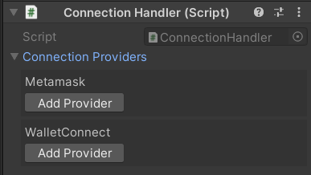
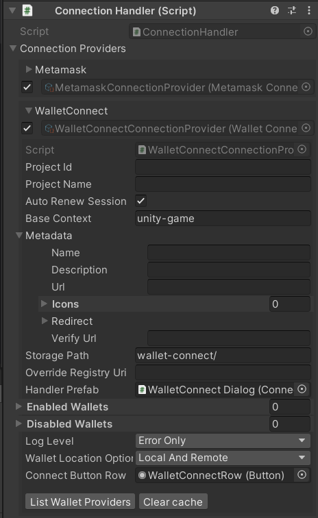
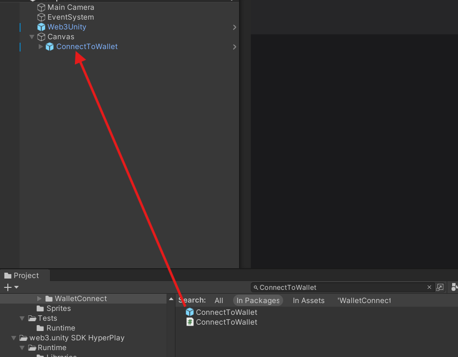
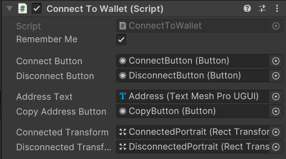

---
slug: /current/login-process
sidebar_position: 8
sidebar_label: Login Process
---


# Login Process

:::info

This page teaches you how the login process is performed & how the web3 object is being initialized.

:::

Wallet connections are made part of the Web3 object's build process when you log in. Once this build process is complete you'll have an instance and all of its components with their states fully initialized. This makes using the SDK quite simple as most calls will come from this object.

## Configuring your Connection Providers

Before you can connect to a wallet, you need to set up your connection providers. You can do this by going to your `Web3Unity` prefab in your scene hierarchy and look under the Connection Providers drop down in the `ConnectionHandler` script.



You can add a connection provider of your choice. We currently support Wallet Connect and Metamask in the core package and Web3Auth and HyperPlay as external/add-on packages. Once you've added a connection provider of your choice you can then configure it by further expanding the connection provider. If your connection provider needs further configuration please look [here](/current/choose-your-wallet) on how to configure it.



## Connecting to a Wallet

Once you have Configured your connection provider you can drag in `ConnectToWallet.prefab` found in `Packages/io.chainsafe.web3-unity/Runtime/Prefabs/` to connect to a wallet automatically. This prefab has a connect button ready and available that'll initialize building a Web3 object using the connection your choice. You can also use the script `ConnectToWallet` to make your own connection prefab.



If you would like to connect to a wallet manually, you can follow the steps below.

```csharp
public class ConnectToWallet : MonoBehaviour
{
    private async void Start()
    {
        await Web3Unity.Instance.Initialize(true);
                
        await Web3Unity.Instance.Connect<WalletConnectConnectionProvider>();

        if (Web3Unity.Connected)
        {
            Debug.Log("Connected");
            
            var web3 = Web3Unity.Web3;
        }
    }
}
```

You can replace `WalletConnectConnectionProvider` with any other connection provider available, If a connection provider doesn't exist you can also implement your own by inheriting from the `ConnectionProvider` class. Once connected you can access the instantiated Web3 via `Web3Unity.Web3`.
