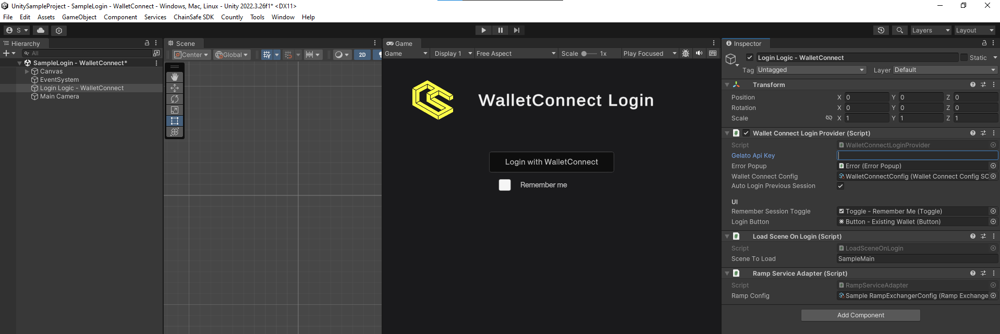

---
slug: /current/login-process
sidebar_position: 8
sidebar_label: Login Process
---


# Login Process

:::info

This page teaches you how the login process is performed & the how the web3 object is being initialized.

:::

Wallet connections are made as apart of the Web3 object's build process when you log in. Once this build process is complete you'll have an instance and all of it's components with their states fully initialized. This makes using the SDK quite simple as most calls will come from this object.

```csharp
public class LoginSample : MonoBehaviour
{
    private Web3Builder web3Builder;

    private void Awake()
    {
        web3Builder = new Web3Builder(ProjectConfigUtilities.Load())
            .Configure(services =>
            {
                // Configure Web3 client to use WalletConnect
                services.UseUnityEnvironment()
                        .UseRpcProvider()
                        .UseWalletConnect()
                        .UseWalletConnectSigner()
                        .UseWalletConnectTransactionExecutor();
            });
    }
}
```

Wallet connection happens when `LaunchAsync()` is called on the `Web3Builder` object as seen below.

``` csharp
public class LoginSample : MonoBehaviour
{
    . . .
    
    private Web3 web3;
    
    public async void Login()
    {
        web3 = await web3Builder.LaunchAsync();
    }
}
```

You can then use this web3 instance as needed through the SDK which you can see examples of in our sample scripts area [here](/current/sample-scripts).

``` csharp
public class LoginSample : MonoBehaviour
{
    . . .
    
    public string GetPlayerAddress()
    {
        return Web3Accessor.Web3.Signer.PublicAddress;
    }
}
```

Whilst we go into the core functionality of the build process here, if you simply want to use the login scene provided
with the samples, it will do everything here in the login process so you don't need to worry. Just add a LoginProvider
of your choice and you're good to go.



You can then access the Web3 client that was build by LoginProvider with a static `Web3Accessor.Web3` property.