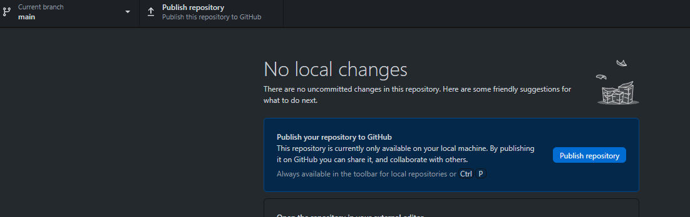

# Web3Wallet Builds For Mobile & Desktop Games

:::info

The Web3Wallet build option allows game developers to build Unity games for desktop and mobile (iOS/Android). This build uses our [Web3Wallet](https://github.com/ChainSafe/game-web3wallet) component and contains various prefabs & scripts.

:::

### Building To Web3Wallet ###

Here's a video tutorial on how to start a Web3Wallet build with the SDK: 
<iframe width="800" height="450" src="https://www.youtube.com/embed/ZD65bofy-zk?list=PLPn3rQCo3XrNirDbLmwb98V3YJP8R6kkr" title="How To Start A Web3Wallet Build With web3.unity v2 (For Desktop And Mobile!)" frameborder="0" allow="accelerometer; autoplay; clipboard-write; encrypted-media; gyroscope; picture-in-picture; web-share" allowfullscreen></iframe>

### Block Number {#block-number}

Get the current (i.e. latest) block number.

```csharp
using Web3Unity.Scripts.Library.Ethers.Providers;
using UnityEngine;

public class Web3WalletGetBlockNumber : MonoBehaviour
{
    public async void BlockNumber()
    {
        var provider = new JsonRpcProvider("YOUR_NODE");
        Debug.Log("Block Number: " + await provider.GetBlockNumber());
    }
}
```

### Gas Price {#block-number}

Get the current gas price for a transaction based on chain / network and rpc.

```csharp
using Web3Unity.Scripts.Library.Ethers.Providers;
using UnityEngine;

public class Web3WalletGetGasPrice : MonoBehaviour
{
    public async void GasPrice()
    {
        var provider = new JsonRpcProvider("YOUR_NODE");
        Debug.Log("Gas Price: " + await provider.GetGasPrice());
    }
}
```

### Gas Limit {#block-number}

Get the current gas limit for a transaction based on chain / network and rpc.

```csharp
using Web3Unity.Scripts.Library.Ethers.Contracts;
using Web3Unity.Scripts.Library.Ethers.Providers;
using UnityEngine;

public class Web3WalletGetGasLimit : MonoBehaviour
{
    public async void GasLimit()
    {
        var provider = new JsonRpcProvider("YOUR_NODE");
        string contractAbi = "[ { \"inputs\": [ { \"internalType\": \"uint8\", \"name\": \"_myArg\", \"type\": \"uint8\" } ], \"name\": \"addTotal\", \"outputs\": [], \"stateMutability\": \"nonpayable\", \"type\": \"function\" }, { \"inputs\": [], \"name\": \"myTotal\", \"outputs\": [ { \"internalType\": \"uint256\", \"name\": \"\", \"type\": \"uint256\" } ], \"stateMutability\": \"view\", \"type\": \"function\" } ]";
        string contractAddress = "0x741C3F3146304Aaf5200317cbEc0265aB728FE07";
        var contract = new Contract(contractAbi, contractAddress, provider);
        var gasLimit= await contract.EstimateGas("addTotal", new object[] {});
        Debug.Log("Gas Limit: " + gasLimit);
    }
}
```

### Transaction Status {#transaction-status}

```csharp
using Nethereum.Hex.HexTypes;
using Web3Unity.Scripts.Library.Ethers.Providers;
using Web3Unity.Scripts.Library.Ethers.Signers;
using Web3Unity.Scripts.Library.Ethers.Transactions;
using UnityEngine;

public class Web3WalletGetTxStatus : MonoBehaviour
{
    public async void TransactionStatus()
    {
        var provider = new JsonRpcProvider("YOUR_NODE");
        var signer = new JsonRpcSigner(provider, 0);
        var tx = await signer.SendTransaction(new TransactionRequest
        {
            To = await signer.GetAddress(),
            Value = new HexBigInteger(100000)
        });
        var txReceipt = await tx.Wait();
        Debug.Log("Transaction receipt: " + txReceipt.Confirmations);
    }
}
```

### Nonce {#nonce}

```csharp
using Nethereum.Hex.HexTypes;
using Web3Unity.Scripts.Library.Ethers.Providers;
using Web3Unity.Scripts.Library.Ethers.Signers;
using Web3Unity.Scripts.Library.Ethers.Transactions;
using UnityEngine;

public class Web3WalletGetNonce : MonoBehaviour
{
    public async void Nonce()
    {
        var provider = new JsonRpcProvider("YOUR_NODE");
        var signer = new JsonRpcSigner(provider, 0);
        var tx = await signer.SendTransaction(new TransactionRequest
        {
            To = await signer.GetAddress(),
            Value = new HexBigInteger(100000)
        });
        var nonce = tx.Nonce;
        Debug.Log("Nonce: " + nonce);
    }
}
```

### Sign Transaction Through Mobile and Desktop {#sign-through-mobile-and-desktop}

```csharp
string response = await Web3Wallet.Sign("hello");
print(response);
```

### Verify Web Wallet {#verify}

Verify a signed message via a Web Wallet.

```csharp
using System.Text;
using Nethereum.Signer;
using Nethereum.Util;
using UnityEngine;
using Web3Unity.Scripts.Library.Web3Wallet;

public class Web3WalletSignVerify : MonoBehaviour
{
    // Start is called before the first frame update
    async void Start()
    {
        string message = "hello";
        string signature = await Web3Wallet.Sign(message);
        //verification
        SignVerifySignature(signature, message);
    }

    public void SignVerifySignature(string signatureString, string originalMessage)
    {
        string msg = "\x19" + "Ethereum Signed Message:\n" + originalMessage.Length + originalMessage;
        byte[] msgHash = new Sha3Keccack().CalculateHash(Encoding.UTF8.GetBytes(msg));
        EthECDSASignature signature = MessageSigner.ExtractEcdsaSignature(signatureString);
        EthECKey key = EthECKey.RecoverFromSignature(signature, msgHash);

        bool isValid = key.Verify(msgHash, signature);
        Debug.Log("Address Returned: " + key.GetPublicAddress());
        Debug.Log("Is Valid: " + isValid);
    }
}
```

### Hosting Your Own Sign Page {#hosting-your-own-sign-page}

You can find the Web3Wallet repo [here](https://github.com/ChainSafe/game-web3wallet). You can download and host this on git for free. This instantiates web3 in a webpage to allow MetaMask to connect & make transactions. We'll guide you through this process below.

Step 1: [Create a GitHub account](https://github.com/join).

Step 2: Clone the [Web3Wallet](https://github.com/ChainSafe/game-web3wallet) repo using GitHub Desktop. Press `Add`, `Clone Repository...`, and then paste in the following URL: `https://github.com/ChainSafe/game-web3wallet`.

.png>)

.png>)

Step 3: GitHub Desktop will ask you if you want to fork the repo. When prompted, select `For My Own Purposes`. This will create a fork, where you can push to your own repository.

.png>)

Step 4: You will need to edit the `package.json` file to confirm to the directory where the signer will be found. Run the yarn install/build process for [Web3Wallet](https://github.com/ChainSafe/game-web3wallet). Once you are happy with your changes, press `Ctrl + P`, or the blue button below, to push your repository to GitHub. This stores these files online and makes them readily accessible!



Step 5: Navigate to your GitHub repository settings page and find the `Pages` section. From here, select `Deploy from a branch`, set your branch to `main` and the folder as `root` (Some users have reported that selecting `gh-page` branch has worked over `main` so please try this instead if you're experiencing errors). Press `Save` and wait for the repo to build. This creates a webpage with a public URL that we can access.

.png>)

Step 6: Lastly, update the `Web3Wallet.cs` file in the `web3unity` folder in Unity. Update the URL to point to the one created in the previous step. Once ready, the new URL will be displayed above the `Build and deployment` settings (seen in the image above).

.png>)

To add additional customizations (such as page design & colors) to the web page, you can open the repository in VSCode to parameterize the `index.js` & `styles.css` files. 

:::info

Note: if the code for the sign page's functionalities are altered, it may cause unforeseen issues which we may have trouble assisting with.

::: 

### Secure Hash Algorithm 3 (SHA-3) Through Web3Wallet

Calculates the SHA-3 of the input.

```csharp
using Web3Unity.Scripts.Library.Web3Wallet;
using UnityEngine;

public class Web3WalletSha3Example : MonoBehaviour
{
    void Start()
    {
        string message = "hello";
        string hashedMessage = Web3Wallet.Sha3(message);
        // 0x1c8aff950685c2ed4bc3174f3472287b56d9517b9c948127319a09a7a36deac8
        print(hashedMessage);
    }
}
```

### Transfer ERC-20 Token Through Mobile and Desktop {#transfer-erc-20-token-through-mobile-and-desktop}

```csharp
using UnityEngine;
using Web3Unity.Scripts.Library.ETHEREUEM.EIP;
using Web3Unity.Scripts.Library.Ethers.Contracts;
using Web3Unity.Scripts.Library.Web3Wallet;

public class Web3WalletTransfer20Example : MonoBehaviour
{
    async public void OnTransfer20()
    {
        // https://chainlist.org/
        string chainId = "5"; // goerli
        // contract to interact with 
        string contract = "0xc778417e063141139fce010982780140aa0cd5ab";
        // value in wei
        string value = "0";
        // abi in json format
        string abi = ABI.ERC_20;
        // smart contract method to call
        string method = ETH_METHOD.Transfer;
        // account to send erc20 to
        string toAccount = "0xdD4c825203f97984e7867F11eeCc813A036089D1";
        // amount of erc20 tokens to send
        string amount = "1000000000000000";
        // create data to interact with smart contract
        var contractData = new Contract(abi, contract);
        var data = contractData.Calldata(method, new object[]
        {
            toAccount,
            amount
        });
        // gas limit OPTIONAL
        string gasLimit = "";
        // gas price OPTIONAL
        string gasPrice = "";
        // send transaction
        string response = await Web3Wallet.SendTransaction(chainId, contract, value, data, gasLimit, gasPrice);
        print(response);
    }
}
```
### Transfer ERC-721 NFT Token Through Mobile and Desktop {#transfer-erc-721-nft-token-through-mobile-and-desktop}

```csharp
using UnityEngine;
using Web3Unity.Scripts.Library.Ethers.Contracts;
using Web3Unity.Scripts.Library.Web3Wallet;

public class Web3WalletTransfer721 : MonoBehaviour
{
    async public void OnTransfer721()
    {
        // https://chainlist.org/
        string chainId = "503129905"; // nebula
        // contract to interact with 
        string contractAddress = "0x0B102638532be8A1b3d0ed1fcE6eC603Bec37848";
        // value in wei
        string value = "0";
        // abi in json format
        string battle_axe_abi = "[{\"inputs\":[],\"stateMutability\":\"nonpayable\",\"type\":\"constructor\"},{\"anonymous\":false,\"inputs\":[{\"indexed\":true,\"internalType\":\"address\",\"name\":\"owner\",\"type\":\"address\"},{\"indexed\":true,\"internalType\":\"address\",\"name\":\"approved\",\"type\":\"address\"},{\"indexed\":true,\"internalType\":\"uint256\",\"name\":\"tokenId\",\"type\":\"uint256\"}],\"name\":\"Approval\",\"type\":\"event\"},{\"anonymous\":false,\"inputs\":[{\"indexed\":true,\"internalType\":\"address\",\"name\":\"owner\",\"type\":\"address\"},{\"indexed\":true,\"internalType\":\"address\",\"name\":\"operator\",\"type\":\"address\"},{\"indexed\":false,\"internalType\":\"bool\",\"name\":\"approved\",\"type\":\"bool\"}],\"name\":\"ApprovalForAll\",\"type\":\"event\"},{\"inputs\":[{\"internalType\":\"address\",\"name\":\"to\",\"type\":\"address\"},{\"internalType\":\"uint256\",\"name\":\"tokenId\",\"type\":\"uint256\"}],\"name\":\"approve\",\"outputs\":[],\"stateMutability\":\"nonpayable\",\"type\":\"function\"},{\"inputs\":[{\"internalType\":\"uint256\",\"name\":\"tokenId\",\"type\":\"uint256\"}],\"name\":\"burn\",\"outputs\":[],\"stateMutability\":\"nonpayable\",\"type\":\"function\"},{\"inputs\":[{\"internalType\":\"bytes32\",\"name\":\"role\",\"type\":\"bytes32\"},{\"internalType\":\"address\",\"name\":\"account\",\"type\":\"address\"}],\"name\":\"grantRole\",\"outputs\":[],\"stateMutability\":\"nonpayable\",\"type\":\"function\"},{\"inputs\":[{\"internalType\":\"bytes32\",\"name\":\"role\",\"type\":\"bytes32\"},{\"internalType\":\"address\",\"name\":\"account\",\"type\":\"address\"}],\"name\":\"renounceRole\",\"outputs\":[],\"stateMutability\":\"nonpayable\",\"type\":\"function\"},{\"inputs\":[{\"internalType\":\"bytes32\",\"name\":\"role\",\"type\":\"bytes32\"},{\"internalType\":\"address\",\"name\":\"account\",\"type\":\"address\"}],\"name\":\"revokeRole\",\"outputs\":[],\"stateMutability\":\"nonpayable\",\"type\":\"function\"},{\"anonymous\":false,\"inputs\":[{\"indexed\":true,\"internalType\":\"bytes32\",\"name\":\"role\",\"type\":\"bytes32\"},{\"indexed\":true,\"internalType\":\"bytes32\",\"name\":\"previousAdminRole\",\"type\":\"bytes32\"},{\"indexed\":true,\"internalType\":\"bytes32\",\"name\":\"newAdminRole\",\"type\":\"bytes32\"}],\"name\":\"RoleAdminChanged\",\"type\":\"event\"},{\"anonymous\":false,\"inputs\":[{\"indexed\":true,\"internalType\":\"bytes32\",\"name\":\"role\",\"type\":\"bytes32\"},{\"indexed\":true,\"internalType\":\"address\",\"name\":\"account\",\"type\":\"address\"},{\"indexed\":true,\"internalType\":\"address\",\"name\":\"sender\",\"type\":\"address\"}],\"name\":\"RoleGranted\",\"type\":\"event\"},{\"anonymous\":false,\"inputs\":[{\"indexed\":true,\"internalType\":\"bytes32\",\"name\":\"role\",\"type\":\"bytes32\"},{\"indexed\":true,\"internalType\":\"address\",\"name\":\"account\",\"type\":\"address\"},{\"indexed\":true,\"internalType\":\"address\",\"name\":\"sender\",\"type\":\"address\"}],\"name\":\"RoleRevoked\",\"type\":\"event\"},{\"inputs\":[{\"internalType\":\"address\",\"name\":\"to\",\"type\":\"address\"},{\"internalType\":\"string\",\"name\":\"uri\",\"type\":\"string\"}],\"name\":\"safeMint\",\"outputs\":[],\"stateMutability\":\"nonpayable\",\"type\":\"function\"},{\"inputs\":[{\"internalType\":\"address\",\"name\":\"from\",\"type\":\"address\"},{\"internalType\":\"address\",\"name\":\"to\",\"type\":\"address\"},{\"internalType\":\"uint256\",\"name\":\"tokenId\",\"type\":\"uint256\"}],\"name\":\"safeTransferFrom\",\"outputs\":[],\"stateMutability\":\"nonpayable\",\"type\":\"function\"},{\"inputs\":[{\"internalType\":\"address\",\"name\":\"from\",\"type\":\"address\"},{\"internalType\":\"address\",\"name\":\"to\",\"type\":\"address\"},{\"internalType\":\"uint256\",\"name\":\"tokenId\",\"type\":\"uint256\"},{\"internalType\":\"bytes\",\"name\":\"data\",\"type\":\"bytes\"}],\"name\":\"safeTransferFrom\",\"outputs\":[],\"stateMutability\":\"nonpayable\",\"type\":\"function\"},{\"inputs\":[{\"internalType\":\"address\",\"name\":\"operator\",\"type\":\"address\"},{\"internalType\":\"bool\",\"name\":\"approved\",\"type\":\"bool\"}],\"name\":\"setApprovalForAll\",\"outputs\":[],\"stateMutability\":\"nonpayable\",\"type\":\"function\"},{\"anonymous\":false,\"inputs\":[{\"indexed\":true,\"internalType\":\"address\",\"name\":\"from\",\"type\":\"address\"},{\"indexed\":true,\"internalType\":\"address\",\"name\":\"to\",\"type\":\"address\"},{\"indexed\":true,\"internalType\":\"uint256\",\"name\":\"tokenId\",\"type\":\"uint256\"}],\"name\":\"Transfer\",\"type\":\"event\"},{\"inputs\":[{\"internalType\":\"address\",\"name\":\"from\",\"type\":\"address\"},{\"internalType\":\"address\",\"name\":\"to\",\"type\":\"address\"},{\"internalType\":\"uint256\",\"name\":\"tokenId\",\"type\":\"uint256\"}],\"name\":\"transferFrom\",\"outputs\":[],\"stateMutability\":\"nonpayable\",\"type\":\"function\"},{\"inputs\":[{\"internalType\":\"address\",\"name\":\"owner\",\"type\":\"address\"}],\"name\":\"balanceOf\",\"outputs\":[{\"internalType\":\"uint256\",\"name\":\"\",\"type\":\"uint256\"}],\"stateMutability\":\"view\",\"type\":\"function\"},{\"inputs\":[],\"name\":\"DEFAULT_ADMIN_ROLE\",\"outputs\":[{\"internalType\":\"bytes32\",\"name\":\"\",\"type\":\"bytes32\"}],\"stateMutability\":\"view\",\"type\":\"function\"},{\"inputs\":[{\"internalType\":\"uint256\",\"name\":\"tokenId\",\"type\":\"uint256\"}],\"name\":\"getApproved\",\"outputs\":[{\"internalType\":\"address\",\"name\":\"\",\"type\":\"address\"}],\"stateMutability\":\"view\",\"type\":\"function\"},{\"inputs\":[{\"internalType\":\"bytes32\",\"name\":\"role\",\"type\":\"bytes32\"}],\"name\":\"getRoleAdmin\",\"outputs\":[{\"internalType\":\"bytes32\",\"name\":\"\",\"type\":\"bytes32\"}],\"stateMutability\":\"view\",\"type\":\"function\"},{\"inputs\":[{\"internalType\":\"bytes32\",\"name\":\"role\",\"type\":\"bytes32\"},{\"internalType\":\"address\",\"name\":\"account\",\"type\":\"address\"}],\"name\":\"hasRole\",\"outputs\":[{\"internalType\":\"bool\",\"name\":\"\",\"type\":\"bool\"}],\"stateMutability\":\"view\",\"type\":\"function\"},{\"inputs\":[{\"internalType\":\"address\",\"name\":\"owner\",\"type\":\"address\"},{\"internalType\":\"address\",\"name\":\"operator\",\"type\":\"address\"}],\"name\":\"isApprovedForAll\",\"outputs\":[{\"internalType\":\"bool\",\"name\":\"\",\"type\":\"bool\"}],\"stateMutability\":\"view\",\"type\":\"function\"},{\"inputs\":[],\"name\":\"MINTER_ROLE\",\"outputs\":[{\"internalType\":\"bytes32\",\"name\":\"\",\"type\":\"bytes32\"}],\"stateMutability\":\"view\",\"type\":\"function\"},{\"inputs\":[],\"name\":\"name\",\"outputs\":[{\"internalType\":\"string\",\"name\":\"\",\"type\":\"string\"}],\"stateMutability\":\"view\",\"type\":\"function\"},{\"inputs\":[{\"internalType\":\"uint256\",\"name\":\"tokenId\",\"type\":\"uint256\"}],\"name\":\"ownerOf\",\"outputs\":[{\"internalType\":\"address\",\"name\":\"\",\"type\":\"address\"}],\"stateMutability\":\"view\",\"type\":\"function\"},{\"inputs\":[{\"internalType\":\"bytes4\",\"name\":\"interfaceId\",\"type\":\"bytes4\"}],\"name\":\"supportsInterface\",\"outputs\":[{\"internalType\":\"bool\",\"name\":\"\",\"type\":\"bool\"}],\"stateMutability\":\"view\",\"type\":\"function\"},{\"inputs\":[],\"name\":\"symbol\",\"outputs\":[{\"internalType\":\"string\",\"name\":\"\",\"type\":\"string\"}],\"stateMutability\":\"view\",\"type\":\"function\"},{\"inputs\":[{\"internalType\":\"uint256\",\"name\":\"tokenId\",\"type\":\"uint256\"}],\"name\":\"tokenURI\",\"outputs\":[{\"internalType\":\"string\",\"name\":\"\",\"type\":\"string\"}],\"stateMutability\":\"view\",\"type\":\"function\"}]";
        // smart contract method to call
        string method = "safeMint";
        // account to send erc721 to
        string toAccount = PlayerPrefs.GetString("Account");
        // gas limit OPTIONAL
        string gasLimit = "";
        // gas price OPTIONAL
        string gasPrice = "";
        // uri
        string uri = "ipfs://QmNn5EaGR26kU7aAMH7LhkNsAGcmcyJgun3Wia4MftVicW/1.json";
        var contract = new Contract(battle_axe_abi, contractAddress);
        Debug.Log("Contract: " + contract);
        var calldata = contract.Calldata(method, new object[]
        {
            toAccount,
            uri
        });
        Debug.Log("Contract Data: " + calldata);
        // send transaction
        string response = await Web3Wallet.SendTransaction(chainId, contractAddress, value, calldata, gasLimit, gasPrice);
        print(response);

    }
}
```

### Transfer ERC-1155 NFT Token through Mobile and Desktop {#transfer-erc-1155-nft-token-through-mobile-and-desktop}

```csharp
using UnityEngine;
using Web3Unity.Scripts.Library.ETHEREUEM.EIP;
using Web3Unity.Scripts.Library.Ethers.Contracts;
using Web3Unity.Scripts.Library.Web3Wallet;

public class Web3WalletTransfer1155Example : MonoBehaviour
{
    public async void OnTransfer1155()
    {
        // https://chainlist.org/
        var chainId = "5"; // goerli
        // contract to interact with 
        var contract = "0xae283E79a5361CF1077bf2638a1A953c872AD973";
        // value in wei
        var value = "0";
        // abi in json format
        var abi = ABI.ERC_1155;
        // smart contract method to call
        var method = "safeTransferFrom";
        // account to sent tokens to
        var toAccount = PlayerPrefs.GetString("Account");
        // token id to send
        var tokenId = 0;
        // amount of tokens to send
        var amount = 1;
        // bytes
        byte[] dataObject = { };
        // array of arguments for contract
        var contractData = new Contract(abi, contract);
        var data = contractData.Calldata(method, new object[]
        {
            PlayerPrefs.GetString("Account"),
            toAccount,
            tokenId,
            amount,
            dataObject
        });
        // gas limit OPTIONAL
        var gasLimit = "";
        // gas price OPTIONAL
        var gasPrice = "";
        // send transaction
        var response = await Web3Wallet.SendTransaction(chainId, contract, value, data, gasLimit, gasPrice);
        print(response);
    }
}
```

### Call Custom Contracts {#call-custom-contracts}

Call will execute a smart contract method without altering the smart contract state.

See [Reading A Value From A Solidity Contract (Web3Wallet Builds)](https://docs.gaming.chainsafe.io/current/web3wallet-mobile-and-desktop#reading-a-value-from-a-solidity-contract) for a working example.

Here's a video tutorial on how to make read/write interactions to custom smart contracts using Web3Wallet: 
<iframe width="800" height="450" src="https://www.youtube.com/embed/VZ1EBVXoZ9E?list=PLPn3rQCo3XrNirDbLmwb98V3YJP8R6kkr" title="How To Make Read+Write Interactions With Custom Smart Contracts Using Web3Wallet On web3.unity v2" frameborder="0" allow="accelerometer; autoplay; clipboard-write; encrypted-media; gyroscope; picture-in-picture; web-share" allowfullscreen></iframe>

### Solidity Contract Example

```csharp
// SPDX-License-Identifier: MIT
pragma solidity ^0.8.0;

contract AddTotal {
    uint256 public myTotal = 0;

    function addTotal(uint8 _myArg) public {
        myTotal = myTotal + _myArg;
    }
}
```

### Reading A Value From A Solidity Contract (Web3Wallet Builds)

```csharp
using Web3Unity.Scripts.Library.Ethers.Contracts;
using Newtonsoft.Json;
using Web3Unity.Scripts.Library.Ethers.Providers;
using UnityEngine;

public class Web3WalletContractRead : MonoBehaviour
{
    async public void CheckVariable()
    {
        string contractAbi = "[ { \"inputs\": [ { \"internalType\": \"uint8\", \"name\": \"_myArg\", \"type\": \"uint8\" } ], \"name\": \"addTotal\", \"outputs\": [], \"stateMutability\": \"nonpayable\", \"type\": \"function\" }, { \"inputs\": [], \"name\": \"myTotal\", \"outputs\": [ { \"internalType\": \"uint256\", \"name\": \"\", \"type\": \"uint256\" } ], \"stateMutability\": \"view\", \"type\": \"function\" } ]";
        // address of contract
        string contractAddress = "0x741C3F3146304Aaf5200317cbEc0265aB728FE07";
        string method = "myTotal";
        // you can use this to create a provider for hardcoding and parse this instead of rpc get instance
        var provider = new JsonRpcProvider("YOUR_NODE");
        var contract = new Contract(contractAbi, contractAddress, provider);
        Debug.Log("Contract: " + contract);
        var calldata = await contract.Call(method, new object[]
        {
            // if you need to add parameters you can do so, a call with no args is blank
            // arg1,
            // arg2
        });
        // display response in game
        print("Contract Variable Total: " + calldata[0]);
    }
}
```

### Reading An Array From A Solidity Contract (Web3Wallet Builds)

```csharp
using Newtonsoft.Json;
using UnityEngine;
using UnityEngine.UI;
using Web3Unity.Scripts.Library.Ethers.Contracts;
using Web3Unity.Scripts.Library.Ethers.Providers;

public class Web3WalletGetArray : MonoBehaviour
{
    public Text playerAddresses;
    public async void GetArrayData()
    {
        // contract to interact with 
        string contractAddress = "0x5244d0453A727EDa96299384370359f4A2B5b20a";
        // abi in json format
        string abi =
            "[{\"inputs\":[{\"internalType\":\"address[]\",\"name\":\"_addresses\",\"type\":\"address[]\"}],\"name\":\"setStore\",\"outputs\":[],\"stateMutability\":\"nonpayable\",\"type\":\"function\"},{\"inputs\":[{\"internalType\":\"uint256\",\"name\":\"\",\"type\":\"uint256\"}],\"name\":\"bought\",\"outputs\":[{\"internalType\":\"address\",\"name\":\"\",\"type\":\"address\"}],\"stateMutability\":\"view\",\"type\":\"function\"},{\"inputs\":[],\"name\":\"getStore\",\"outputs\":[{\"internalType\":\"address[]\",\"name\":\"\",\"type\":\"address[]\"}],\"stateMutability\":\"view\",\"type\":\"function\"}]";
        // smart contract method to call
        string method = "getStore";
        var provider = new JsonRpcProvider("YOUR_NODE");
        var contract = new Contract(abi, contractAddress, provider);
        var calldata = await contract.Call(method);
        string json = JsonConvert.SerializeObject(calldata[0], Formatting.Indented);
        string[] addresses = JsonConvert.DeserializeObject<string[]>(json);
        if (addresses != null) Debug.Log("Addresses: " + addresses[0]);
        if (addresses != null) playerAddresses.text = addresses[0];
    }
}
```

### Writing A Value To A Solidity Contract (Web3Wallet Builds)

```csharp
using Newtonsoft.Json;
using Web3Unity.Scripts.Library.Ethers.Contracts;
using Web3Unity.Scripts.Library.Ethers.Providers;
using Web3Unity.Scripts.Library.Web3Wallet;
using UnityEngine;

public class Web3WalletContractSend : MonoBehaviour
{
    async public void AddOneToVariable()
    {
        string chainId = "5";
        // abi in json format
        public string contractAbi = "[ { \"inputs\": [ { \"internalType\": \"uint8\", \"name\": \"_myArg\", \"type\": \"uint8\" } ], \"name\": \"addTotal\", \"outputs\": [], \"stateMutability\": \"nonpayable\", \"type\": \"function\" }, { \"inputs\": [], \"name\": \"myTotal\", \"outputs\": [ { \"internalType\": \"uint256\", \"name\": \"\",       \"type\": \"uint256\" } ], \"stateMutability\": \"view\", \"type\": \"function\" } ]";
        // address of contract
        public string contractAddress = "0x741C3F3146304Aaf5200317cbEc0265aB728FE07";
        string method = "addTotal";
        string amount = "1";
        var contract = new Contract(contractAbi, contractAddress);
        // values should be parsed as integers here
        var calldata = contract.Calldata(method, new object[]
        {
            int.Parse(amount)
        });
        // send transaction
        string response = await Web3Wallet.SendTransaction(chainId, contractAddress, "0", calldata, "", "");
        // display response in game
        print("Please check the contract variable again in a few seconds once the chain has processed the request!");
    }
}
```

### Writing An Array To A Solidity Contract (Web3Wallet Builds)

```csharp
using UnityEngine;
using Web3Unity.Scripts.Library.Ethers.Contracts;
using Web3Unity.Scripts.Library.Web3Wallet;

public class Web3WalletSendArray : MonoBehaviour
{
    public async void SendArrayObject()
    {
        // https://chainlist.org/
        var chainId = "5"; // goerli
        // contract to interact with 
        var contractAddress = "0x5244d0453A727EDa96299384370359f4A2B5b20a";
        // value in wei
        var value = "0";
        // abi in json format
        var abi =
            "[{\"inputs\":[{\"internalType\":\"address[]\",\"name\":\"_addresses\",\"type\":\"address[]\"}],\"name\":\"setStore\",\"outputs\":[],\"stateMutability\":\"nonpayable\",\"type\":\"function\"},{\"inputs\":[{\"internalType\":\"uint256\",\"name\":\"\",\"type\":\"uint256\"}],\"name\":\"bought\",\"outputs\":[{\"internalType\":\"address\",\"name\":\"\",\"type\":\"address\"}],\"stateMutability\":\"view\",\"type\":\"function\"},{\"inputs\":[],\"name\":\"getStore\",\"outputs\":[{\"internalType\":\"address[]\",\"name\":\"\",\"type\":\"address[]\"}],\"stateMutability\":\"view\",\"type\":\"function\"}]";
        // smart contract method to call
        var method = "setStore";
        string[] stringArray =
            {"0xFb3aECf08940785D4fB3Ad87cDC6e1Ceb20e9aac", "0x92d4040e4f3591e60644aaa483821d1bd87001e3"};
        var contract = new Contract(abi, contractAddress);
        // gas limit OPTIONAL
        var gasLimit = "";
        // gas price OPTIONAL
        var gasPrice = "";
        Debug.Log("Contract: " + contract);
        var calldata = contract.Calldata(method, new object[]
        {
            stringArray
        });
        Debug.Log("Contract Data: " + calldata);
        // send transaction
        var response = await Web3Wallet.SendTransaction(chainId, contractAddress, value, calldata, gasLimit, gasPrice);
        print(response);
    }
}
```
