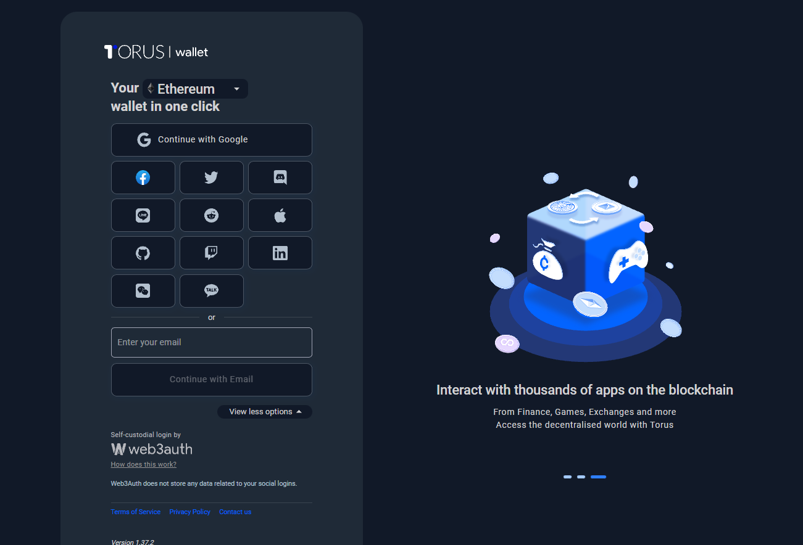
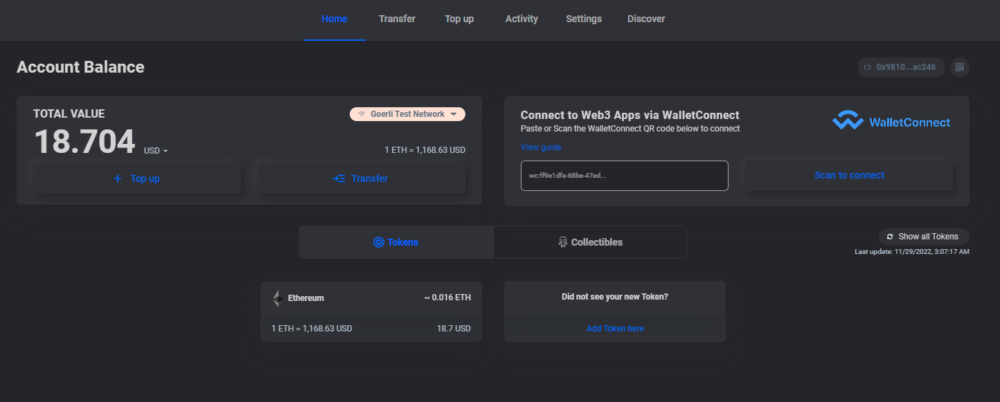
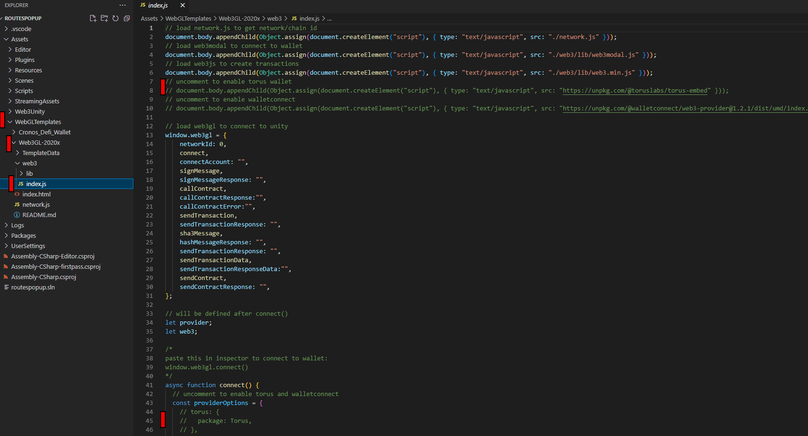
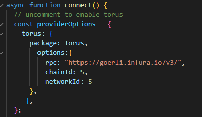

# Implementing Social Logins To WebGL Builds

:::info

How to import and use social logins with WebGL builds.

:::

## Why Should We Use Social Logins

Some developers feel that having social logins (e.g. Google, Facebook, Twitter, GitHub, Discord, etc.) would be a much better entrance system for users getting into the blockchain space. Some users tend to feel more comfortable having a wallet tied to a social account they already own. This helps to speed up onboarding and reduces friction when it comes to gaining new users. With a click of a button they can authorize an account and be on their way!

## What Is The Torus Wallet?

The Torus Wallet powered by Web3Auth is a browser-enabled web wallet that seamlessly integrates into WebGL builds. Below, we’ll walk you through the wallet, how to integrate it, as well as how to use it with the web3.unity SDK.

## Why Use The Torus Wallet?

Torus is simple to setup and very easy to use. It allows you to login via social networks with only 1-click of a button. Through the use of various social accounts, you’re able to connect and authenticate users into your game quite easily!

## An Amazing Dashboard Full Of Features!

Once logged in, you'll be presented with a very clean looking dashboard where you can see your balance, activity and various things that any user needs to manage their blockchain usage.

## How To Integrate The Torus Wallet Into web3.unity

Using this wallet in WebGL builds is very simple! All you need to do is visit the `index.js` file in WebGLTemplates -> Web3 -> Index.js. Uncomment the `torus` javascript import at the top and uncomment the provider options in the connect field below.

Here's an example of a connect field with proper configuration. You'll see options to add an RPC, a `chainId`, and a `networkId`. Here, we've used Goerli's chain config with their default RPC as this is a great place to start for any developer wanting to try transactions on a free testnet. If you need goerliETH you can obtain it from the faucet for free from the [Goerli PoW Faucet](https://goerli-faucet.pk910.de/).

## Build Your Project And Test It Out

Once the config is set, you can press `Ctrl + b` from Unity to create a local build and test things out. Upon using the WebGL login scene, you'll be greeted with a pop-up allowing you to select the Torus Wallet as a form of authentication. You can see an example of this on our [amazing chicken demo](https://chainsafe.github.io/ChainSafe-Demo-WebGL/)

## Making A Transaction

This is extremely easy as the Torus Wallet integrates perfectly with our SDK. You can test a transaction out by walking to any of the functions and giving them a click. You'll see a little pop up asking you to authorize the transaction like so. Just press accept and watch the magic happen!

## That's All There Is To It!

Yes! it's really that easy! We hope you enjoy having such an amazing wallet at your finger tips. We hope you develop something great and we're proud to be integrated with these amazing teams. Keep learning and happy coding!
