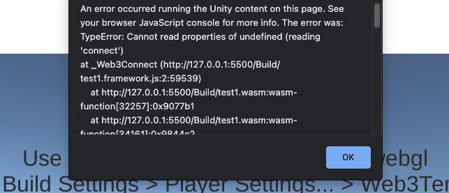
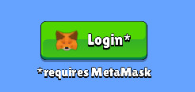

# FAQ

:::info

Frequently asked questions about the ChainSafe gaming SDK.

:::

**Q**: I want to connect to other EVM compatible chains but it only lets me connect to Ethereum. How do I do that?

**A**: You will need to edit the **network.js** file found within the WebTemplates folder. Edit the ChainId to the one for the blockchain you want to game to hit.

**Q:** I'm getting the following error when trying to import an NFT texture into the SDK. **Curl error 1: Protocol "ipfs" not supported or disabled in libcurl**

**A:** IPFS has its own protocol that isn't supported in JSON.Net in order to get around that you need to add something like the following code snippet.

```csharp
string imageUri = data.image;
if (imageUri.StartsWith("ipfs://"))
{
     imageUri = imageUri.Replace("ipfs://", "https://ipfs.io/ipfs/");
C#// Some code
```

**Q:** Is the SDK free to use.&#x20;

**A:** Yes, the SDK is free to use.

**Q:** Does the SDK support chains like Solana or Algorand.

**A:** Not currently, the SDK is multi-chain. Although, our support is mainly geared towards EVM Ethereum Virtual Machine chains. We do have plans for supporting the above in the future.

**Q:** Can I make Desktop games with the SDK.

**A:** Yes, you can make Desktop / Web and Mobile games using our SDK

**Q:** I'm getting the following error **Cannot read properties of undefined reading connect** when clicking the login button. What am I doing wrong?



**A:** This error typically happens with the user hasn't selected the Web3GL Template for making WebGL Games. Make sure you have selected the provided template before making a Web3GL based game.


**Q:** I'm having issues building with react or into a server and it's showing "Uncaught TypeError: Cannot read properties of undefined (reading 'connect')" on build, what should I do?

**A:**  You need to add the web3 component into your react build manually, you can do this like:

1. &#x20;In your public folder, add the web3 folder from a unity build.
2. Then import the following as a script at index.html.
3. \<script src="%PUBLIC\_URL%/YourGame/web3/index.js">\</script> \<script src="%PUBLIC\_URL%/YourGame/web3/lib/web3modal.js">\</script> \<script src="%PUBLIC\_URL%/YourGame/web3/lib/web3.min.js">\</script> \<script src="%PUBLIC\_URL%/YourGame/network.js">\</script>
4. This will solve your issue, Happy Coding!

**Q.** The Google Play / Apple AppStore is rejecting my application, what can I do?\
**A1.** This usually happens because the game has not informed the user that a MetaMask pop up will occur. You can solve this by adding a simple notification as seen below.



**A2.** Some stores may require a demo version of the game so that the stores teams can review the product without needing an external wallet. You can simply add a demo button within the game that takes the user to a free to play version of your game without blockchain calls to test. This should be enough for the store to accept your games application. Happy coding!

**Q.** How do I enable Torus and other wallets for the SDK?

**A.** You can do this be editing the WebGLTemplates -> WebGL2020x -> Web3 -> index.js file. You need to uncomment the wallet at the top to allow the UNPKG javascript file to be used and then uncomment the wallet in the connect function below. Other wallets can be added the same way provided the developers of the wallet supply a UNPKG javascript file and the wallet is EVM compatible like MetaMask.


