# Migrating From web3.unity Legacy v1.x To v2.x

:::info

This guide will assist you in upgrading from older versions (v1.6.x or lower) of ChainSafe Gaming's **web3.unity** SDK to the latest version. The latest version simplifies the process of learning and using the SDK. It is important to note that the SDK is still in beta and will continue to be updated and improved.

:::

### Major Changes {#major-changes}

The major changes between legacy versions (v1.6.x or lower) and the latest version of the SDK (v2) have been made in order to ease the onboarding experience of new game developers, as well as make the SDK more decentralized, flexible, and scalable for existing developers. 

These changes include:
* New libraries with cleaner code, i.e EVM & Web Wallet.
* RPC providers are now handled client-side as opposed to going through a ChainSafe API, which means you will need an Infura-enabled RPC (Chainstack) or a local node. Chainstack offers 3 million calls per month for free, which should be enough for testing and most production applications.
* Methods have been cleaned up so you no longer need to enter the network and chain parameters over and over again.
* Hash Message for sign verify with WebGL has been altered slightly to be handled via libraries.
* Private key transactions have been removed. You can still use sign, however these calls will now need a new import of "using Web3Unity.Scripts.Library.Web3PrivateKey"

Here's a side-by-side video comparing changes in our chicken demo in legacy v1.6, and the latest version from web3.unity core dev Sneakz:
<iframe width="800" height="450" src="https://www.youtube.com/embed/V7R8_3XvBEo?list=PLPn3rQCo3XrP6kFaurgMfMQBsyppYBhqW" title="A Side-By-Side Code Comparison Between v1.6.x and v2 Of web3.unity Using The Chicken Demo!" frameborder="0" allow="accelerometer; autoplay; clipboard-write; encrypted-media; gyroscope; picture-in-picture; web-share" allowfullscreen></iframe>

### Removing The Old Files {#removing-the-old-files}

Delete the Web3Unity & WebGLTemplates and Plugins -> Nethereum folders from your game as seen below to ensure there are no code clashes.

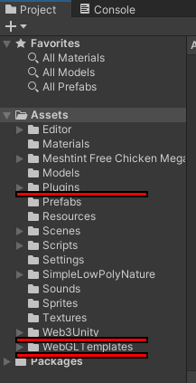

### Importing The Latest Version {#importing-version-2}

Download & import the latest version of the SDK package from our [GitHub](https://github.com/ChainSafe/web3.unity/releases/)

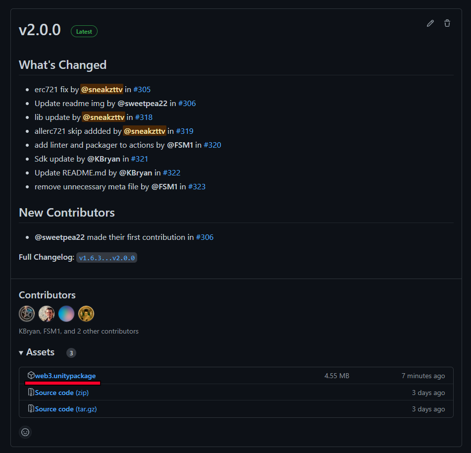

### Adding The New Libraries {#adding-the-new-libraries}

You may see some errors when you initially import the new package. Please disregard them as this is normal. As the libraries have now been given name spaces, you will need to import them at the top of the file to gain access to all of their features (as seen below). This has been done for EVM, Web Wallet & Contracts. Web Graphics Library should work as normal as long as the changes below are implemented.

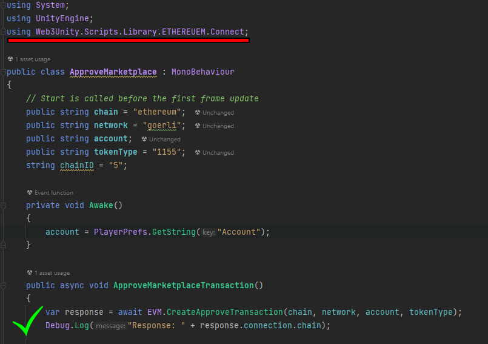

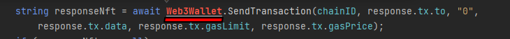

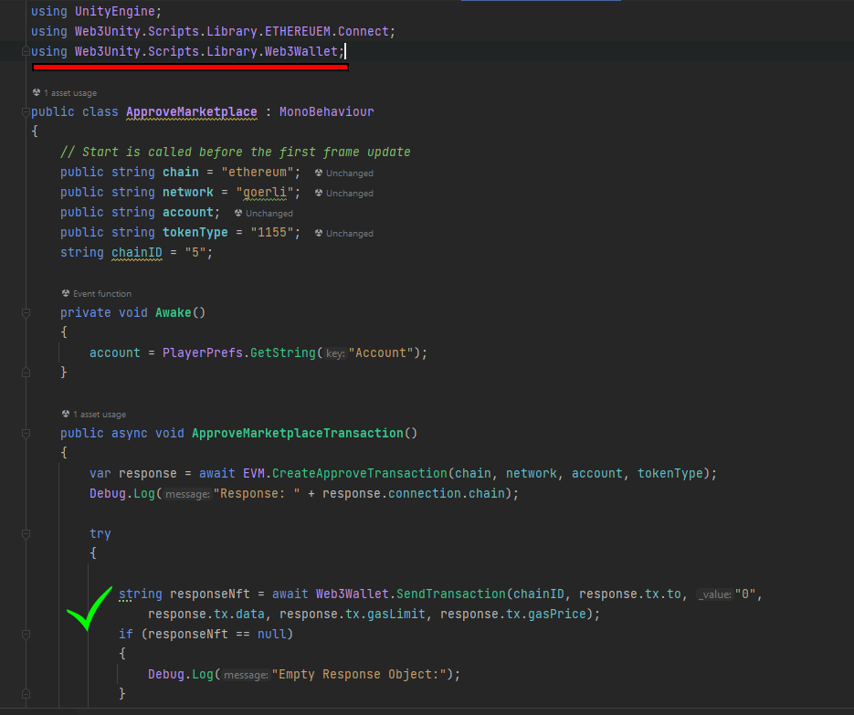

### Changes To Remove Errors {#changes-to-remove-errors}

The next step will require changing the EVM.Call & EVM.CreateContractData methods to methods compatible for the newest version. You'll notice this is now done locally (client-side) with reads and writes enabled directly with Unity and an RPC provider of your choice. In legacy versions (v1.6.x or lower), interactions with the blockchain went through a ChainSafe API server, which has now been removed for the latest versions. This means less time spent developing/waiting & more time spent gaming!

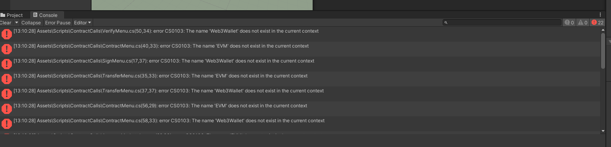

### Contract ABI To JSON format {#contract-abi-to-json-format}
In order to interact with a contract, you'll need the ABI of the contract in a readable format. To do this, you can follow the steps below:

1. Copy the ABI from your contract source, remix, or other IDE.
2. Paste it into your browser address bar to get it onto 1 line.
3. Copy it again from the address bar and paste it into [here](https://codebeautify.org/csharp-escape-unescape).
4. Press escape and copy the result.
5. Paste result into Unity under string contractAbi = "PASTE_HERE";

### EVM.Call-To-Call-Data {#evm.call-to-call-data}

Below, you can see the differences between the old EVM.Call and the new contract.Calldata method. We're simply creating a new object reference and accessing the function as seen below. All builds will require this change.

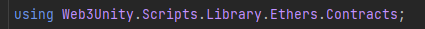

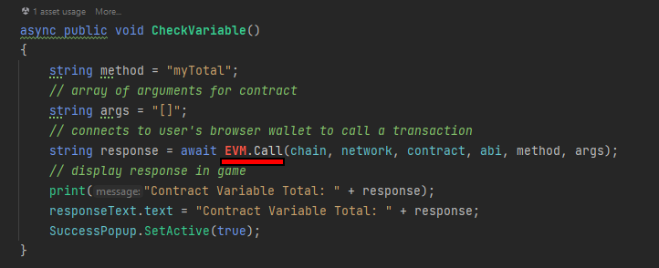

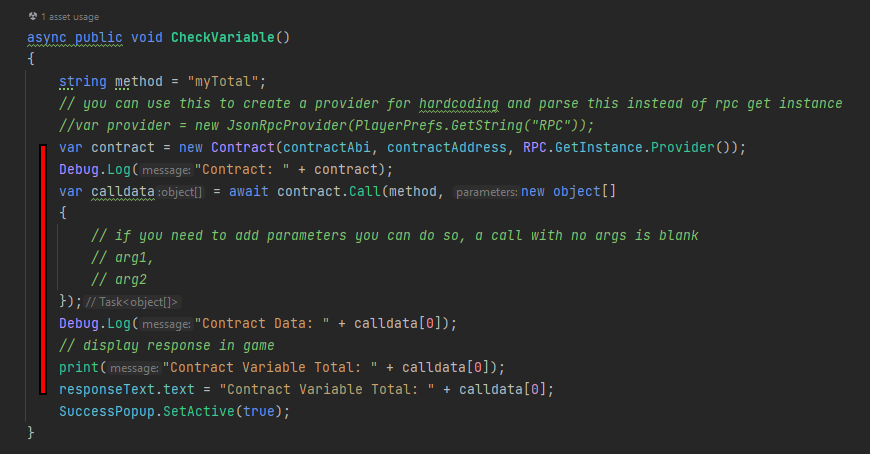

### EVM.CreateContractData-To-Call-Data {#evm.createcontractdata-to-call-data}

Following a similar pattern, the same can be done for EVM.CreateContractData. Please pay attention to the slight changes. You'll notice that the previous way of serializing data into an object has now been included into the contract object for ease of use. You can simply remove these and place them into the object creation as seen below. Please note this is only for Web Wallet Builds - other builds will not need a method change for transactions.

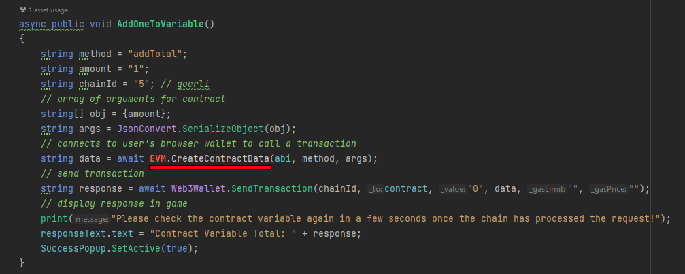

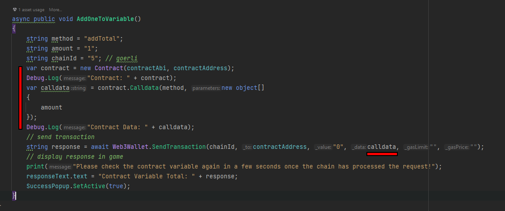

### Web Graphics Library Sign Verify {#web-graphics-library-sign-verify}

Web Graphics Library Sign verify has been altered slightly. Instead of it being an EVM.Call method, it is now handled entirely within the library. You can see the changes between the old and the new versions below.

Old version:
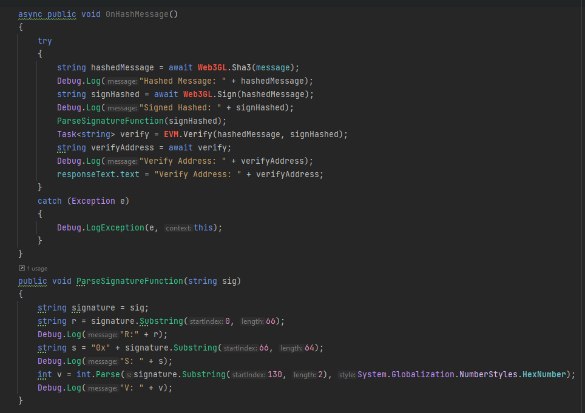

New version:
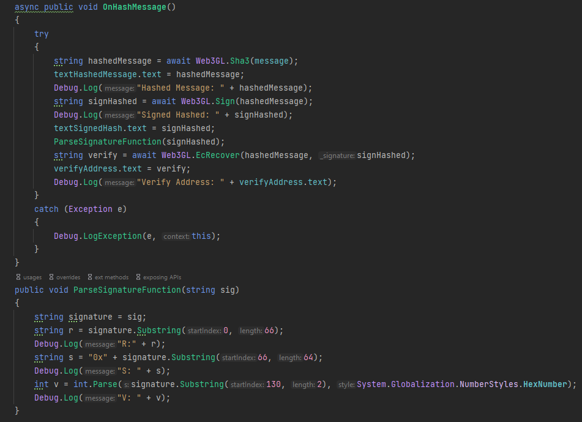

### Test, Test & Test Again! {#test-test-&-test-again}
So far, this is all you should need to do. As we continue to make changes, we'll be implementing and testing these within both versions of the chicken demo. If you get stuck in any way, you can always refer to the examples in the respective WebGL and WebWallet  repositories from our [Discord announcement](https://discord.com/channels/593655374469660673/948330931394052116/1006409190400598070/). Please give it a test and let our devs know in Discord if you have any troubles. Happy coding!
