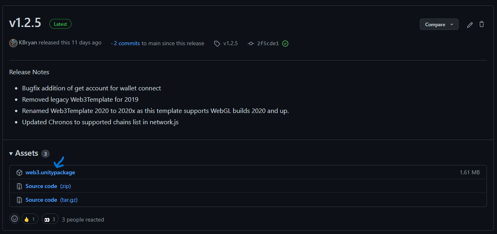
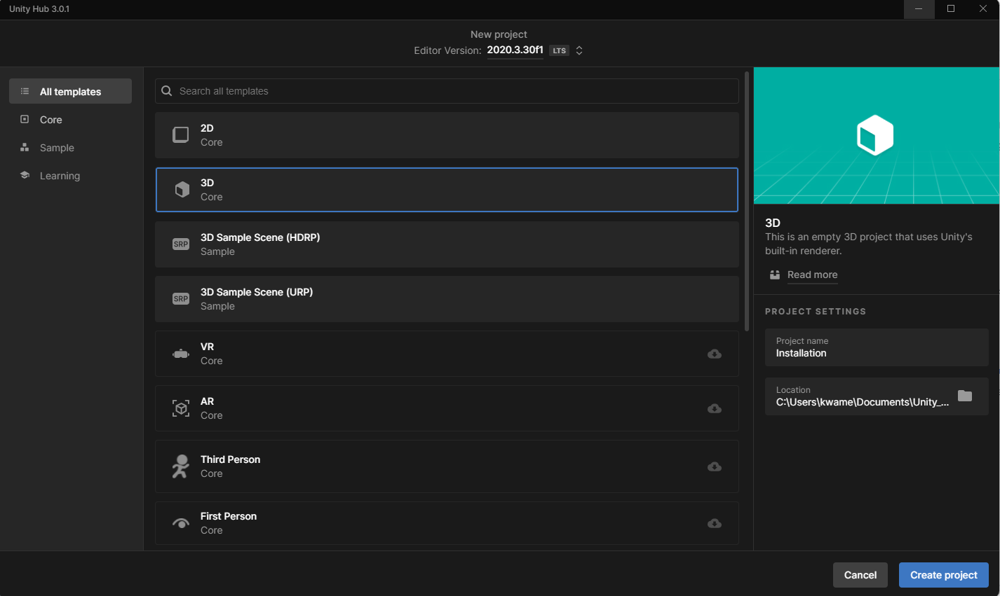
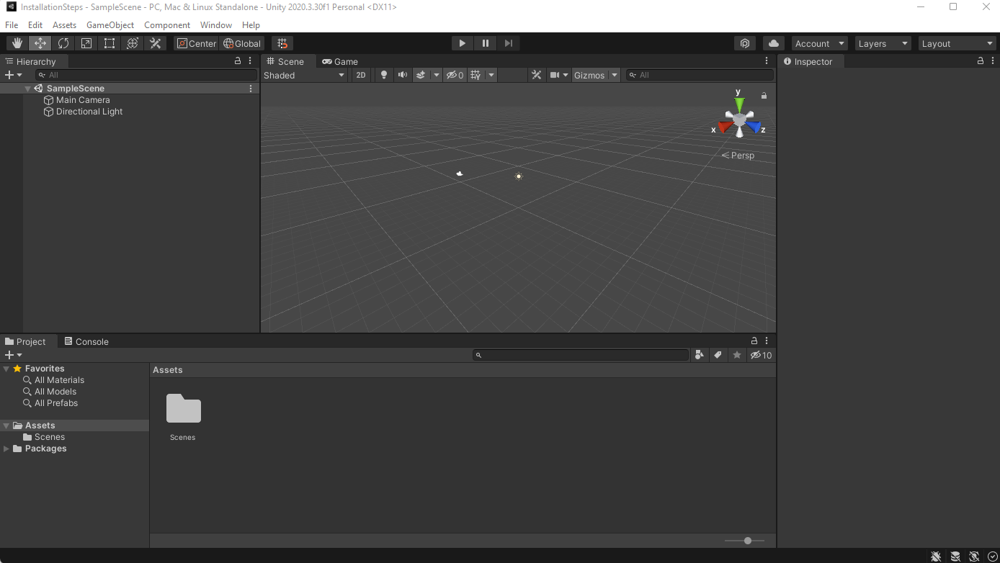
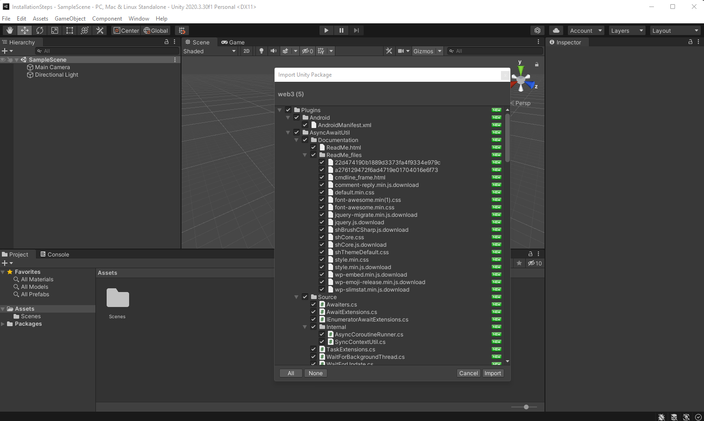
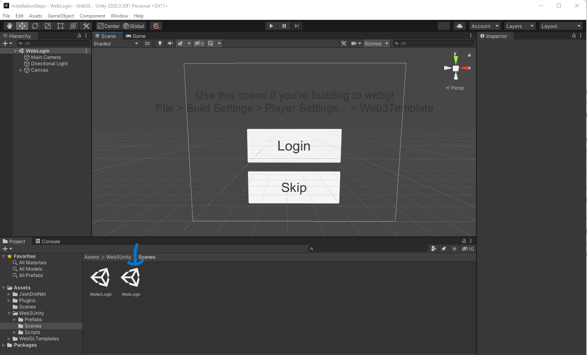
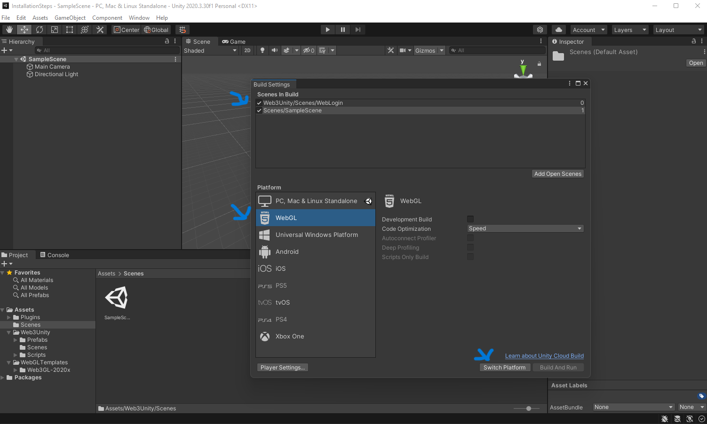
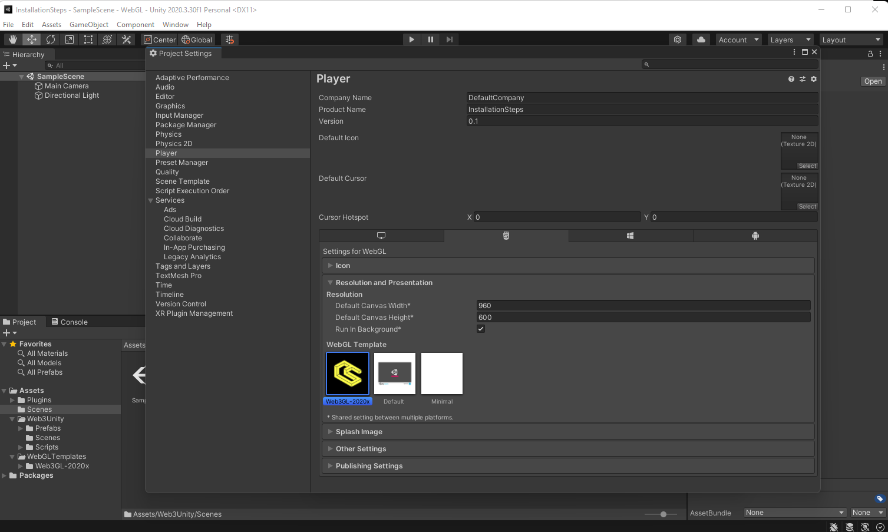
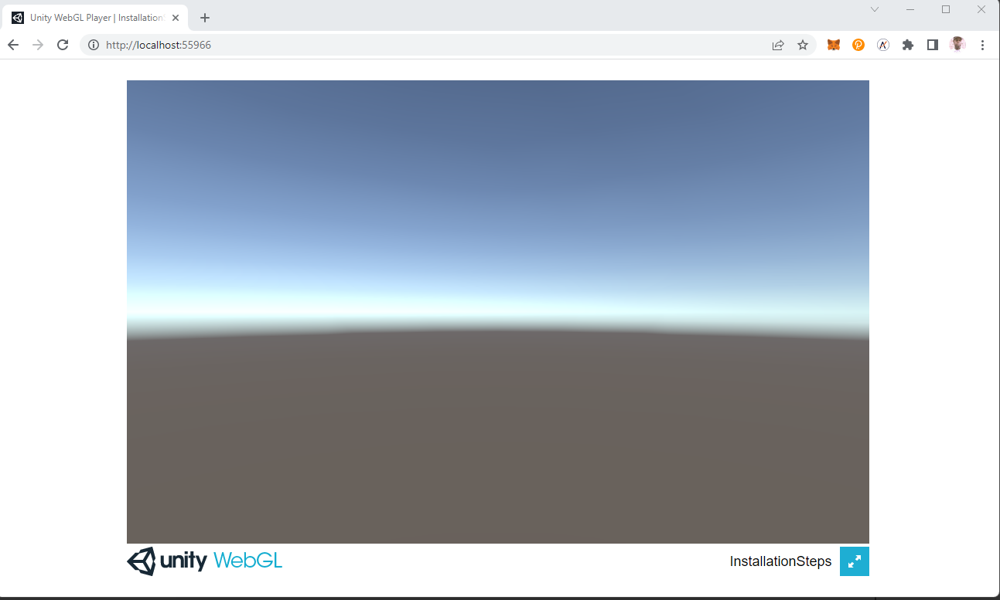

# Installation

:::info

In this section, we will go through the steps necessary for installing the web3.unity SDK into the Unity3D game engine. We will follow the installation with an example of how to implement a sample web3 login screen.

:::

## Installing web3.unity

### Install MetaMask

You will need to have MetaMask installed in order to make web3-enabled games. If you already have MetaMask installed, you can skip this section and navigate to the [Downloading The SDK](#downloading-the-sdk) section. If you have not installed a web3 wallet, please visit [MetaMask](https://t.co/8UNUrkShG6) for installation instructions.&#x20;

### Downloading The SDK

In order to install web3.unity into the Unity3D game engine, you must download the `web3.unitypackage` file to your computer.

Fetch the latest bundled asset release (web3.unitypackage) via this [direct download link](https://github.com/ChainSafe/web3.unity/releases/latest/download/web3.unitypackage).  Alternatively, visit the [web3.unity release page](https://github.com/ChainSafe/web3.unity/releases) to locate specific versions, read changelogs, etc.

### Creating A New Unity3D Project

Once you have downloaded the `web3.unitypackage` bundle to your computer, you will need to create a new Unity3D project. In the following example, we will create an empty 3D project with a 3D scene. However, the web3.unity plugin supports all Unity project types. 

&#x20;

Now that we have created a new project and have a clean interface to work with, we can import the SDK into our project.

### Importing The web3.unity SDK

Now that we have a new Unity3D project, we are ready to install the web3.unity SDK package. Dragging the `web3.unitypackage` into the `Assets` directory will bring up the dialogue shown on the screen below. Press the `Import` button.

## Building A web3 Login

### Building A WebGL Project

Next, we are going to build out our game scene. We will only add the necessary components to build and connect the SDK to a sample Unity3D scene. The SDK provides a `WebLogin` scene that connects your web3 wallet to Unity. The is found in the `Web3Unity` -> `Scenes` folder. The file is named `WebLogin`. This is going to be the first scene that game developers will use.

### Building Out Our Sample Scene

The web3.unity SDK is multi-chain. This means that our SDK can connect to many different versions of the Ethereum Virtual Machine (EVM) on various blockchains. This is an important step that is often missed when deploying your project. To adjust the chain your game connects to, you will need to update a `network.js` file, which can be found in the file path: `WebGL Templates` -> `Web3GL-2020x` -> `network.js`. Replace the values below with the `web3ChainId`, `id`, `label`, `token` & `rpcUrl` of the EVM blockchain you wish to connect to. You can gather this information from [chainlist](https://chainlist.org) as needed. The SDK will also detect the network your web3 wallet has selected and will change without you having to configure it.

&#x20;

Now, we are ready to build out our sample project. We will use the `WebLogin` scene and the default scene provided by Unity. It's important to have a second scene as the SDK expects there to be a connecting screen. This is found by clicking `File` -> `Build Settings`. You will need to drag & import the `WebLogin` scene into the first build index. The `WebLogin` scene is found in the `Web3Unity` -> `Scenes` folder.

Make sure the `WebLogin` scene is in the first index followed by the `SampleScene` found in the scenes folder provided by Unity3D. At this point, we are also going to need to change our platform to WebGL within `Build Settings`. Select `WebGL` and then press `Switch Platform`.

### Connecting The ChainSafe WebGL Template

In order to connect the web3.unity SDK to web3, we are going to need to select the custom template provided by the SDK.  On selecting the `Project Settings` and navigating to `Player` -> `Resolution and Presentation`, select the `Web3GL-2020x` template.&#x20;

Now, we are ready to build out our project and test it in the browser. This will require us to create a folder for our build. This can be named anything you wish.

### Viewing The Project In The Browser

Unity provides a built-in webserver for our Web3GL-enabled games. On selecting the `build and run` option, Unity will create a built-out project and launch it in your browser. Selecting the login button will prompt the MetaMask wallet extension to open.&#x20;

After entering your password and selecting an account, the SDK will automatically navigate you to the `SampleScene` we added to the build index.

### Congratulations

You have successfully installed the web3.unity SDK. We look forward to seeing what you build.

### How To Install The ChainSafe Gaming web3.unity SDK Video Tutorial

Here's a tutorial on the complete web3.unity installation flow: 
<iframe width="800" height="450" src="https://www.youtube.com/embed/9QtcXo_6izw?list=PLPn3rQCo3XrMkgAqFRtih9xGIKciD0b0N" title="How To Install The ChainSafe Gaming web3.unity SDK" frameborder="0" allow="accelerometer; autoplay; clipboard-write; encrypted-media; gyroscope; picture-in-picture; web-share" allowfullscreen></iframe>

