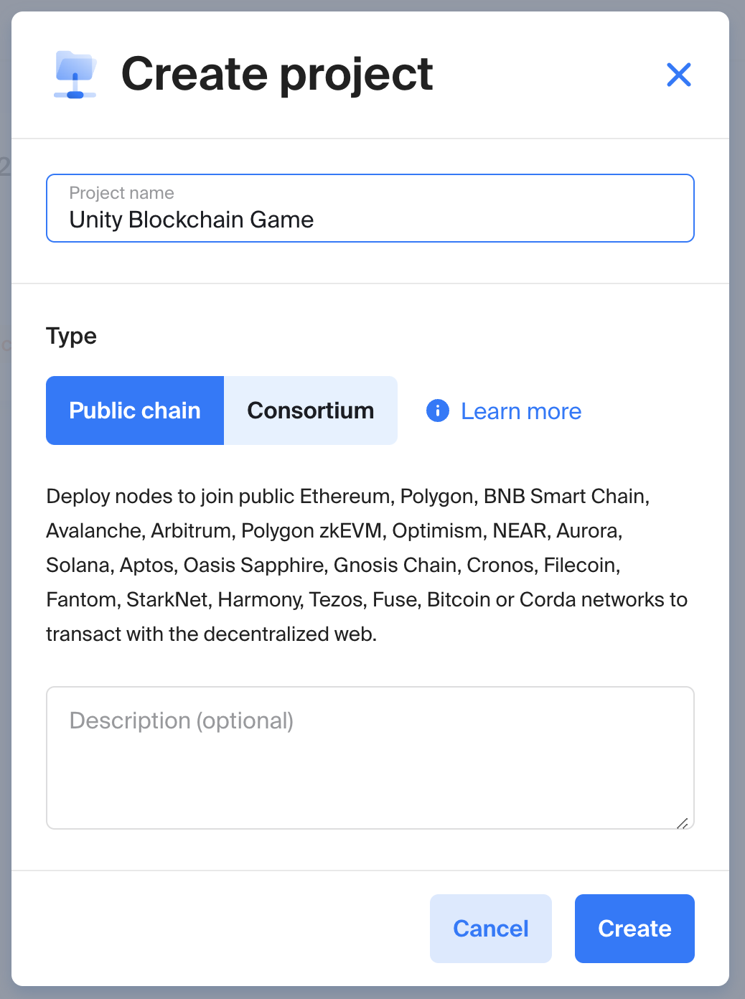
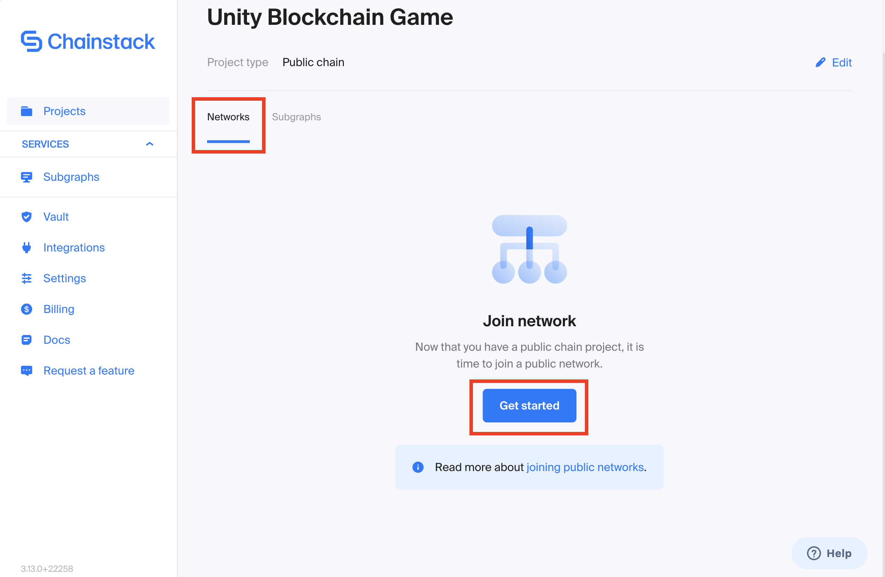
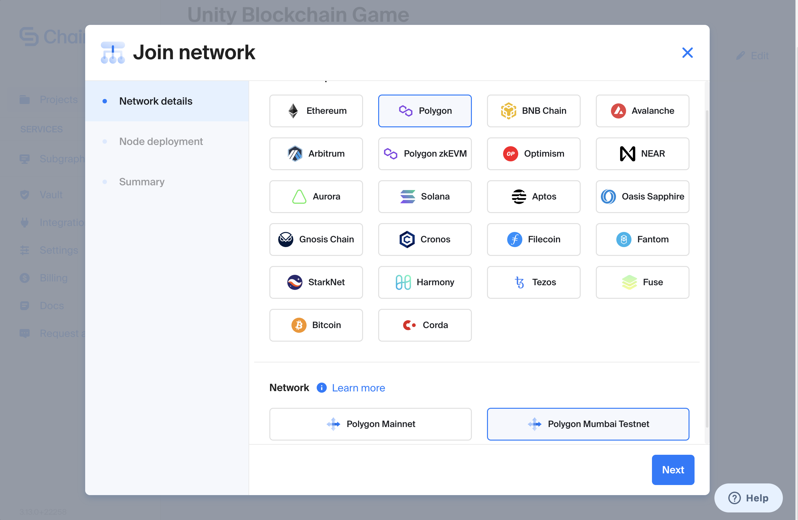
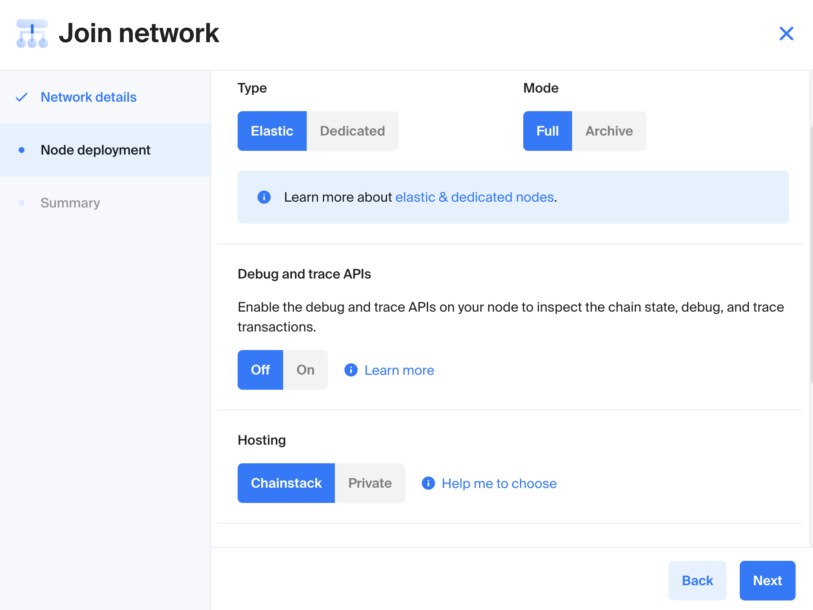
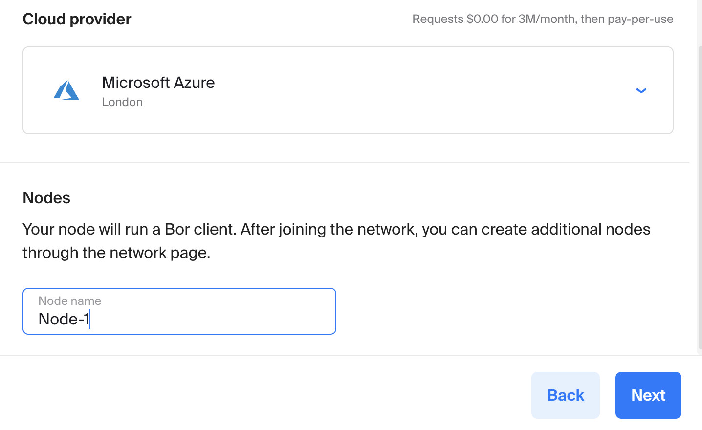
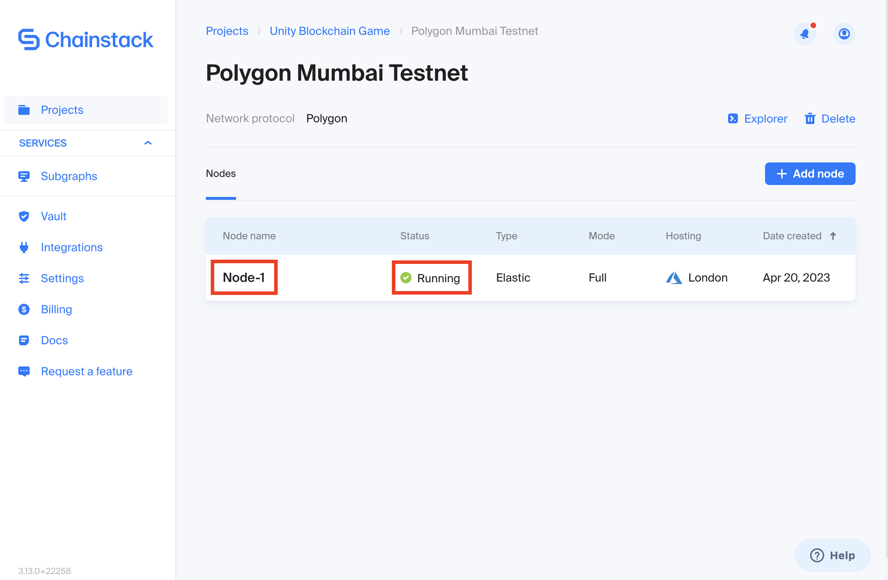
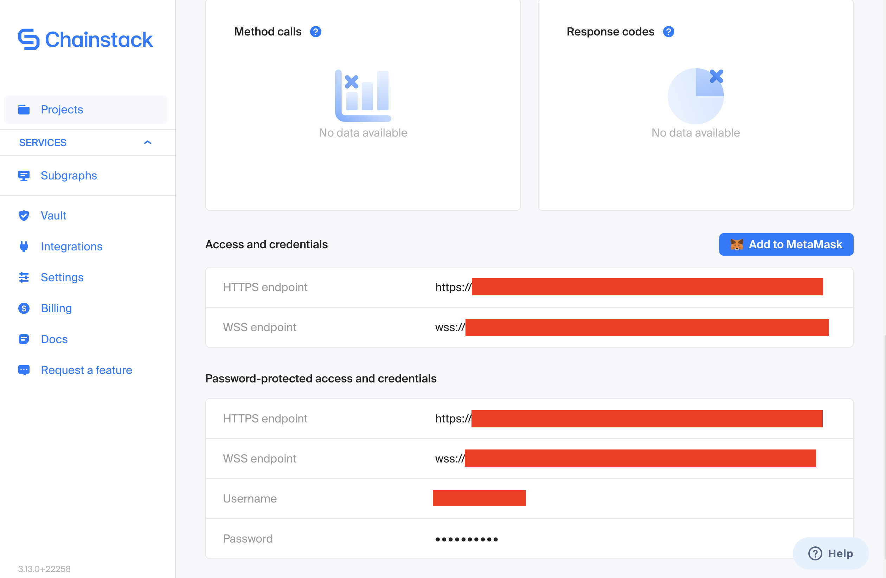

# Setting Up An RPC Node For web3.unity 

:::info

This section walks through the process of setting up an RPC node to be used with the web3.unity SDK. We use [Chainstack](https://console.chainstack.com/user/account/create?utm_campaign=Referrals&utm_source=chainsafe&utm_medium=referrals) as an example, but this can also be done with other providers. Setting up an RPC node is a requirement for the SDK and will enable interactions with selected EVM chains in Unity-based blockchain games.

:::

# Prerequisites 

- A Chainstack account (sign up at [Chainstack](https://console.chainstack.com/user/account/create?utm_campaign=Referrals&utm_source=chainsafe&utm_medium=referrals) if you don't have one)
- Familiarity with the web3.unity SDK

# Creating a project in Chainstack

1. Create (or log in) to your Chainstack account and navigate to the Dashboard.

2. Click on “Projects” in the left sidebar, then click on “Create project”.

3. Give your project a name and select “Public chain” for the Type.

4. You will appear back on the dashboard. Select your newly created project.

5. Inside the project, choose "Networks" from the ribbon menu, and then click on “Get Started” to begin deploying an RPC node.

# Deploying an RPC node

1. After clicking on the “Get started” button, you will be presented with 3 required steps. In the first step “Network details”, you will select the EVM chain that your blockchain game will be making interactions with.

2. Depending on which EVM chain you select, you will be prompted to select a network under a given chain. In our example, we have selected Polygon and its Mumbai testnet. Click “Next”.

3. If you are under Chainstack’s Developer plan, you will only be able to select the default options presented in the “Node deployment” step. This means you will choose “Elastic” for node type, “Full” for full node, “Off” for Debug and trace APIs, “Chainstack” for Hosting, and any available provider under the Cloud provider drop-down menu. Finally, name your node and click “Next”.

:::info

Note that Chainstack’s Developer plan provides 3 million free API requests per month. This should be enough for most testing and app development purposes. If your game requires more calls per month, we would suggest [upgrading your plan](https://console.chainstack.com/user/account/create?utm_campaign=Referrals&utm_source=chainsafe&utm_medium=referrals). 

:::

4. Review the details under the “Summary” step and then click “Join network”.
You will appear back in your project dashboard. Your newly created node will take a moment to deploy while under a “Pending” status. 

5. Once deployed, the node’s status will turn green under a “Running” status. You can now expand the details of your node by clicking on its name. 

# Retrieving your HTTPS endpoint

1. Within the node dashboard, you will be presented with a number of KPIs and metrics. Please scroll down to the “Access and credentials” section. 

2. From here, take note of the HTTPS endpoint, which will be the RPC URL you will use to configure web3.unity and allow your Unity game to interact with the blockchain. 

