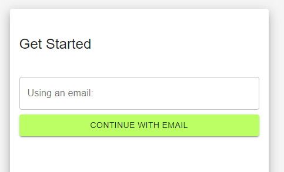
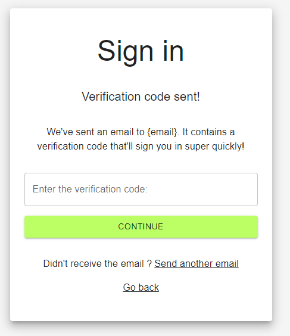
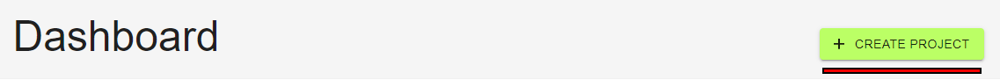
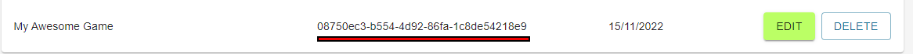
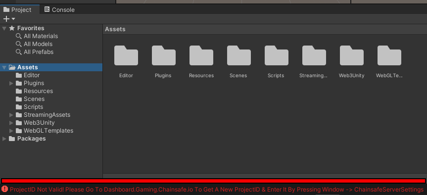
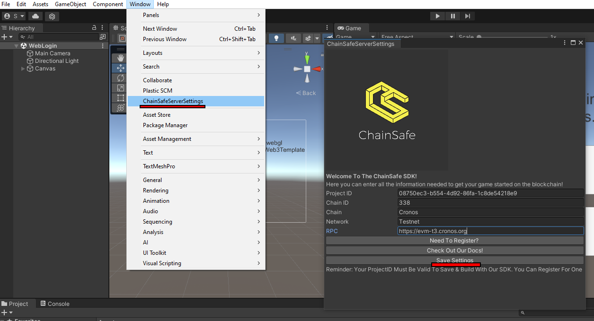

# Project ID Registration

:::info

Registering your project to gain access to build features with our SDK

:::

## Please register your project with us

Don't panic, this is just so that we can offer a more hands on approach when it comes to debugging and catching errors in your blockchain calls. We'll walk you to sign up and validate your Project ID within unity as well as all of the initial project things you may need to get started.

## Here's NFTPixels to walk you through the sign up process

Don't want to scroll through reading? No problem! NFTPixels is here with a quick sign up video.

<iframe width="800" height="450" src="https://www.youtube-nocookie.com/embed/sQZiZp1uxC4" title="YouTube video player" frameborder="0" allow="accelerometer; autoplay; clipboard-write; encrypted-media; gyroscope; picture-in-picture" allowfullscreen></iframe>

## Sign up on our dashboard via email

Please sign up via email. You can get to our sign up dashboard by clicking the link here [https://dashboard.gaming.chainsafe.io/](https://dashboard.gaming.chainsafe.io/)

## Enter the verification code sent to you email

Our sign up process is password free for security reasons. You will be sent an authorization code to your chosen email. Please enter this in to unlock your dashboard. This ensures no nasty third parties can steal your data.

## Press the create button to create your project

## Enter a project name

Please enter your games title and press create.

## You will be presented with a fresh Project ID

This is your Project ID, copy it and please keep it safe! Please don't give it away to other users. We use this to help identify and support you within the blockchain space. You can press the edit or delete buttons to alter your project name or delete the ID as needed.

## Install the newest release of the SDK

Welcome to our newest 1.6.0 SDK release! Woohoo! Please keep your Project ID handy as you'll need it once you've installed the SDK package from [https://github.com/ChainSafe/web3.unity/releases](https://github.com/ChainSafe/web3.unity/releases)

## Open unity and install the web3 unity package

Open installing the newest release you'll be presented with a debug error that will stop you from editing or building. Don't worry, your Project ID unlocks this and we'll have you up and running in just a moment!

## Saving your Project ID within unity

In the menu bar up the top you can press Window -> ChainSafe Server Settings to bring up the pop up. From here you can enter your Project ID along with your games chain information. Press save and that's it! You're ready to go!

## We can now offer you additional support!

Thank you for signing up with us and you're now free to explore our SDK at your own pace. We hope you enjoy the ChainSafe experience and what we have to offer to the blockchain space.

