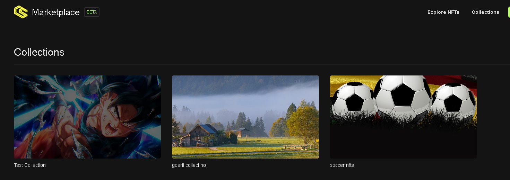
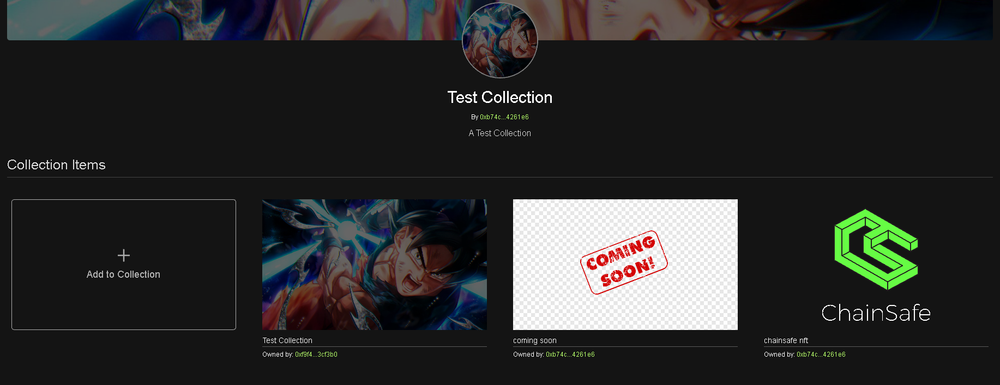
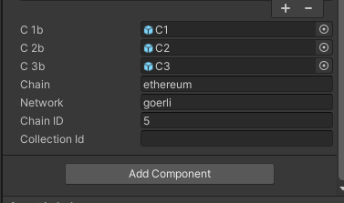
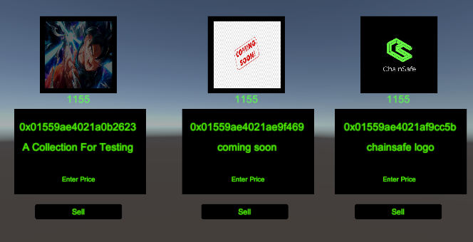

# In-game NFT Marketplace

:::info

web3.unity provides prefabs for integrating an in-game marketplace. A web UI via the [ChainSafe Gaming Marketplace](https://marketplace.chainsafe.io) is also available. To access and interact with the marketplace, various endpoints are available to games implementing this feature.

:::

## Create Approval Transaction

In order to interact with the marketplace, an account must be given approval by the minting interface. This is achieved by using the web3.unity SDK's `EVM.CreateApproveTransaction` class method. A sample code snippet is provided below. Please refer to the `CreateApproval.cs` and `CreateApproval` prefabs provided in the SDK.

```csharp
using System;
using System.Collections;
using System.Collections.Generic;
using UnityEngine;
using Web3Unity.Scripts.Library.ETHEREUEM.Connect;
using Web3Unity.Scripts.Library.Web3Wallet;

public class CreateApprovalWebWallet : MonoBehaviour
{
    // Start is called before the first frame update
    public string chain = "ethereum";
    public string network = "goerli";
    public string account;
    public string tokenType = "1155";
    string chainID = "5";

    private void Awake()
    {
        account = PlayerPrefs.GetString("Account");
    }

    public async void ApproveTransaction()
    {
        var response = await EVM.CreateApproveTransaction(chain, network, account, tokenType);
        Debug.Log("Response: " + response.connection.chain);

        try
        {

            string responseNft = await Web3Wallet.SendTransaction(chainID, response.tx.to, "0",
                response.tx.data, response.tx.gasLimit, response.tx.gasPrice);
            if (responseNft == null)
            {
                Debug.Log("Empty Response Object:");
            }
            print(responseNft);
            Debug.Log(responseNft);
        }
        catch (Exception e)
        {
            Debug.LogException(e, this);
        }
    }
}
```

<iframe width="800" height="450" src="https://www.youtube-nocookie.com/embed/Twm3crRgHVg" title="YouTube video player" frameborder="0" allow="accelerometer; autoplay; clipboard-write; encrypted-media; gyroscope; picture-in-picture" allowfullscreen></iframe>

## Get Listed NFT's

To get a list of marketplace NFT's that have been minted through the marketplace, the SDK provides an `EVM.GetNftMarket` function. This method returns all NFT's that have been minted and listed for sale. We have provided a sample code snippet below, but please also refer to the `GetListNFTWebGL.cs` and `GetListedNFTWebWallet.cs` prefabs in the SDK for full implementation details. The source files provided also allow the user to purchase the listed NFT in game.

* chain = ethereum / goerli / avalanche
* network = testnet / mainnet

```csharp
using System.Collections;
using System.Collections.Generic;
using Models;
using Newtonsoft.Json;
using UnityEngine;
using UnityEngine.Networking;
using UnityEngine.UI;
using Web3Unity.Scripts.Library.ETHEREUEM.Connect;

public class GetListedNFTWebWallet : MonoBehaviour
{
    private string chain = "ethereum";
    public Renderer textureObject;
    private string network = "goerli";
    private string chainID = "5";
    public Text price;
    public Text seller;
    public Text description;
    public Text listPercentage;
    public Text contractAddr;
    public Text tokenId;
    public Text itemId;
    private string _itemPrice = "";
    private string _tokenType = "";

    private string _itemID = "";


    public void Awake()
    {

        price.text = "";
        seller.text = "";
        description.text = "";
        listPercentage.text = "";
        tokenId.text = "";
        itemId.text = "";
        contractAddr.text = "";
    }

    // Start is called before the first frame update
    async void Start()
    {
        List<GetNftListModel.Response> response = await EVM.GetNftMarket(chain, network);
        price.text = response[0].price;
        seller.text = response[0].seller;
        Debug.Log("Seller: " + response[0].seller);
        if (response[0].uri.StartsWith("ipfs://"))
        {
            response[0].uri = response[0].uri.Replace("ipfs://", "https://ipfs.io/ipfs/");
            Debug.Log("Response URI" + response[0].uri);
        }

        UnityWebRequest webRequest = UnityWebRequest.Get(response[0].uri);
        await webRequest.SendWebRequest();
        RootGetNFT data =
            JsonConvert.DeserializeObject<RootGetNFT>(
                System.Text.Encoding.UTF8.GetString(webRequest.downloadHandler.data));
        if (data.description == null)
        {
            description.text = "";
        }
        else
        {
            description.text = data.description;
        }

        // parse json to get image uri
        string imageUri = data.image;
        if (imageUri.StartsWith("ipfs://"))
        {
            imageUri = imageUri.Replace("ipfs://", "https://ipfs.io/ipfs/");
            StartCoroutine(DownloadImage(imageUri));
        }
        else
        {
            StartCoroutine(DownloadImage(imageUri));
        }

        if (data.properties != null)
        {
            foreach (var prop in data.properties.additionalFiles)
            {
                if (prop.StartsWith("ipfs://"))
                {
                    var additionalURi = prop.Replace("ipfs://", "https://ipfs.io/ipfs/");
                }
            }
        }
        listPercentage.text = response[0].listedPercentage;
        Debug.Log(response[0].listedPercentage);
        contractAddr.text = response[0].nftContract;
        itemId.text = response[0].itemId;
        _itemID = response[0].itemId;
        _itemPrice = response[0].price;
        _tokenType = response[0].tokenType;
        tokenId.text = response[0].tokenId;
    }
    
    IEnumerator DownloadImage(string MediaUrl)
    {
        UnityWebRequest request = UnityWebRequestTexture.GetTexture(MediaUrl);
        yield return request.SendWebRequest();
        if (request.result == UnityWebRequest.Result.ProtocolError)
            Debug.Log(request.error);
        else
        {
            Texture2D webTexture = ((DownloadHandlerTexture)request.downloadHandler).texture as Texture2D;
            Sprite webSprite = SpriteFromTexture2D(webTexture);
            textureObject.GetComponent<Image>().sprite = webSprite;
        }
    }

    Sprite SpriteFromTexture2D(Texture2D texture)
    {
        return Sprite.Create(texture, new Rect(0.0f, 0.0f, texture.width, texture.height), new Vector2(0.5f, 0.5f),
            100.0f);
    }
}
```

<iframe width="800" height="450" src="https://www.youtube-nocookie.com/embed/ukr3Ozeahr8" title="YouTube video player" frameborder="0" allow="accelerometer; autoplay; clipboard-write; encrypted-media; gyroscope; picture-in-picture" allowfullscreen></iframe>

## Functionality For Purchasing A Marketplace NFT

Once an NFT has been minted and listed for sale, you can allow the purchase of these items in-game by using the `EVM.CreatePurchaseNftTransaction` function provided in `EVM.cs`. There are also prefabs created for the different builds (`BuyItemWebGL` and `BuyItemWebWallet`) that is implemented in the `GetListedNFTWebGL.cs` and `GetListedNFTWebWallet.cs` files. See below for a code snippet of the implementation:

* chain = ethereum / goerli / avalanche
* network = testnet / mainnet
* account = connected account
* item id = the token id of the minted item
* item price = the price set by the issuer
* token type = either erc721 or erc1155

```csharp
using System;
using Models;
using UnityEngine;
using UnityEngine.UI;
using Web3Unity.Scripts.Library.ETHEREUEM.Connect;
using Web3Unity.Scripts.Library.Web3Wallet;

public class GetListedNFTWebWallet : MonoBehaviour
{
    private string chain = "ethereum";
    private string network = "goerli";
    private string chainID = "5";
    public Text price;
    public Text seller;
    public Text description;
    public Text listPercentage;
    public Text contractAddr;
    public Text tokenId;
    public Text itemId;
    private string _itemPrice = "";
    private string _tokenType = "";

    private string _itemID = "";


    public void Awake()
    {

        price.text = "";
        seller.text = "";
        description.text = "";
        listPercentage.text = "";
        tokenId.text = "";
        itemId.text = "";
        contractAddr.text = "";
    }

    public async void PurchaseItem()
    {
        BuyNFT.Response response = await EVM.CreatePurchaseNftTransaction(chain, network,
            PlayerPrefs.GetString("Account"), _itemID, _itemPrice, _tokenType);
        Debug.Log("Account: " + response.tx.account);
        Debug.Log("To : " + response.tx.to);
        Debug.Log("Value : " + response.tx.value);
        Debug.Log("Data : " + response.tx.data);
        Debug.Log("Gas Price : " + response.tx.gasPrice);
        Debug.Log("Gas Limit : " + response.tx.gasLimit);

        try
        {
            string responseNft = await Web3Wallet.SendTransaction(chainID, response.tx.to, response.tx.value,
                response.tx.data, response.tx.gasLimit, response.tx.gasPrice);
            if (responseNft == null)
            {
                Debug.Log("Empty Response Object:");
            }
            print(responseNft);
            Debug.Log(responseNft);
        }
        catch (Exception e)
        {
            Debug.LogException(e, this);
        }
    }
}
```

<iframe width="800" height="450" src="https://www.youtube-nocookie.com/embed/ukr3Ozeahr8" title="YouTube video player" frameborder="0" allow="accelerometer; autoplay; clipboard-write; encrypted-media; gyroscope; picture-in-picture" allowfullscreen></iframe>

## &#x20;Listing Minted Asset

To list minted NFT's for sale, the SDK provides an `EVM.CreateListNftTransaction` function. You can find the prefabs and its implementation by searching for the file names `ListItemWebGL` and `ListItemWebWallet`. See below for the code snippet:

* chain = ethereum / goerli / avalanche
* network = testnet / mainnet
* account = connected account
* item id = the token id of the minted item
* item price = the price set by the seller
* token type = either erc721 or erc1155

```csharp
using System;
using System.Collections;
using System.Collections.Generic;
using Models;
using Newtonsoft.Json;
using UnityEngine;
using UnityEngine.Networking;
using UnityEngine.UI;
using Web3Unity.Scripts.Library.ETHEREUEM.Connect;
using Web3Unity.Scripts.Library.Web3Wallet;

namespace Web3Unity.Scripts.Prefabs.Minter
{
    public class ListNftWebWallet : MonoBehaviour
    {
        private string chain = "ethereum";
        private string network = "goerli";
        private string chainID = "5";
        private string _itemPrice = "0.001";
        private string _tokenType = "";
        private string _itemID = "";
        private string account;

        public Renderer textureObject;
        public Text description;
        public Text tokenURI;
        public Text contractAddr;
        public Text isApproved;
        public InputField itemPrice;
        public Text noListedItems;
        public Text playerAccount;

        public void Awake()
        {
            account = PlayerPrefs.GetString("Account");
            description.text = "";
            tokenURI.text = "";
            isApproved.text = "";
            contractAddr.text = "";
        }

        // Start is called before the first frame update
        async void Start()
        {
            playerAccount.text = account;
            try
            {
                List<MintedNFT.Response> response = await EVM.GetMintedNFT(chain, network, account);

                if (response[1].uri == null)
                {
                    Debug.Log("Not Listed Items");
                    return;
                }
                if (response[1].uri.StartsWith("ipfs://"))
                {
                    response[1].uri = response[1].uri.Replace("ipfs://", "https://ipfs.io/ipfs/");
                }

                UnityWebRequest webRequest = UnityWebRequest.Get(response[1].uri);
                await webRequest.SendWebRequest();
                RootGetNFT data =
                    JsonConvert.DeserializeObject<RootGetNFT>(
                        System.Text.Encoding.UTF8.GetString(webRequest.downloadHandler.data));
                description.text = data.description;
                // parse json to get image uri
                string imageUri = data.image;
                if (imageUri.StartsWith("ipfs://"))
                {
                    imageUri = imageUri.Replace("ipfs://", "https://ipfs.io/ipfs/");
                    StartCoroutine(DownloadImage(imageUri));
                }
                else
                {
                    StartCoroutine(DownloadImage(imageUri));
                }

                tokenURI.text = response[1].uri;
                Debug.Log(response[1].uri);
                contractAddr.text = response[1].nftContract;
                Debug.Log("NFT Contract: " + response[1].nftContract);
                isApproved.text = response[1].isApproved.ToString();
                _itemID = response[1].id;
                _itemPrice = itemPrice.text;
                Debug.Log("Token Type: " + response[1].tokenType);
                _tokenType = response[1].tokenType;
            }
            catch (Exception e)
            {
                noListedItems.text = "NO LISTED ITEM for " + account;
                Debug.Log("No Listed Items" + e);
            }
        }

        // ReSharper disable Unity.PerformanceAnalysis
        IEnumerator DownloadImage(string MediaUrl)
        {
            UnityWebRequest request = UnityWebRequestTexture.GetTexture(MediaUrl);
            yield return request.SendWebRequest();
            if (request.result == UnityWebRequest.Result.ProtocolError)
                Debug.Log(request.error);
            else
            {
                Texture2D webTexture = ((DownloadHandlerTexture)request.downloadHandler).texture as Texture2D;
                Sprite webSprite = SpriteFromTexture2D(webTexture);
                textureObject.GetComponent<Image>().sprite = webSprite;
            }
        }

        Sprite SpriteFromTexture2D(Texture2D texture)
        {
            return Sprite.Create(texture, new Rect(0.0f, 0.0f, texture.width, texture.height), new Vector2(0.5f, 0.5f),
                100.0f);
        }

        public async void ListItem()
        {

            float eth = float.Parse(_itemPrice);
            float decimals = 1000000000000000000; // 18 decimals
            float wei = eth * decimals;
            Debug.Log("ItemID: " + _itemID);
            ListNFT.Response response =
                await EVM.CreateListNftTransaction(chain, network, account, _itemID, Convert.ToDecimal(wei).ToString(), _tokenType);
            int value = Convert.ToInt32(response.tx.value.hex, 16);
            Debug.Log("Response: " + response);
            try
            {
                string responseNft = await Web3Wallet.SendTransaction(chainID, response.tx.to, value.ToString(),
                    response.tx.data, response.tx.gasLimit, response.tx.gasPrice);
                if (responseNft == null)
                {
                    Debug.Log("Empty Response Object:");
                }
            }
            catch (Exception e)
            {
                Debug.Log("Error: " + e);
            }
        }
    }
}
```

<iframe width="800" height="450" src="https://www.youtube-nocookie.com/embed/Twm3crRgHVg" title="YouTube video player" frameborder="0" allow="accelerometer; autoplay; clipboard-write; encrypted-media; gyroscope; picture-in-picture" allowfullscreen></iframe>

## Using the collections prefabs
There is also a Collections feature for the [Marketplace](https://marketplace.chainsafe.io/collections). This allows the creation of an NFT collection page that makes it easier to group and display NFTs for a specific game using our marketplace. For example, if you have a collection of swords, shields, and armors all under the same collection, you can setup an in-game marketplace using our marketplace prefab and ensure only your collection NFTs are displayed within Unity.



Once you've created a collection, you will be able to assign or remove NFTs from this collection as long as you are the collection owner/admin. You can assign as many NFTs as you'd like to a collection and then use that in-game. Take note of the collection slug on this page which is the last bit of the URL you see above after "collections/".



Locate the prefabs found in prefabs -> minter -> webgl/web3wallet folders. You can configure the parameters of the prefabs to ensure only approved NFTs are visible in the collection. Don't forget to add your slug to the Collections Slug field in the inspector.



Being able to set the Collection Slug means you can use the prefab to parameterize exclusive buying & selling of only your NFTs via our marketplace in-game. The prefab currently only has space for 3 objects per collection, but you can increase the amount of objects to any size you'd like for purchase or sale.



Here's a tutorial explaining collections and how they can be used with the new filterable marketplace prefabs.

<iframe width="800" height="450" src="https://www.youtube.com/embed/huywhyOYk1Q" title="Introducing &quot;Collections&quot; For web3.unity" frameborder="0" allow="accelerometer; autoplay; clipboard-write; encrypted-media; gyroscope; picture-in-picture; web-share" allowfullscreen></iframe>